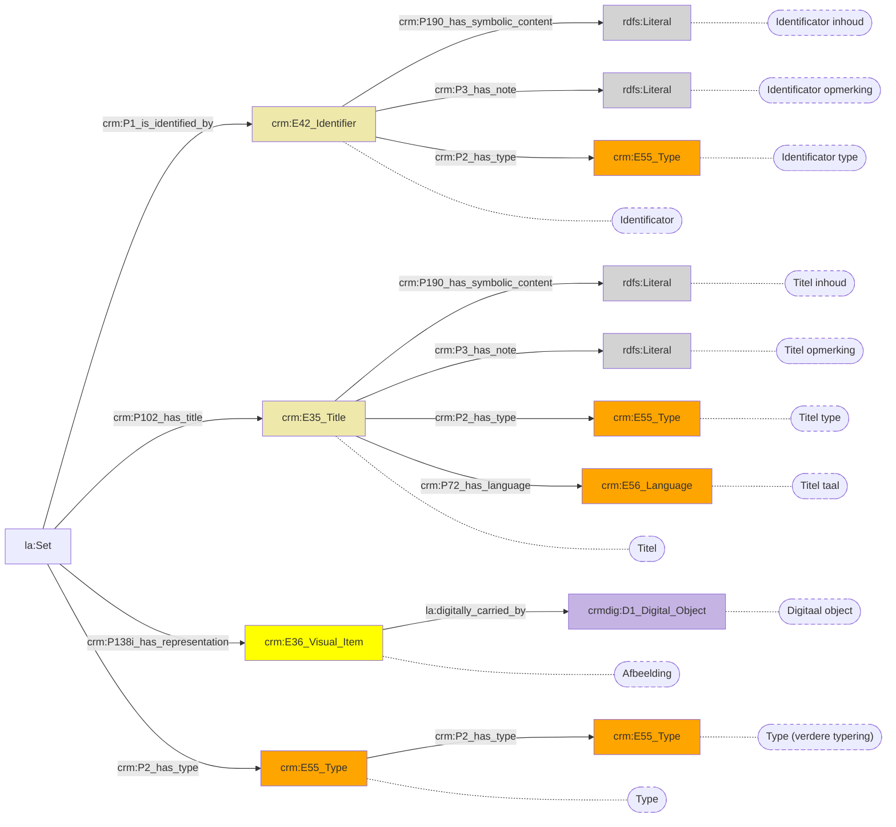

```mermaid
graph LR
style 6c5fbe62-b2ec-11ef-86f2-960003b0d355 fill:#EEE8AA
style 6c5fc9f2-b2ec-11ef-86f2-960003b0d355 fill:#D3D3D3
style 6c5fcd44-b2ec-11ef-86f2-960003b0d355 fill:#ffa500
style 6c5fce7a-b2ec-11ef-86f2-960003b0d355 fill:#D3D3D3
style 6c5fd15e-b2ec-11ef-86f2-960003b0d355 fill:#ffa500
style 8ba5d7b2-b2eb-11ef-86f2-960003b0d355 fill:#ffa500
style 8ba5ddd4-b2eb-11ef-86f2-960003b0d355 fill:#ffa500
style b456b080-bb9e-11ef-9b84-960003b0d355 fill:#ffff00
style b456b558-bb9e-11ef-9b84-960003b0d355 fill:#C5B4E3
style d7077c74-b2eb-11ef-95ba-960003b0d355 fill:#EEE8AA
style d70781ba-b2eb-11ef-95ba-960003b0d355 fill:#D3D3D3
style d707834a-b2eb-11ef-95ba-960003b0d355 fill:#D3D3D3
style d70785d4-b2eb-11ef-95ba-960003b0d355 fill:#ffa500
6c5fbe62-b2ec-11ef-86f2-960003b0d355["crm:E35_Title"]-->|"crm:P190_has_symbolic_content"|6c5fce7a-b2ec-11ef-86f2-960003b0d355(rdfs:Literal)
6c5fbe62-b2ec-11ef-86f2-960003b0d355["crm:E35_Title"]-->|"crm:P3_has_note"|6c5fc9f2-b2ec-11ef-86f2-960003b0d355(rdfs:Literal)
d7077c74-b2eb-11ef-95ba-960003b0d355["crm:E42_Identifier"]-->|"crm:P190_has_symbolic_content"|d70781ba-b2eb-11ef-95ba-960003b0d355(rdfs:Literal)
d7077c74-b2eb-11ef-95ba-960003b0d355["crm:E42_Identifier"]-->|"crm:P3_has_note"|d707834a-b2eb-11ef-95ba-960003b0d355(rdfs:Literal)
style 6c5fce7a-b2ec-11ef-86f2-960003b0d355_s stroke-dasharray: 5
style 6c5fcd44-b2ec-11ef-86f2-960003b0d355_s stroke-dasharray: 5
style 6c5fc9f2-b2ec-11ef-86f2-960003b0d355_s stroke-dasharray: 5
style 6c5fd15e-b2ec-11ef-86f2-960003b0d355_s stroke-dasharray: 5
style 8ba5ddd4-b2eb-11ef-86f2-960003b0d355_s stroke-dasharray: 5
style d7077c74-b2eb-11ef-95ba-960003b0d355_s stroke-dasharray: 5
style 6c5fbe62-b2ec-11ef-86f2-960003b0d355_s stroke-dasharray: 5
style b456b080-bb9e-11ef-9b84-960003b0d355_s stroke-dasharray: 5
style 8ba5d7b2-b2eb-11ef-86f2-960003b0d355_s stroke-dasharray: 5
style b456b558-bb9e-11ef-9b84-960003b0d355_s stroke-dasharray: 5
style d70781ba-b2eb-11ef-95ba-960003b0d355_s stroke-dasharray: 5
style d70785d4-b2eb-11ef-95ba-960003b0d355_s stroke-dasharray: 5
style d707834a-b2eb-11ef-95ba-960003b0d355_s stroke-dasharray: 5
6c5fbe62-b2ec-11ef-86f2-960003b0d355["crm:E35_Title"]-->|"crm:P2_has_type"|6c5fcd44-b2ec-11ef-86f2-960003b0d355["crm:E55_Type"]
6c5fbe62-b2ec-11ef-86f2-960003b0d355["crm:E35_Title"]-->|"crm:P72_has_language"|6c5fd15e-b2ec-11ef-86f2-960003b0d355["crm:E56_Language"]
8ba5d7b2-b2eb-11ef-86f2-960003b0d355["crm:E55_Type"]-->|"crm:P2_has_type"|8ba5ddd4-b2eb-11ef-86f2-960003b0d355["crm:E55_Type"]
92985afe-b0b1-11ef-95ba-960003b0d355["la:Set"]-->|"crm:P1_is_identified_by"|d7077c74-b2eb-11ef-95ba-960003b0d355["crm:E42_Identifier"]
92985afe-b0b1-11ef-95ba-960003b0d355["la:Set"]-->|"crm:P102_has_title"|6c5fbe62-b2ec-11ef-86f2-960003b0d355["crm:E35_Title"]
92985afe-b0b1-11ef-95ba-960003b0d355["la:Set"]-->|"crm:P138i_has_representation"|b456b080-bb9e-11ef-9b84-960003b0d355["crm:E36_Visual_Item"]
92985afe-b0b1-11ef-95ba-960003b0d355["la:Set"]-->|"crm:P2_has_type"|8ba5d7b2-b2eb-11ef-86f2-960003b0d355["crm:E55_Type"]
b456b080-bb9e-11ef-9b84-960003b0d355["crm:E36_Visual_Item"]-->|"la:digitally_carried_by"|b456b558-bb9e-11ef-9b84-960003b0d355["crmdig:D1_Digital_Object"]
d7077c74-b2eb-11ef-95ba-960003b0d355["crm:E42_Identifier"]-->|"crm:P2_has_type"|d70785d4-b2eb-11ef-95ba-960003b0d355["crm:E55_Type"]
6c5fce7a-b2ec-11ef-86f2-960003b0d355["rdfs:Literal"]-.-6c5fce7a-b2ec-11ef-86f2-960003b0d355_s(["Titel inhoud"])
6c5fcd44-b2ec-11ef-86f2-960003b0d355["crm:E55_Type"]-.-6c5fcd44-b2ec-11ef-86f2-960003b0d355_s(["Titel type"])
6c5fc9f2-b2ec-11ef-86f2-960003b0d355["rdfs:Literal"]-.-6c5fc9f2-b2ec-11ef-86f2-960003b0d355_s(["Titel opmerking"])
6c5fd15e-b2ec-11ef-86f2-960003b0d355["crm:E56_Language"]-.-6c5fd15e-b2ec-11ef-86f2-960003b0d355_s(["Titel taal"])
8ba5ddd4-b2eb-11ef-86f2-960003b0d355["crm:E55_Type"]-.-8ba5ddd4-b2eb-11ef-86f2-960003b0d355_s(["Type (verdere typering)"])
d7077c74-b2eb-11ef-95ba-960003b0d355["crm:E42_Identifier"]-.-d7077c74-b2eb-11ef-95ba-960003b0d355_s(["Identificator"])
6c5fbe62-b2ec-11ef-86f2-960003b0d355["crm:E35_Title"]-.-6c5fbe62-b2ec-11ef-86f2-960003b0d355_s(["Titel"])
b456b080-bb9e-11ef-9b84-960003b0d355["crm:E36_Visual_Item"]-.-b456b080-bb9e-11ef-9b84-960003b0d355_s(["Afbeelding"])
8ba5d7b2-b2eb-11ef-86f2-960003b0d355["crm:E55_Type"]-.-8ba5d7b2-b2eb-11ef-86f2-960003b0d355_s(["Type"])
b456b558-bb9e-11ef-9b84-960003b0d355["crmdig:D1_Digital_Object"]-.-b456b558-bb9e-11ef-9b84-960003b0d355_s(["Digitaal object"])
d70781ba-b2eb-11ef-95ba-960003b0d355["rdfs:Literal"]-.-d70781ba-b2eb-11ef-95ba-960003b0d355_s(["Identificator inhoud"])
d70785d4-b2eb-11ef-95ba-960003b0d355["crm:E55_Type"]-.-d70785d4-b2eb-11ef-95ba-960003b0d355_s(["Identificator type"])
d707834a-b2eb-11ef-95ba-960003b0d355["rdfs:Literal"]-.-d707834a-b2eb-11ef-95ba-960003b0d355_s(["Identificator opmerking"])
```
