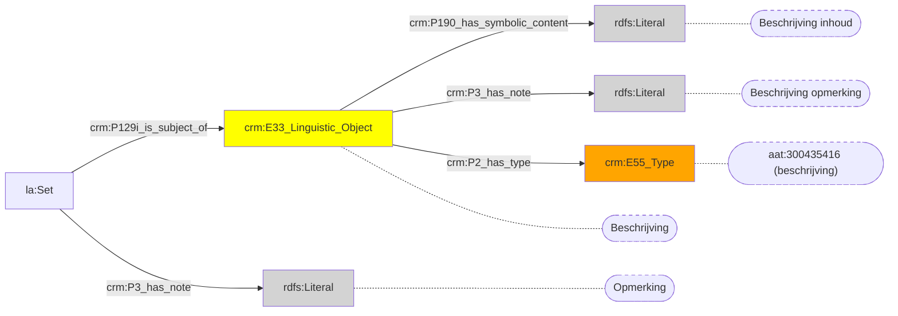

```mermaid
graph LR
style 9b1e2e74-b2eb-11ef-9b84-960003b0d355 fill:#ffff00
style 9b1e33c4-b2eb-11ef-9b84-960003b0d355 fill:#D3D3D3
style 9b1e37a2-b2eb-11ef-9b84-960003b0d355 fill:#D3D3D3
style 9b1e3a36-b2eb-11ef-9b84-960003b0d355 fill:#ffa500
style b132d732-b2eb-11ef-86f2-960003b0d355 fill:#D3D3D3
92985afe-b0b1-11ef-95ba-960003b0d355["la:Set"]-->|"crm:P3_has_note"|b132d732-b2eb-11ef-86f2-960003b0d355(rdfs:Literal)
9b1e2e74-b2eb-11ef-9b84-960003b0d355["crm:E33_Linguistic_Object"]-->|"crm:P190_has_symbolic_content"|9b1e37a2-b2eb-11ef-9b84-960003b0d355(rdfs:Literal)
9b1e2e74-b2eb-11ef-9b84-960003b0d355["crm:E33_Linguistic_Object"]-->|"crm:P3_has_note"|9b1e33c4-b2eb-11ef-9b84-960003b0d355(rdfs:Literal)
style 9b1e2e74-b2eb-11ef-9b84-960003b0d355_s stroke-dasharray: 5
style b132d732-b2eb-11ef-86f2-960003b0d355_s stroke-dasharray: 5
style 9b1e37a2-b2eb-11ef-9b84-960003b0d355_s stroke-dasharray: 5
style 9b1e3a36-b2eb-11ef-9b84-960003b0d355_s stroke-dasharray: 5
style 9b1e33c4-b2eb-11ef-9b84-960003b0d355_s stroke-dasharray: 5
92985afe-b0b1-11ef-95ba-960003b0d355["la:Set"]-->|"crm:P129i_is_subject_of"|9b1e2e74-b2eb-11ef-9b84-960003b0d355["crm:E33_Linguistic_Object"]
9b1e2e74-b2eb-11ef-9b84-960003b0d355["crm:E33_Linguistic_Object"]-->|"crm:P2_has_type"|9b1e3a36-b2eb-11ef-9b84-960003b0d355["crm:E55_Type"]
9b1e2e74-b2eb-11ef-9b84-960003b0d355["crm:E33_Linguistic_Object"]-.-9b1e2e74-b2eb-11ef-9b84-960003b0d355_s(["Beschrijving"])
b132d732-b2eb-11ef-86f2-960003b0d355["rdfs:Literal"]-.-b132d732-b2eb-11ef-86f2-960003b0d355_s(["Opmerking"])
9b1e37a2-b2eb-11ef-9b84-960003b0d355["rdfs:Literal"]-.-9b1e37a2-b2eb-11ef-9b84-960003b0d355_s(["Beschrijving inhoud"])
9b1e3a36-b2eb-11ef-9b84-960003b0d355["crm:E55_Type"]-.-9b1e3a36-b2eb-11ef-9b84-960003b0d355_s(["aat:300435416 (beschrijving)"])
9b1e33c4-b2eb-11ef-9b84-960003b0d355["rdfs:Literal"]-.-9b1e33c4-b2eb-11ef-9b84-960003b0d355_s(["Beschrijving opmerking"])
```
