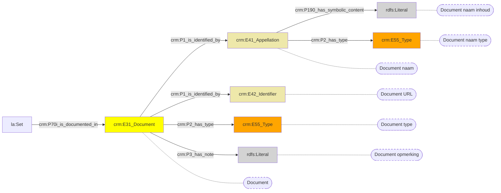

```mermaid
graph LR
style bb66bd5a-b2ea-11ef-9b84-960003b0d355 fill:#ffa500
style bb66c390-b2ea-11ef-9b84-960003b0d355 fill:#ffa500
style bb66c796-b2ea-11ef-9b84-960003b0d355 fill:#EEE8AA
style bb66cb38-b2ea-11ef-9b84-960003b0d355 fill:#ffff00
style bb66cea8-b2ea-11ef-9b84-960003b0d355 fill:#D3D3D3
style bb66d16e-b2ea-11ef-9b84-960003b0d355 fill:#D3D3D3
style bb66d3ee-b2ea-11ef-9b84-960003b0d355 fill:#EEE8AA
bb66c796-b2ea-11ef-9b84-960003b0d355["crm:E41_Appellation"]-->|"crm:P190_has_symbolic_content"|bb66cea8-b2ea-11ef-9b84-960003b0d355(rdfs:Literal)
bb66cb38-b2ea-11ef-9b84-960003b0d355["crm:E31_Document"]-->|"crm:P3_has_note"|bb66d16e-b2ea-11ef-9b84-960003b0d355(rdfs:Literal)
style bb66cb38-b2ea-11ef-9b84-960003b0d355_s stroke-dasharray: 5
style bb66cea8-b2ea-11ef-9b84-960003b0d355_s stroke-dasharray: 5
style bb66bd5a-b2ea-11ef-9b84-960003b0d355_s stroke-dasharray: 5
style bb66c796-b2ea-11ef-9b84-960003b0d355_s stroke-dasharray: 5
style bb66d3ee-b2ea-11ef-9b84-960003b0d355_s stroke-dasharray: 5
style bb66c390-b2ea-11ef-9b84-960003b0d355_s stroke-dasharray: 5
style bb66d16e-b2ea-11ef-9b84-960003b0d355_s stroke-dasharray: 5
92985afe-b0b1-11ef-95ba-960003b0d355["la:Set"]-->|"crm:P70i_is_documented_in"|bb66cb38-b2ea-11ef-9b84-960003b0d355["crm:E31_Document"]
bb66c796-b2ea-11ef-9b84-960003b0d355["crm:E41_Appellation"]-->|"crm:P2_has_type"|bb66bd5a-b2ea-11ef-9b84-960003b0d355["crm:E55_Type"]
bb66cb38-b2ea-11ef-9b84-960003b0d355["crm:E31_Document"]-->|"crm:P1_is_identified_by"|bb66c796-b2ea-11ef-9b84-960003b0d355["crm:E41_Appellation"]
bb66cb38-b2ea-11ef-9b84-960003b0d355["crm:E31_Document"]-->|"crm:P1_is_identified_by"|bb66d3ee-b2ea-11ef-9b84-960003b0d355["crm:E42_Identifier"]
bb66cb38-b2ea-11ef-9b84-960003b0d355["crm:E31_Document"]-->|"crm:P2_has_type"|bb66c390-b2ea-11ef-9b84-960003b0d355["crm:E55_Type"]
bb66cb38-b2ea-11ef-9b84-960003b0d355["crm:E31_Document"]-.-bb66cb38-b2ea-11ef-9b84-960003b0d355_s(["Document"])
bb66cea8-b2ea-11ef-9b84-960003b0d355["rdfs:Literal"]-.-bb66cea8-b2ea-11ef-9b84-960003b0d355_s(["Document naam inhoud"])
bb66bd5a-b2ea-11ef-9b84-960003b0d355["crm:E55_Type"]-.-bb66bd5a-b2ea-11ef-9b84-960003b0d355_s(["Document naam type"])
bb66c796-b2ea-11ef-9b84-960003b0d355["crm:E41_Appellation"]-.-bb66c796-b2ea-11ef-9b84-960003b0d355_s(["Document naam"])
bb66d3ee-b2ea-11ef-9b84-960003b0d355["crm:E42_Identifier"]-.-bb66d3ee-b2ea-11ef-9b84-960003b0d355_s(["Document URL"])
bb66c390-b2ea-11ef-9b84-960003b0d355["crm:E55_Type"]-.-bb66c390-b2ea-11ef-9b84-960003b0d355_s(["Document type"])
bb66d16e-b2ea-11ef-9b84-960003b0d355["rdfs:Literal"]-.-bb66d16e-b2ea-11ef-9b84-960003b0d355_s(["Document opmerking"])
```
