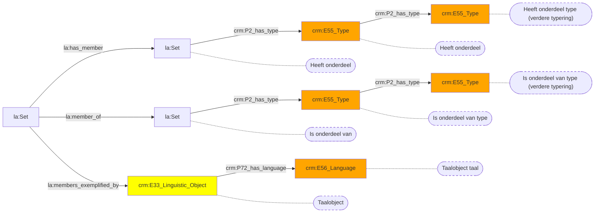

```mermaid
graph LR
style 325fef08-b633-11ef-95ba-960003b0d355 fill:#ffa500
style 325ff3b8-b633-11ef-95ba-960003b0d355 fill:#ffa500
style 4072233c-bb9b-11ef-a481-960003b0d355 fill:#ffa500
style 5e03d6e2-b633-11ef-86f2-960003b0d355 fill:#ffa500
style 5e03dcc8-b633-11ef-86f2-960003b0d355 fill:#ffa500
style f832fbf6-b2ed-11ef-95ba-960003b0d355 fill:#ffff00
style 325fef08-b633-11ef-95ba-960003b0d355_s stroke-dasharray: 5
style 325ff3b8-b633-11ef-95ba-960003b0d355_s stroke-dasharray: 5
style 5e03dcc8-b633-11ef-86f2-960003b0d355_s stroke-dasharray: 5
style fe1abbde-b2e9-11ef-a481-960003b0d355_s stroke-dasharray: 5
style 2231bb3a-b2ea-11ef-95ba-960003b0d355_s stroke-dasharray: 5
style f832fbf6-b2ed-11ef-95ba-960003b0d355_s stroke-dasharray: 5
style 4072233c-bb9b-11ef-a481-960003b0d355_s stroke-dasharray: 5
style 5e03d6e2-b633-11ef-86f2-960003b0d355_s stroke-dasharray: 5
2231bb3a-b2ea-11ef-95ba-960003b0d355["la:Set"]-->|"crm:P2_has_type"|325fef08-b633-11ef-95ba-960003b0d355["crm:E55_Type"]
325fef08-b633-11ef-95ba-960003b0d355["crm:E55_Type"]-->|"crm:P2_has_type"|325ff3b8-b633-11ef-95ba-960003b0d355["crm:E55_Type"]
5e03d6e2-b633-11ef-86f2-960003b0d355["crm:E55_Type"]-->|"crm:P2_has_type"|5e03dcc8-b633-11ef-86f2-960003b0d355["crm:E55_Type"]
92985afe-b0b1-11ef-95ba-960003b0d355["la:Set"]-->|"la:has_member"|fe1abbde-b2e9-11ef-a481-960003b0d355["la:Set"]
92985afe-b0b1-11ef-95ba-960003b0d355["la:Set"]-->|"la:member_of"|2231bb3a-b2ea-11ef-95ba-960003b0d355["la:Set"]
92985afe-b0b1-11ef-95ba-960003b0d355["la:Set"]-->|"la:members_exemplified_by"|f832fbf6-b2ed-11ef-95ba-960003b0d355["crm:E33_Linguistic_Object"]
f832fbf6-b2ed-11ef-95ba-960003b0d355["crm:E33_Linguistic_Object"]-->|"crm:P72_has_language"|4072233c-bb9b-11ef-a481-960003b0d355["crm:E56_Language"]
fe1abbde-b2e9-11ef-a481-960003b0d355["la:Set"]-->|"crm:P2_has_type"|5e03d6e2-b633-11ef-86f2-960003b0d355["crm:E55_Type"]
325fef08-b633-11ef-95ba-960003b0d355["crm:E55_Type"]-.-325fef08-b633-11ef-95ba-960003b0d355_s(["Is onderdeel van type"])
325ff3b8-b633-11ef-95ba-960003b0d355["crm:E55_Type"]-.-325ff3b8-b633-11ef-95ba-960003b0d355_s(["Is onderdeel van type (verdere typering)"])
5e03dcc8-b633-11ef-86f2-960003b0d355["crm:E55_Type"]-.-5e03dcc8-b633-11ef-86f2-960003b0d355_s(["Heeft onderdeel type (verdere typering)"])
fe1abbde-b2e9-11ef-a481-960003b0d355["la:Set"]-.-fe1abbde-b2e9-11ef-a481-960003b0d355_s(["Heeft onderdeel"])
2231bb3a-b2ea-11ef-95ba-960003b0d355["la:Set"]-.-2231bb3a-b2ea-11ef-95ba-960003b0d355_s(["Is onderdeel van"])
f832fbf6-b2ed-11ef-95ba-960003b0d355["crm:E33_Linguistic_Object"]-.-f832fbf6-b2ed-11ef-95ba-960003b0d355_s(["Taalobject"])
4072233c-bb9b-11ef-a481-960003b0d355["crm:E56_Language"]-.-4072233c-bb9b-11ef-a481-960003b0d355_s(["Taalobject taal"])
5e03d6e2-b633-11ef-86f2-960003b0d355["crm:E55_Type"]-.-5e03d6e2-b633-11ef-86f2-960003b0d355_s(["Heeft onderdeel"])
```
