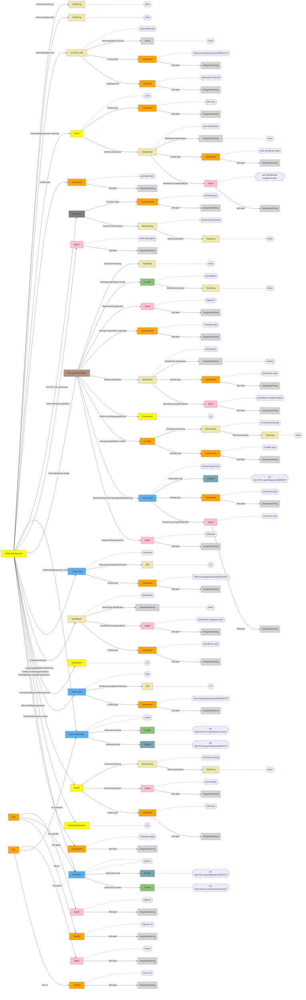

```mermaid
graph LR
137[Rol]-->|Rol.rol|143[TypeRol]
91[PublicatieExpressie]-->|InformatieObject.gaatOver|124[TypeEntiteit]
160[Werk]-->|Entiteit.identificator|161[Identificator]
91[PublicatieExpressie]-->|PublicatieExpressie.creatie|138[Publicatie]
91[PublicatieExpressie]-->|ConceptueelDing.heeftComponent|92[PublicatieExpressie]
22[MensgemaaktObject]-->|MaterieelDing.beheerder|38[Agent]
91[PublicatieExpressie]-->|WettelijkObject.isOnderworpenAan|145[Recht]
91[PublicatieExpressie]-->|Entiteit.toekenning|111[Toekenning]
91[PublicatieExpressie]-->|Entiteit.wordtVoorgesteldDoor|123[VisueelItem]
91[PublicatieExpressie]-->|Entiteit.identificator|95[Identificator]
95[Identificator]-->|Entiteit.type|96[TypeEntiteit]
22[MensgemaaktObject]-->|MaterieelDing.isOvergedragenBijVerwerving|50[Verwerving]
91[PublicatieExpressie]-->|Entiteit.toekenning|107[Toekenning]
102[Dimensie]-->|Dimensie.beschrijving|103[Beschrijving]
137[Rol]-->|Rol.activiteit|138[Publicatie]
117[crm:E35_Title]-->|Taalobject.taal|121[Taalcode]
24[Identificator]-->|Identificator.toegekendDoor|28[Agent]
22[MensgemaaktObject]-->|MensgemaaktObject.conditie|67[Conditie]
161[Identificator]-->|Identificator.toegekendDoor|165[Agent]
50[Verwerving]-->|Verwerving.overgedragenVan|54[Agent]
91[PublicatieExpressie]-->|InformatieObject.drager|22[MensgemaaktObject]
137[Rol]-->|Rol.agent|141[Agent]
117[crm:E35_Title]-->|Entiteit.type|118[TypeEntiteit]
50[Verwerving]-->|Entiteit.type|51[TypeEntiteit]
161[Identificator]-->|Entiteit.type|162[TypeEntiteit]
145[Recht]-->|Entiteit.type|150[TypeRecht]
22[MensgemaaktObject]-->|Entiteit.wordtVoorgesteldDoor|37[VisueelItem]
24[Identificator]-->|Entiteit.type|25[TypeEntiteit]
91[PublicatieExpressie]-->|InformatieObject.gaatOver|219[Agent]
22[MensgemaaktObject]-->|Entiteit.identificator|24[Identificator]
91[PublicatieExpressie]-->|crm:P43_has_dimension|102[Dimensie]
155[Rol]-->|Rol.rol|158[TypeRol]
22[MensgemaaktObject]-->|MensgemaaktObject.materiaal|81[TypeMateriaal]
160[Werk]-->|Entiteit.type|167[TypeEntiteit]
102[Dimensie]-->|Dimensie.type|105[TypeGrootheid]
91[PublicatieExpressie]-->|ZelfstandigeExpressie.creatie|152[ExpressieCreatie]
107[Toekenning]-->|Entiteit.type|108[TypeEntiteit]
67[Conditie]-->|Conditie.type|70[TypeConditie]
155[Rol]-->|Rol.activiteit|152[ExpressieCreatie]
111[Toekenning]-->|Entiteit.type|112[TypeEntiteit]
145[Recht]-->|Recht.isInBezitVan|148[Agent]
95[Identificator]-->|Identificator.toegekendDoor|99[Agent]
155[Rol]-->|Rol.agent|156[Agent]
91[PublicatieExpressie]-->|Entiteit.type|115[TypeEntiteit]
67[Conditie]-->|Conditie.beschrijving|68[Beschrijving]
91[PublicatieExpressie]-->|ZelfstandigeExpressie.realiseert|160[Werk]
22[MensgemaaktObject]-->|MaterieelDing.eigenaar|48[Agent]
145[Recht]-->|Recht.beschrijving|146[Beschrijving]
91[PublicatieExpressie]-->|InformatieObject.titel|117[crm:E35_Title]
22[MensgemaaktObject]-->|MensgemaaktObject.locatie|79(Locatie)
91[PublicatieExpressie]-->|InformatieObject.titel|136(TaalString)
165[Agent]-->|rdfs:label|193(GetypeerdeString)
152[ExpressieCreatie]-->|Gebeurtenis.tijd|154(Periode)
105[TypeGrootheid]-->|rdfs:label|106(GetypeerdeString)
96[TypeEntiteit]-->|rdfs:label|97(GetypeerdeString)
48[Agent]-->|rdfs:label|49(GetypeerdeString)
143[TypeRol]-->|rdfs:label|144(GetypeerdeString)
50[Verwerving]-->|Gebeurtenis.tijd|53(Periode)
107[Toekenning]-->|Toekenning.toegekendAttribuut|110(URI)
24[Identificator]-->|Identificator.identificator|27(GetypeerdeString)
162[TypeEntiteit]-->|rdfs:label|163(GetypeerdeString)
121[Taalcode]-->|rdfs:label|122(GetypeerdeString)
68[Beschrijving]-->|Beschrijving.tekst|69(TaalString)
138[Publicatie]-->|Gebeurtenis.plaats|139(Locatie)
81[TypeMateriaal]-->|rdfs:label|82(GetypeerdeString)
38[Agent]-->|rdfs:label|39(GetypeerdeString)
156[Agent]-->|rdfs:label|157(GetypeerdeString)
152[ExpressieCreatie]-->|Gebeurtenis.plaats|153(Locatie)
103[Beschrijving]-->|Beschrijving.tekst|104(TaalString)
146[Beschrijving]-->|Beschrijving.tekst|147(TaalString)
54[Agent]-->|rdfs:label|55(GetypeerdeString)
99[Agent]-->|rdfs:label|100(GetypeerdeString)
161[Identificator]-->|Identificator.identificator|164(GetypeerdeString)
91[PublicatieExpressie]-->|Entiteit.beschrijving|94(TaalString)
25[TypeEntiteit]-->|rdfs:label|26(GetypeerdeString)
115[TypeEntiteit]-->|rdfs:label|116(GetypeerdeString)
167[TypeEntiteit]-->|rdfs:label|168(GetypeerdeString)
118[TypeEntiteit]-->|rdfs:label|119(GetypeerdeString)
117[crm:E35_Title]-->|InformatieObject.inhoud|120(String)
70[TypeConditie]-->|rdfs:label|71(GetypeerdeString)
141[Agent]-->|rdfs:label|142(GetypeerdeString)
138[Publicatie]-->|Gebeurtenis.tijd|140(Periode)
108[TypeEntiteit]-->|rdfs:label|109(GetypeerdeString)
112[TypeEntiteit]-->|rdfs:label|113(GetypeerdeString)
158[TypeRol]-->|rdfs:label|159(GetypeerdeString)
148[Agent]-->|rdfs:label|149(GetypeerdeString)
124[TypeEntiteit]-->|rdfs:label|127(GetypeerdeString)
79[Locatie]-->|Entiteit.beschrijving|80(TaalString)
22[MensgemaaktObject]-->|Entiteit.beschrijving|23(TaalString)
28[Agent]-->|rdfs:label|29(GetypeerdeString)
219[Agent]-->|rdfs:label|126(GetypeerdeString)
150[TypeRecht]-->|rdfs:label|151(GetypeerdeString)
95[Identificator]-->|Identificator.identificator|98(GetypeerdeString)
111[Toekenning]-->|Toekenning.toegekendAttribuut|114(URI)
51[TypeEntiteit]-->|rdfs:label|52(GetypeerdeString)
style 79_s stroke-dasharray: 5
style 143_s stroke-dasharray: 5
style 124_s stroke-dasharray: 5
style 136_s stroke-dasharray: 5
style 161_s stroke-dasharray: 5
style 138_s stroke-dasharray: 5
style 92_s stroke-dasharray: 5
style 154_s stroke-dasharray: 5
style 38_s stroke-dasharray: 5
style 111_s stroke-dasharray: 5
style 53_s stroke-dasharray: 5
style 110_s stroke-dasharray: 5
style 27_s stroke-dasharray: 5
style 123_s stroke-dasharray: 5
style 95_s stroke-dasharray: 5
style 96_s stroke-dasharray: 5
style 50_s stroke-dasharray: 5
style 107_s stroke-dasharray: 5
style 103_s stroke-dasharray: 5
style 138_s stroke-dasharray: 5
style 69_s stroke-dasharray: 5
style 121_s stroke-dasharray: 5
style 28_s stroke-dasharray: 5
style 165_s stroke-dasharray: 5
style 139_s stroke-dasharray: 5
style 54_s stroke-dasharray: 5
style 153_s stroke-dasharray: 5
style 141_s stroke-dasharray: 5
style 104_s stroke-dasharray: 5
style 147_s stroke-dasharray: 5
style 164_s stroke-dasharray: 5
style 94_s stroke-dasharray: 5
style 118_s stroke-dasharray: 5
style 51_s stroke-dasharray: 5
style 162_s stroke-dasharray: 5
style 150_s stroke-dasharray: 5
style 120_s stroke-dasharray: 5
style 37_s stroke-dasharray: 5
style 25_s stroke-dasharray: 5
style 219_s stroke-dasharray: 5
style 24_s stroke-dasharray: 5
style 140_s stroke-dasharray: 5
style 158_s stroke-dasharray: 5
style 81_s stroke-dasharray: 5
style 167_s stroke-dasharray: 5
style 105_s stroke-dasharray: 5
style 152_s stroke-dasharray: 5
style 108_s stroke-dasharray: 5
style 70_s stroke-dasharray: 5
style 152_s stroke-dasharray: 5
style 80_s stroke-dasharray: 5
style 112_s stroke-dasharray: 5
style 23_s stroke-dasharray: 5
style 148_s stroke-dasharray: 5
style 99_s stroke-dasharray: 5
style 98_s stroke-dasharray: 5
style 156_s stroke-dasharray: 5
style 115_s stroke-dasharray: 5
style 68_s stroke-dasharray: 5
style 160_s stroke-dasharray: 5
style 48_s stroke-dasharray: 5
style 114_s stroke-dasharray: 5
style 146_s stroke-dasharray: 5
style 117_s stroke-dasharray: 5
79[Locatie]-.-79_s([standplaats])
143[TypeRol]-.-143_s([uitgever rol])
124[TypeEntiteit]-.-124_s([onderwerp type])
136[TaalString]-.-136_s([tekst])
161[Identificator]-.-161_s([werk identificator])
138[Publicatie]-.-138_s([uitgave])
92[PublicatieExpressie]-.-92_s([uri])
154[Periode]-.-154_s([zie http://id.loc.gov/datatypes/edtf/EDTF])
38[Agent]-.-38_s([beheerder])
111[Toekenning]-.-111_s([taal])
53[Periode]-.-53_s([zie http://id.loc.gov/datatypes/edtf/EDTF])
110[URI]-.-110_s([uri])
27[GetypeerdeString]-.-27_s([waarde])
123[VisueelItem]-.-123_s([uri])
95[Identificator]-.-95_s([identificator])
96[TypeEntiteit]-.-96_s([identificator type])
50[Verwerving]-.-50_s([verwerving periode])
107[Toekenning]-.-107_s([informatie])
103[Beschrijving]-.-103_s([afmeting beschrijving])
138[Publicatie]-.-138_s([uitgave])
69[TaalString]-.-69_s([tekst])
121[Taalcode]-.-121_s([alternatieve titel taal])
28[Agent]-.-28_s([identificator toegekend door])
165[Agent]-.-165_s([werk identificator toegekend door])
139[Locatie]-.-139_s([zie http://www.w3.org/ns/prov#Location])
54[Agent]-.-54_s([verworven van])
153[Locatie]-.-153_s([zie http://www.w3.org/ns/prov#Location])
141[Agent]-.-141_s([uitgever])
104[TaalString]-.-104_s([tekst])
147[TaalString]-.-147_s([tekst])
164[GetypeerdeString]-.-164_s([tekst])
94[TaalString]-.-94_s([tekst])
118[TypeEntiteit]-.-118_s([''http://vocab.getty.edu/aat/300264273''])
51[TypeEntiteit]-.-51_s([verwerving type])
162[TypeEntiteit]-.-162_s([werk identificator type])
150[TypeRecht]-.-150_s([recht type])
120[String]-.-120_s([tekst])
37[VisueelItem]-.-37_s([uri])
25[TypeEntiteit]-.-25_s([identificator type])
219[Agent]-.-219_s([onderwerp agent])
24[Identificator]-.-24_s([identificator])
140[Periode]-.-140_s([zie http://id.loc.gov/datatypes/edtf/EDTF])
158[TypeRol]-.-158_s([auteur rol])
81[TypeMateriaal]-.-81_s([materiaal type])
167[TypeEntiteit]-.-167_s([werk type])
105[TypeGrootheid]-.-105_s([afmeting type])
152[ExpressieCreatie]-.-152_s([auteur])
108[TypeEntiteit]-.-108_s([''http://vocab.getty.edu/aat/300311832''])
70[TypeConditie]-.-70_s([conditie type])
152[ExpressieCreatie]-.-152_s([auteur])
80[TaalString]-.-80_s([tekst])
112[TypeEntiteit]-.-112_s([''http://vocab.getty.edu/aat/300389739''])
23[TaalString]-.-23_s([tekst])
148[Agent]-.-148_s([recht houder])
99[Agent]-.-99_s([identificator toegekend door])
98[GetypeerdeString]-.-98_s([tekst])
156[Agent]-.-156_s([auteur])
115[TypeEntiteit]-.-115_s([publicatie type])
68[Beschrijving]-.-68_s([conditie beschrijving])
160[Werk]-.-160_s([werk])
48[Agent]-.-48_s([eigenaar])
114[URI]-.-114_s([uri])
146[Beschrijving]-.-146_s([recht beschrijving])
117[crm:E35_Title]-.-117_s([alternatieve titel])
style 100 fill:#D3D3D3
style 102 fill:#808080
style 103 fill:#EEE8AA
style 104 fill:#EEE8AA
style 105 fill:#ffa500
style 106 fill:#D3D3D3
style 107 fill:#5DAEEC
style 108 fill:#ffa500
style 109 fill:#D3D3D3
style 110 fill:#EEE8AA
style 111 fill:#5DAEEC
style 112 fill:#ffa500
style 113 fill:#D3D3D3
style 114 fill:#EEE8AA
style 115 fill:#ffa500
style 116 fill:#D3D3D3
style 117 fill:#EEE8AA
style 118 fill:#ffa500
style 119 fill:#D3D3D3
style 120 fill:#D3D3D3
style 121 fill:#ffa500
style 122 fill:#D3D3D3
style 123 fill:#ffff00
style 124 fill:#ffa500
style 126 fill:#D3D3D3
style 127 fill:#D3D3D3
style 136 fill:#EEE8AA
style 137 fill:#ffa500
style 138 fill:#5DAEEC
style 139 fill:#8CBF76
style 140 fill:#76A5AF
style 141 fill:#ffc0cb
style 142 fill:#D3D3D3
style 143 fill:#ffa500
style 144 fill:#D3D3D3
style 145 fill:#ffff00
style 146 fill:#EEE8AA
style 147 fill:#EEE8AA
style 148 fill:#ffc0cb
style 149 fill:#D3D3D3
style 150 fill:#ffa500
style 151 fill:#D3D3D3
style 152 fill:#5DAEEC
style 153 fill:#8CBF76
style 154 fill:#76A5AF
style 155 fill:#ffa500
style 156 fill:#ffc0cb
style 157 fill:#D3D3D3
style 158 fill:#ffa500
style 159 fill:#D3D3D3
style 160 fill:#ffff00
style 161 fill:#EEE8AA
style 162 fill:#ffa500
style 163 fill:#D3D3D3
style 164 fill:#D3D3D3
style 165 fill:#ffc0cb
style 167 fill:#ffa500
style 168 fill:#D3D3D3
style 193 fill:#D3D3D3
style 219 fill:#ffc0cb
style 22 fill:#B0927A
style 23 fill:#EEE8AA
style 24 fill:#EEE8AA
style 25 fill:#ffa500
style 26 fill:#D3D3D3
style 27 fill:#D3D3D3
style 28 fill:#ffc0cb
style 29 fill:#D3D3D3
style 37 fill:#ffff00
style 38 fill:#ffc0cb
style 39 fill:#D3D3D3
style 48 fill:#ffc0cb
style 49 fill:#D3D3D3
style 50 fill:#5DAEEC
style 51 fill:#ffa500
style 52 fill:#D3D3D3
style 53 fill:#76A5AF
style 54 fill:#ffc0cb
style 55 fill:#D3D3D3
style 67 fill:#ffa500
style 68 fill:#EEE8AA
style 69 fill:#EEE8AA
style 70 fill:#ffa500
style 71 fill:#D3D3D3
style 79 fill:#8CBF76
style 80 fill:#EEE8AA
style 81 fill:#ffa500
style 82 fill:#D3D3D3
style 91 fill:#ffff00
style 92 fill:#ffff00
style 94 fill:#EEE8AA
style 95 fill:#EEE8AA
style 96 fill:#ffa500
style 97 fill:#D3D3D3
style 98 fill:#D3D3D3
style 99 fill:#ffc0cb
```
