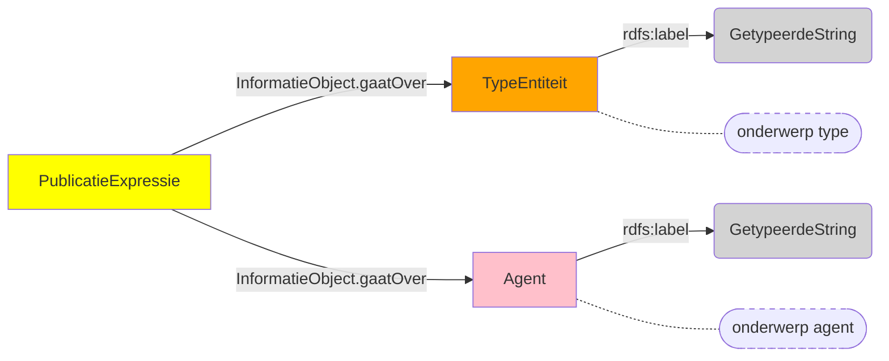

```mermaid
graph LR
124[TypeEntiteit]-->|rdfs:label|127(GetypeerdeString)
219[Agent]-->|rdfs:label|126(GetypeerdeString)
91[PublicatieExpressie]-->|InformatieObject.gaatOver|124[TypeEntiteit]
91[PublicatieExpressie]-->|InformatieObject.gaatOver|219[Agent]
124[TypeEntiteit]-.-124_s([onderwerp type])
219[Agent]-.-219_s([onderwerp agent])
style 124_s stroke-dasharray: 5
style 219_s stroke-dasharray: 5
style 124 fill:#ffa500
style 126 fill:#D3D3D3
style 127 fill:#D3D3D3
style 219 fill:#ffc0cb
style 91 fill:#ffff00
```
