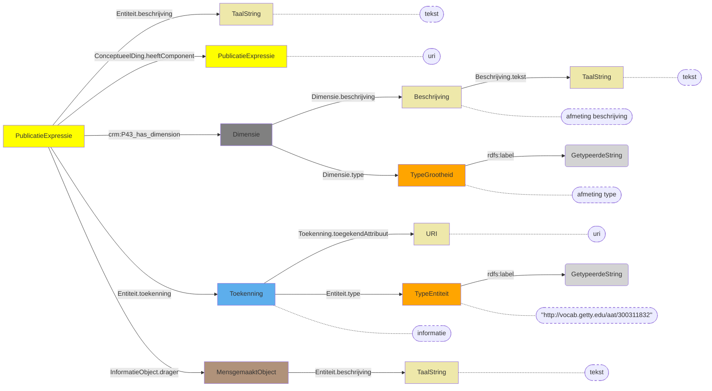

```mermaid
graph LR
103[Beschrijving]-->|Beschrijving.tekst|104(TaalString)
105[TypeGrootheid]-->|rdfs:label|106(GetypeerdeString)
107[Toekenning]-->|Toekenning.toegekendAttribuut|110(URI)
108[TypeEntiteit]-->|rdfs:label|109(GetypeerdeString)
22[MensgemaaktObject]-->|Entiteit.beschrijving|23(TaalString)
91[PublicatieExpressie]-->|Entiteit.beschrijving|94(TaalString)
102[Dimensie]-->|Dimensie.beschrijving|103[Beschrijving]
102[Dimensie]-->|Dimensie.type|105[TypeGrootheid]
107[Toekenning]-->|Entiteit.type|108[TypeEntiteit]
91[PublicatieExpressie]-->|ConceptueelDing.heeftComponent|92[PublicatieExpressie]
91[PublicatieExpressie]-->|crm:P43_has_dimension|102[Dimensie]
91[PublicatieExpressie]-->|Entiteit.toekenning|107[Toekenning]
91[PublicatieExpressie]-->|InformatieObject.drager|22[MensgemaaktObject]
103[Beschrijving]-.-103_s([afmeting beschrijving])
105[TypeGrootheid]-.-105_s([afmeting type])
104[TaalString]-.-104_s([tekst])
108[TypeEntiteit]-.-108_s([''http://vocab.getty.edu/aat/300311832''])
110[URI]-.-110_s([uri])
23[TaalString]-.-23_s([tekst])
92[PublicatieExpressie]-.-92_s([uri])
94[TaalString]-.-94_s([tekst])
107[Toekenning]-.-107_s([informatie])
style 103_s stroke-dasharray: 5
style 105_s stroke-dasharray: 5
style 104_s stroke-dasharray: 5
style 108_s stroke-dasharray: 5
style 110_s stroke-dasharray: 5
style 23_s stroke-dasharray: 5
style 92_s stroke-dasharray: 5
style 94_s stroke-dasharray: 5
style 107_s stroke-dasharray: 5
style 102 fill:#808080
style 103 fill:#EEE8AA
style 104 fill:#EEE8AA
style 105 fill:#ffa500
style 106 fill:#D3D3D3
style 107 fill:#5DAEEC
style 108 fill:#ffa500
style 109 fill:#D3D3D3
style 110 fill:#EEE8AA
style 22 fill:#B0927A
style 23 fill:#EEE8AA
style 91 fill:#ffff00
style 92 fill:#ffff00
style 94 fill:#EEE8AA
```
