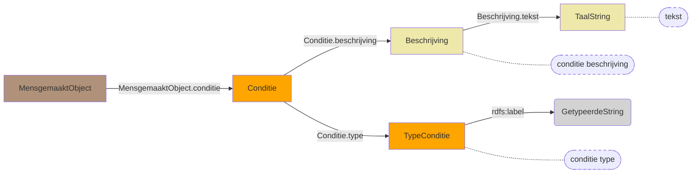

```mermaid
graph LR
68[Beschrijving]-->|Beschrijving.tekst|69(TaalString)
70[TypeConditie]-->|rdfs:label|71(GetypeerdeString)
22[MensgemaaktObject]-->|MensgemaaktObject.conditie|67[Conditie]
67[Conditie]-->|Conditie.beschrijving|68[Beschrijving]
67[Conditie]-->|Conditie.type|70[TypeConditie]
style 68_s stroke-dasharray: 5
style 70_s stroke-dasharray: 5
style 69_s stroke-dasharray: 5
68[Beschrijving]-.-68_s([conditie beschrijving])
70[TypeConditie]-.-70_s([conditie type])
69[TaalString]-.-69_s([tekst])
style 22 fill:#B0927A
style 67 fill:#ffa500
style 68 fill:#EEE8AA
style 69 fill:#EEE8AA
style 70 fill:#ffa500
style 71 fill:#D3D3D3
```
