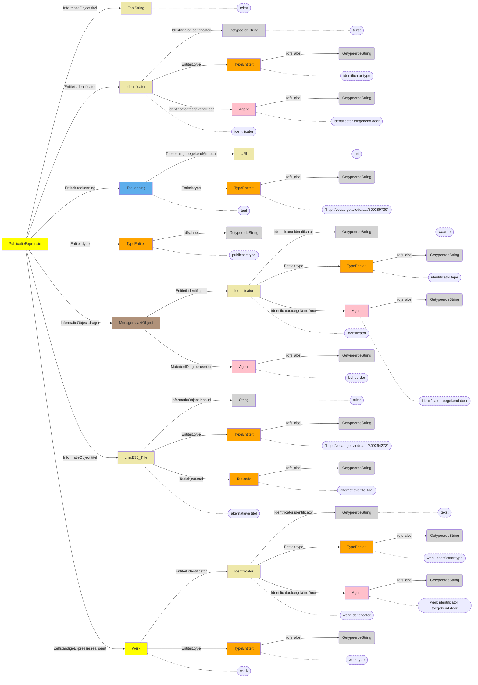

```mermaid
graph LR
111[Toekenning]-->|Toekenning.toegekendAttribuut|114(URI)
112[TypeEntiteit]-->|rdfs:label|113(GetypeerdeString)
115[TypeEntiteit]-->|rdfs:label|116(GetypeerdeString)
117[crm:E35_Title]-->|InformatieObject.inhoud|120(String)
118[TypeEntiteit]-->|rdfs:label|119(GetypeerdeString)
121[Taalcode]-->|rdfs:label|122(GetypeerdeString)
161[Identificator]-->|Identificator.identificator|164(GetypeerdeString)
162[TypeEntiteit]-->|rdfs:label|163(GetypeerdeString)
165[Agent]-->|rdfs:label|193(GetypeerdeString)
167[TypeEntiteit]-->|rdfs:label|168(GetypeerdeString)
24[Identificator]-->|Identificator.identificator|27(GetypeerdeString)
25[TypeEntiteit]-->|rdfs:label|26(GetypeerdeString)
28[Agent]-->|rdfs:label|29(GetypeerdeString)
38[Agent]-->|rdfs:label|39(GetypeerdeString)
91[PublicatieExpressie]-->|InformatieObject.titel|136(TaalString)
95[Identificator]-->|Identificator.identificator|98(GetypeerdeString)
96[TypeEntiteit]-->|rdfs:label|97(GetypeerdeString)
99[Agent]-->|rdfs:label|100(GetypeerdeString)
111[Toekenning]-->|Entiteit.type|112[TypeEntiteit]
117[crm:E35_Title]-->|Entiteit.type|118[TypeEntiteit]
117[crm:E35_Title]-->|Taalobject.taal|121[Taalcode]
160[Werk]-->|Entiteit.identificator|161[Identificator]
160[Werk]-->|Entiteit.type|167[TypeEntiteit]
161[Identificator]-->|Entiteit.type|162[TypeEntiteit]
161[Identificator]-->|Identificator.toegekendDoor|165[Agent]
22[MensgemaaktObject]-->|Entiteit.identificator|24[Identificator]
22[MensgemaaktObject]-->|MaterieelDing.beheerder|38[Agent]
24[Identificator]-->|Entiteit.type|25[TypeEntiteit]
24[Identificator]-->|Identificator.toegekendDoor|28[Agent]
91[PublicatieExpressie]-->|Entiteit.identificator|95[Identificator]
91[PublicatieExpressie]-->|Entiteit.toekenning|111[Toekenning]
91[PublicatieExpressie]-->|Entiteit.type|115[TypeEntiteit]
91[PublicatieExpressie]-->|InformatieObject.drager|22[MensgemaaktObject]
91[PublicatieExpressie]-->|InformatieObject.titel|117[crm:E35_Title]
91[PublicatieExpressie]-->|ZelfstandigeExpressie.realiseert|160[Werk]
95[Identificator]-->|Entiteit.type|96[TypeEntiteit]
95[Identificator]-->|Identificator.toegekendDoor|99[Agent]
112[TypeEntiteit]-.-112_s([''http://vocab.getty.edu/aat/300389739''])
114[URI]-.-114_s([uri])
118[TypeEntiteit]-.-118_s([''http://vocab.getty.edu/aat/300264273''])
120[String]-.-120_s([tekst])
121[Taalcode]-.-121_s([alternatieve titel taal])
161[Identificator]-.-161_s([werk identificator])
167[TypeEntiteit]-.-167_s([werk type])
162[TypeEntiteit]-.-162_s([werk identificator type])
164[GetypeerdeString]-.-164_s([tekst])
165[Agent]-.-165_s([werk identificator toegekend door])
24[Identificator]-.-24_s([identificator])
38[Agent]-.-38_s([beheerder])
25[TypeEntiteit]-.-25_s([identificator type])
27[GetypeerdeString]-.-27_s([waarde])
28[Agent]-.-28_s([identificator toegekend door])
95[Identificator]-.-95_s([identificator])
111[Toekenning]-.-111_s([taal])
115[TypeEntiteit]-.-115_s([publicatie type])
117[crm:E35_Title]-.-117_s([alternatieve titel])
136[TaalString]-.-136_s([tekst])
160[Werk]-.-160_s([werk])
96[TypeEntiteit]-.-96_s([identificator type])
98[GetypeerdeString]-.-98_s([tekst])
99[Agent]-.-99_s([identificator toegekend door])
style 112_s stroke-dasharray: 5
style 114_s stroke-dasharray: 5
style 118_s stroke-dasharray: 5
style 120_s stroke-dasharray: 5
style 121_s stroke-dasharray: 5
style 161_s stroke-dasharray: 5
style 167_s stroke-dasharray: 5
style 162_s stroke-dasharray: 5
style 164_s stroke-dasharray: 5
style 165_s stroke-dasharray: 5
style 24_s stroke-dasharray: 5
style 38_s stroke-dasharray: 5
style 25_s stroke-dasharray: 5
style 27_s stroke-dasharray: 5
style 28_s stroke-dasharray: 5
style 95_s stroke-dasharray: 5
style 111_s stroke-dasharray: 5
style 115_s stroke-dasharray: 5
style 117_s stroke-dasharray: 5
style 136_s stroke-dasharray: 5
style 160_s stroke-dasharray: 5
style 96_s stroke-dasharray: 5
style 98_s stroke-dasharray: 5
style 99_s stroke-dasharray: 5
style 100 fill:#D3D3D3
style 111 fill:#5DAEEC
style 112 fill:#ffa500
style 113 fill:#D3D3D3
style 114 fill:#EEE8AA
style 115 fill:#ffa500
style 116 fill:#D3D3D3
style 117 fill:#EEE8AA
style 118 fill:#ffa500
style 119 fill:#D3D3D3
style 120 fill:#D3D3D3
style 121 fill:#ffa500
style 122 fill:#D3D3D3
style 136 fill:#EEE8AA
style 160 fill:#ffff00
style 161 fill:#EEE8AA
style 162 fill:#ffa500
style 163 fill:#D3D3D3
style 164 fill:#D3D3D3
style 165 fill:#ffc0cb
style 167 fill:#ffa500
style 168 fill:#D3D3D3
style 193 fill:#D3D3D3
style 22 fill:#B0927A
style 24 fill:#EEE8AA
style 25 fill:#ffa500
style 26 fill:#D3D3D3
style 27 fill:#D3D3D3
style 28 fill:#ffc0cb
style 29 fill:#D3D3D3
style 38 fill:#ffc0cb
style 39 fill:#D3D3D3
style 91 fill:#ffff00
style 95 fill:#EEE8AA
style 96 fill:#ffa500
style 97 fill:#D3D3D3
style 98 fill:#D3D3D3
style 99 fill:#ffc0cb
```
