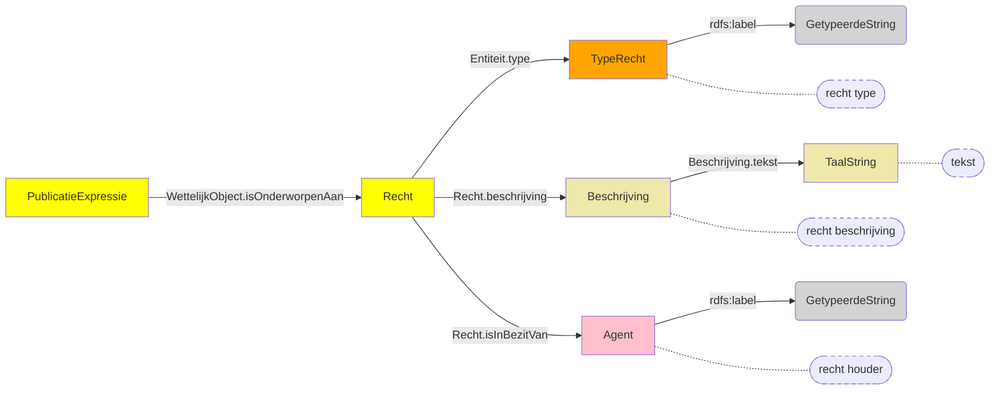

```mermaid
graph LR
146[Beschrijving]-->|Beschrijving.tekst|147(TaalString)
148[Agent]-->|rdfs:label|149(GetypeerdeString)
150[TypeRecht]-->|rdfs:label|151(GetypeerdeString)
145[Recht]-->|Entiteit.type|150[TypeRecht]
145[Recht]-->|Recht.beschrijving|146[Beschrijving]
145[Recht]-->|Recht.isInBezitVan|148[Agent]
91[PublicatieExpressie]-->|WettelijkObject.isOnderworpenAan|145[Recht]
150[TypeRecht]-.-150_s([recht type])
146[Beschrijving]-.-146_s([recht beschrijving])
148[Agent]-.-148_s([recht houder])
147[TaalString]-.-147_s([tekst])
style 150_s stroke-dasharray: 5
style 146_s stroke-dasharray: 5
style 148_s stroke-dasharray: 5
style 147_s stroke-dasharray: 5
style 145 fill:#ffff00
style 146 fill:#EEE8AA
style 147 fill:#EEE8AA
style 148 fill:#ffc0cb
style 149 fill:#D3D3D3
style 150 fill:#ffa500
style 151 fill:#D3D3D3
style 91 fill:#ffff00
```
