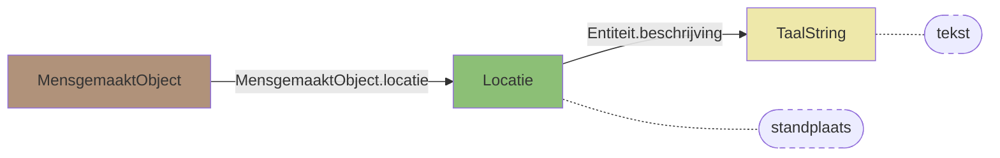

```mermaid
graph LR
22[MensgemaaktObject]-->|MensgemaaktObject.locatie|79(Locatie)
79[Locatie]-->|Entiteit.beschrijving|80(TaalString)
style 79_s stroke-dasharray: 5
style 80_s stroke-dasharray: 5
79[Locatie]-.-79_s([standplaats])
80[TaalString]-.-80_s([tekst])
style 22 fill:#B0927A
style 79 fill:#8CBF76
style 80 fill:#EEE8AA
```
