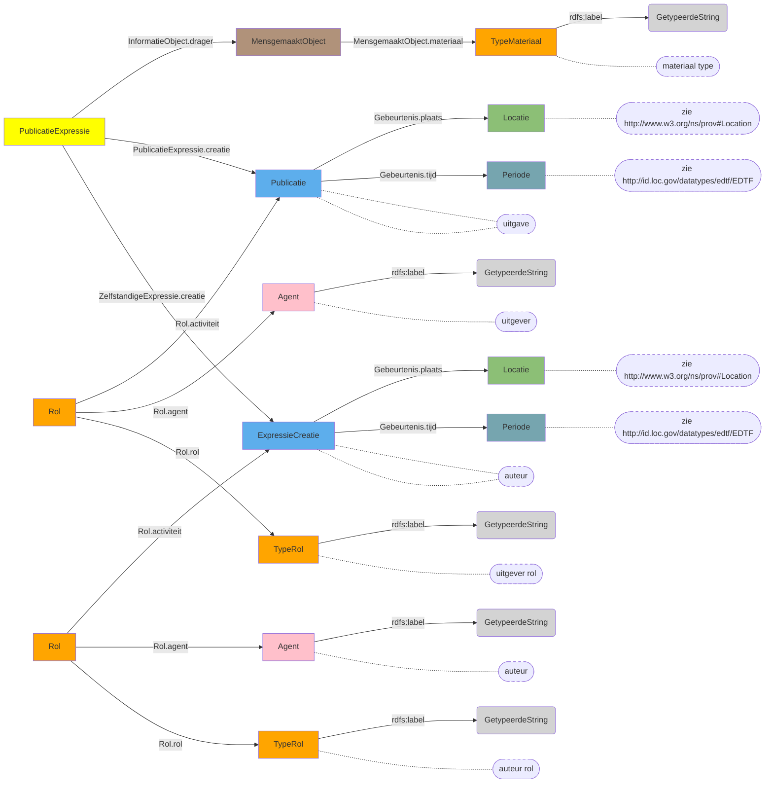

```mermaid
graph LR
138[Publicatie]-->|Gebeurtenis.plaats|139(Locatie)
138[Publicatie]-->|Gebeurtenis.tijd|140(Periode)
141[Agent]-->|rdfs:label|142(GetypeerdeString)
143[TypeRol]-->|rdfs:label|144(GetypeerdeString)
152[ExpressieCreatie]-->|Gebeurtenis.plaats|153(Locatie)
152[ExpressieCreatie]-->|Gebeurtenis.tijd|154(Periode)
156[Agent]-->|rdfs:label|157(GetypeerdeString)
158[TypeRol]-->|rdfs:label|159(GetypeerdeString)
81[TypeMateriaal]-->|rdfs:label|82(GetypeerdeString)
137[Rol]-->|Rol.activiteit|138[Publicatie]
137[Rol]-->|Rol.agent|141[Agent]
137[Rol]-->|Rol.rol|143[TypeRol]
155[Rol]-->|Rol.activiteit|152[ExpressieCreatie]
155[Rol]-->|Rol.agent|156[Agent]
155[Rol]-->|Rol.rol|158[TypeRol]
22[MensgemaaktObject]-->|MensgemaaktObject.materiaal|81[TypeMateriaal]
91[PublicatieExpressie]-->|InformatieObject.drager|22[MensgemaaktObject]
91[PublicatieExpressie]-->|PublicatieExpressie.creatie|138[Publicatie]
91[PublicatieExpressie]-->|ZelfstandigeExpressie.creatie|152[ExpressieCreatie]
138[Publicatie]-.-138_s([uitgave])
141[Agent]-.-141_s([uitgever])
143[TypeRol]-.-143_s([uitgever rol])
139[Locatie]-.-139_s([zie http://www.w3.org/ns/prov#Location])
140[Periode]-.-140_s([zie http://id.loc.gov/datatypes/edtf/EDTF])
153[Locatie]-.-153_s([zie http://www.w3.org/ns/prov#Location])
154[Periode]-.-154_s([zie http://id.loc.gov/datatypes/edtf/EDTF])
152[ExpressieCreatie]-.-152_s([auteur])
156[Agent]-.-156_s([auteur])
158[TypeRol]-.-158_s([auteur rol])
81[TypeMateriaal]-.-81_s([materiaal type])
138[Publicatie]-.-138_s([uitgave])
152[ExpressieCreatie]-.-152_s([auteur])
style 138_s stroke-dasharray: 5
style 141_s stroke-dasharray: 5
style 143_s stroke-dasharray: 5
style 139_s stroke-dasharray: 5
style 140_s stroke-dasharray: 5
style 153_s stroke-dasharray: 5
style 154_s stroke-dasharray: 5
style 152_s stroke-dasharray: 5
style 156_s stroke-dasharray: 5
style 158_s stroke-dasharray: 5
style 81_s stroke-dasharray: 5
style 138_s stroke-dasharray: 5
style 152_s stroke-dasharray: 5
style 137 fill:#ffa500
style 138 fill:#5DAEEC
style 139 fill:#8CBF76
style 140 fill:#76A5AF
style 141 fill:#ffc0cb
style 142 fill:#D3D3D3
style 143 fill:#ffa500
style 144 fill:#D3D3D3
style 152 fill:#5DAEEC
style 153 fill:#8CBF76
style 154 fill:#76A5AF
style 155 fill:#ffa500
style 156 fill:#ffc0cb
style 157 fill:#D3D3D3
style 158 fill:#ffa500
style 159 fill:#D3D3D3
style 22 fill:#B0927A
style 81 fill:#ffa500
style 82 fill:#D3D3D3
style 91 fill:#ffff00
```
