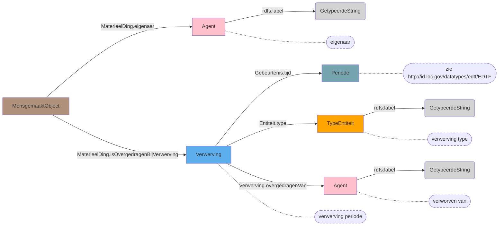

```mermaid
graph LR
48[Agent]-->|rdfs:label|49(GetypeerdeString)
50[Verwerving]-->|Gebeurtenis.tijd|53(Periode)
51[TypeEntiteit]-->|rdfs:label|52(GetypeerdeString)
54[Agent]-->|rdfs:label|55(GetypeerdeString)
22[MensgemaaktObject]-->|MaterieelDing.eigenaar|48[Agent]
22[MensgemaaktObject]-->|MaterieelDing.isOvergedragenBijVerwerving|50[Verwerving]
50[Verwerving]-->|Entiteit.type|51[TypeEntiteit]
50[Verwerving]-->|Verwerving.overgedragenVan|54[Agent]
48[Agent]-.-48_s([eigenaar])
50[Verwerving]-.-50_s([verwerving periode])
51[TypeEntiteit]-.-51_s([verwerving type])
53[Periode]-.-53_s([zie http://id.loc.gov/datatypes/edtf/EDTF])
54[Agent]-.-54_s([verworven van])
style 48_s stroke-dasharray: 5
style 50_s stroke-dasharray: 5
style 51_s stroke-dasharray: 5
style 53_s stroke-dasharray: 5
style 54_s stroke-dasharray: 5
style 22 fill:#B0927A
style 48 fill:#ffc0cb
style 49 fill:#D3D3D3
style 50 fill:#5DAEEC
style 51 fill:#ffa500
style 52 fill:#D3D3D3
style 53 fill:#76A5AF
style 54 fill:#ffc0cb
style 55 fill:#D3D3D3
```
