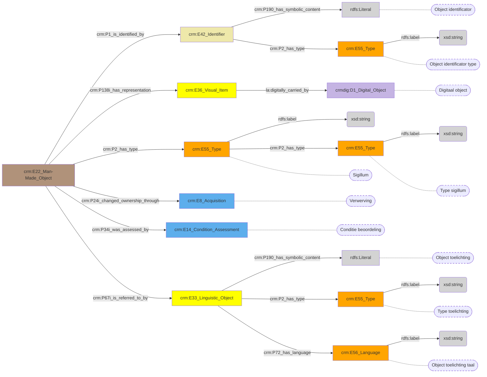

```mermaid
graph LR
31fafa48-df80-11ed-9064-00163e71351b["crm:E42_Identifier"]-->|"crm:P190_has_symbolic_content"|31faff2a-df80-11ed-9064-00163e71351b(rdfs:Literal)
31fb00ec-df80-11ed-9064-00163e71351b["crm:E55_Type"]-->|"rdfs:label"|31fb051a-df80-11ed-9064-00163e71351b(xsd:string)
35eb661e-ee5e-11ed-a1e6-00163e71351b["crm:E33_Linguistic_Object"]-->|"crm:P190_has_symbolic_content"|35eb71cc-ee5e-11ed-a1e6-00163e71351b(rdfs:Literal)
35eb6d76-ee5e-11ed-a1e6-00163e71351b["crm:E55_Type"]-->|"rdfs:label"|35eb7578-ee5e-11ed-a1e6-00163e71351b(xsd:string)
35eb6fce-ee5e-11ed-a1e6-00163e71351b["crm:E56_Language"]-->|"rdfs:label"|35eb73ac-ee5e-11ed-a1e6-00163e71351b(xsd:string)
5f7d3f52-62b7-11ee-bc5c-00163e71351b["crm:E55_Type"]-->|"rdfs:label"|5f7d466e-62b7-11ee-bc5c-00163e71351b(xsd:string)
5f7d44a2-62b7-11ee-bc5c-00163e71351b["crm:E55_Type"]-->|"rdfs:label"|5f7d47e0-62b7-11ee-bc5c-00163e71351b(xsd:string)
099f196c-df80-11ed-9232-00163e71351b["crm:E22_Man-Made_Object"]-->|"crm:P1_is_identified_by"|31fafa48-df80-11ed-9064-00163e71351b["crm:E42_Identifier"]
099f196c-df80-11ed-9232-00163e71351b["crm:E22_Man-Made_Object"]-->|"crm:P138i_has_representation"|643c66b8-df80-11ed-9655-00163e71351b["crm:E36_Visual_Item"]
099f196c-df80-11ed-9232-00163e71351b["crm:E22_Man-Made_Object"]-->|"crm:P2_has_type"|5f7d3f52-62b7-11ee-bc5c-00163e71351b["crm:E55_Type"]
099f196c-df80-11ed-9232-00163e71351b["crm:E22_Man-Made_Object"]-->|"crm:P24i_changed_ownership_through"|afd18e06-62c4-11ee-a9ac-00163e71351b["crm:E8_Acquisition"]
099f196c-df80-11ed-9232-00163e71351b["crm:E22_Man-Made_Object"]-->|"crm:P34i_was_assessed_by"|d0818f0c-62c4-11ee-b0c4-00163e71351b["crm:E14_Condition_Assessment"]
099f196c-df80-11ed-9232-00163e71351b["crm:E22_Man-Made_Object"]-->|"crm:P67i_is_referred_to_by"|35eb661e-ee5e-11ed-a1e6-00163e71351b["crm:E33_Linguistic_Object"]
31fafa48-df80-11ed-9064-00163e71351b["crm:E42_Identifier"]-->|"crm:P2_has_type"|31fb00ec-df80-11ed-9064-00163e71351b["crm:E55_Type"]
35eb661e-ee5e-11ed-a1e6-00163e71351b["crm:E33_Linguistic_Object"]-->|"crm:P2_has_type"|35eb6d76-ee5e-11ed-a1e6-00163e71351b["crm:E55_Type"]
35eb661e-ee5e-11ed-a1e6-00163e71351b["crm:E33_Linguistic_Object"]-->|"crm:P72_has_language"|35eb6fce-ee5e-11ed-a1e6-00163e71351b["crm:E56_Language"]
5f7d3f52-62b7-11ee-bc5c-00163e71351b["crm:E55_Type"]-->|"crm:P2_has_type"|5f7d44a2-62b7-11ee-bc5c-00163e71351b["crm:E55_Type"]
643c66b8-df80-11ed-9655-00163e71351b["crm:E36_Visual_Item"]-->|"la:digitally_carried_by"|643c6a00-df80-11ed-9655-00163e71351b["crmdig:D1_Digital_Object"]
style 5f7d3f52-62b7-11ee-bc5c-00163e71351b_s stroke-dasharray: 5
style afd18e06-62c4-11ee-a9ac-00163e71351b_s stroke-dasharray: 5
style d0818f0c-62c4-11ee-b0c4-00163e71351b_s stroke-dasharray: 5
style 31faff2a-df80-11ed-9064-00163e71351b_s stroke-dasharray: 5
style 31fb00ec-df80-11ed-9064-00163e71351b_s stroke-dasharray: 5
style 35eb71cc-ee5e-11ed-a1e6-00163e71351b_s stroke-dasharray: 5
style 35eb6d76-ee5e-11ed-a1e6-00163e71351b_s stroke-dasharray: 5
style 35eb6fce-ee5e-11ed-a1e6-00163e71351b_s stroke-dasharray: 5
style 5f7d44a2-62b7-11ee-bc5c-00163e71351b_s stroke-dasharray: 5
style 643c6a00-df80-11ed-9655-00163e71351b_s stroke-dasharray: 5
5f7d3f52-62b7-11ee-bc5c-00163e71351b["crm:E55_Type"]-.-5f7d3f52-62b7-11ee-bc5c-00163e71351b_s(["Sigillum"])
afd18e06-62c4-11ee-a9ac-00163e71351b["crm:E8_Acquisition"]-.-afd18e06-62c4-11ee-a9ac-00163e71351b_s(["Verwerving"])
d0818f0c-62c4-11ee-b0c4-00163e71351b["crm:E14_Condition_Assessment"]-.-d0818f0c-62c4-11ee-b0c4-00163e71351b_s(["Conditie beoordeling"])
31faff2a-df80-11ed-9064-00163e71351b["rdfs:Literal"]-.-31faff2a-df80-11ed-9064-00163e71351b_s(["Object identificator"])
31fb00ec-df80-11ed-9064-00163e71351b["crm:E55_Type"]-.-31fb00ec-df80-11ed-9064-00163e71351b_s(["Object identificator type"])
35eb71cc-ee5e-11ed-a1e6-00163e71351b["rdfs:Literal"]-.-35eb71cc-ee5e-11ed-a1e6-00163e71351b_s(["Object toelichting"])
35eb6d76-ee5e-11ed-a1e6-00163e71351b["crm:E55_Type"]-.-35eb6d76-ee5e-11ed-a1e6-00163e71351b_s(["Type "toelichting""])
35eb6fce-ee5e-11ed-a1e6-00163e71351b["crm:E56_Language"]-.-35eb6fce-ee5e-11ed-a1e6-00163e71351b_s(["Object toelichting taal"])
5f7d44a2-62b7-11ee-bc5c-00163e71351b["crm:E55_Type"]-.-5f7d44a2-62b7-11ee-bc5c-00163e71351b_s(["Type "sigillum""])
643c6a00-df80-11ed-9655-00163e71351b["crmdig:D1_Digital_Object"]-.-643c6a00-df80-11ed-9655-00163e71351b_s(["Digitaal object"])
style 099f196c-df80-11ed-9232-00163e71351b fill:#B0927A
style 31fafa48-df80-11ed-9064-00163e71351b fill:#EEE8AA
style 31faff2a-df80-11ed-9064-00163e71351b fill:#D3D3D3
style 31fb00ec-df80-11ed-9064-00163e71351b fill:#ffa500
style 31fb051a-df80-11ed-9064-00163e71351b fill:#D3D3D3
style 35eb661e-ee5e-11ed-a1e6-00163e71351b fill:#ffff00
style 35eb6d76-ee5e-11ed-a1e6-00163e71351b fill:#ffa500
style 35eb6fce-ee5e-11ed-a1e6-00163e71351b fill:#ffa500
style 35eb71cc-ee5e-11ed-a1e6-00163e71351b fill:#D3D3D3
style 35eb73ac-ee5e-11ed-a1e6-00163e71351b fill:#D3D3D3
style 35eb7578-ee5e-11ed-a1e6-00163e71351b fill:#D3D3D3
style 5f7d3f52-62b7-11ee-bc5c-00163e71351b fill:#ffa500
style 5f7d44a2-62b7-11ee-bc5c-00163e71351b fill:#ffa500
style 5f7d466e-62b7-11ee-bc5c-00163e71351b fill:#D3D3D3
style 5f7d47e0-62b7-11ee-bc5c-00163e71351b fill:#D3D3D3
style 643c66b8-df80-11ed-9655-00163e71351b fill:#ffff00
style 643c6a00-df80-11ed-9655-00163e71351b fill:#C5B4E3
style afd18e06-62c4-11ee-a9ac-00163e71351b fill:#5DAEEC
style d0818f0c-62c4-11ee-b0c4-00163e71351b fill:#5DAEEC
```
