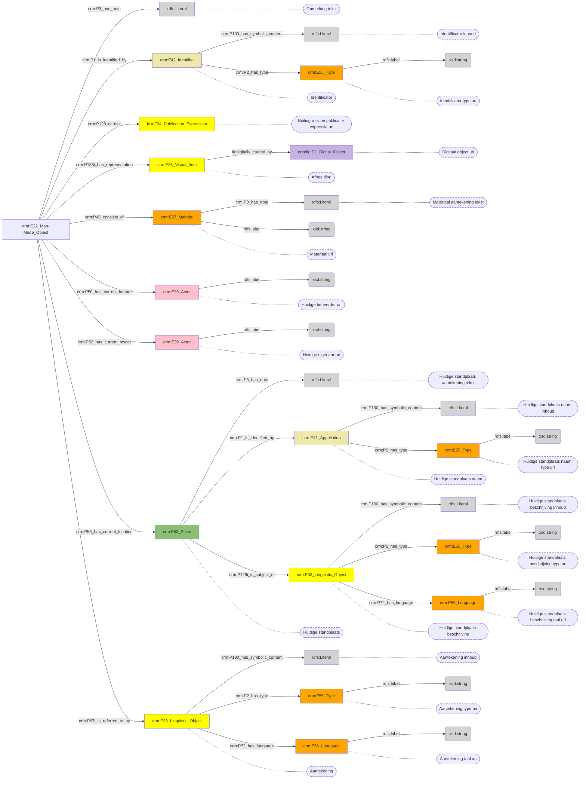

```mermaid
graph LR
099f196c-df80-11ed-9232-00163e71351b["crm:E22_Man-Made_Object"]-->|"crm:P3_has_note"|3725e56e-df80-11ed-9655-00163e71351b(rdfs:Literal)
0c435b50-4bbf-11ee-a9ac-00163e71351b["crm:E41_Appellation"]-->|"crm:P190_has_symbolic_content"|0c435f60-4bbf-11ee-a9ac-00163e71351b(rdfs:Literal)
0c4360a0-4bbf-11ee-a9ac-00163e71351b["crm:E55_Type"]-->|"rdfs:label"|0c43619a-4bbf-11ee-a9ac-00163e71351b(xsd:string)
31fafa48-df80-11ed-9064-00163e71351b["crm:E42_Identifier"]-->|"crm:P190_has_symbolic_content"|31faff2a-df80-11ed-9064-00163e71351b(rdfs:Literal)
31fb00ec-df80-11ed-9064-00163e71351b["crm:E55_Type"]-->|"rdfs:label"|31fb051a-df80-11ed-9064-00163e71351b(xsd:string)
35eb661e-ee5e-11ed-a1e6-00163e71351b["crm:E33_Linguistic_Object"]-->|"crm:P190_has_symbolic_content"|35eb71cc-ee5e-11ed-a1e6-00163e71351b(rdfs:Literal)
35eb6d76-ee5e-11ed-a1e6-00163e71351b["crm:E55_Type"]-->|"rdfs:label"|35eb7578-ee5e-11ed-a1e6-00163e71351b(xsd:string)
35eb6fce-ee5e-11ed-a1e6-00163e71351b["crm:E56_Language"]-->|"rdfs:label"|35eb73ac-ee5e-11ed-a1e6-00163e71351b(xsd:string)
3d7e5e70-ed7f-11ed-9064-00163e71351b["crm:E53_Place"]-->|"crm:P3_has_note"|3d7e632a-ed7f-11ed-9064-00163e71351b(rdfs:Literal)
4cf1af0e-df80-11ed-9655-00163e71351b["crm:E39_Actor"]-->|"rdfs:label"|4cf1b3a0-df80-11ed-9655-00163e71351b(xsd:string)
512ffd00-df80-11ed-9064-00163e71351b["crm:E39_Actor"]-->|"rdfs:label"|513001c4-df80-11ed-9064-00163e71351b(xsd:string)
652f9800-4bbf-11ee-b0c4-00163e71351b["crm:E33_Linguistic_Object"]-->|"crm:P190_has_symbolic_content"|652f9b98-4bbf-11ee-b0c4-00163e71351b(rdfs:Literal)
652f9dc8-4bbf-11ee-b0c4-00163e71351b["crm:E55_Type"]-->|"rdfs:label"|652f9cce-4bbf-11ee-b0c4-00163e71351b(xsd:string)
652f9f9e-4bbf-11ee-b0c4-00163e71351b["crm:E56_Language"]-->|"rdfs:label"|652f9eb8-4bbf-11ee-b0c4-00163e71351b(xsd:string)
97ac7060-4bbe-11ee-a9ac-00163e71351b["crm:E57_Material"]-->|"crm:P3_has_note"|97ac7420-4bbe-11ee-a9ac-00163e71351b(rdfs:Literal)
97ac7060-4bbe-11ee-a9ac-00163e71351b["crm:E57_Material"]-->|"rdfs:label"|97ac7556-4bbe-11ee-a9ac-00163e71351b(xsd:string)
099f196c-df80-11ed-9232-00163e71351b["crm:E22_Man-Made_Object"]-->|"crm:P1_is_identified_by"|31fafa48-df80-11ed-9064-00163e71351b["crm:E42_Identifier"]
099f196c-df80-11ed-9232-00163e71351b["crm:E22_Man-Made_Object"]-->|"crm:P128_carries"|0e6665b8-e435-11ed-9655-00163e71351b["frbr:F24_Publication_Expression"]
099f196c-df80-11ed-9232-00163e71351b["crm:E22_Man-Made_Object"]-->|"crm:P138i_has_representation"|643c66b8-df80-11ed-9655-00163e71351b["crm:E36_Visual_Item"]
099f196c-df80-11ed-9232-00163e71351b["crm:E22_Man-Made_Object"]-->|"crm:P45_consists_of"|97ac7060-4bbe-11ee-a9ac-00163e71351b["crm:E57_Material"]
099f196c-df80-11ed-9232-00163e71351b["crm:E22_Man-Made_Object"]-->|"crm:P50_has_current_keeper"|4cf1af0e-df80-11ed-9655-00163e71351b["crm:E39_Actor"]
099f196c-df80-11ed-9232-00163e71351b["crm:E22_Man-Made_Object"]-->|"crm:P52_has_current_owner"|512ffd00-df80-11ed-9064-00163e71351b["crm:E39_Actor"]
099f196c-df80-11ed-9232-00163e71351b["crm:E22_Man-Made_Object"]-->|"crm:P55_has_current_location"|3d7e5e70-ed7f-11ed-9064-00163e71351b["crm:E53_Place"]
099f196c-df80-11ed-9232-00163e71351b["crm:E22_Man-Made_Object"]-->|"crm:P67i_is_referred_to_by"|35eb661e-ee5e-11ed-a1e6-00163e71351b["crm:E33_Linguistic_Object"]
0c435b50-4bbf-11ee-a9ac-00163e71351b["crm:E41_Appellation"]-->|"crm:P2_has_type"|0c4360a0-4bbf-11ee-a9ac-00163e71351b["crm:E55_Type"]
31fafa48-df80-11ed-9064-00163e71351b["crm:E42_Identifier"]-->|"crm:P2_has_type"|31fb00ec-df80-11ed-9064-00163e71351b["crm:E55_Type"]
35eb661e-ee5e-11ed-a1e6-00163e71351b["crm:E33_Linguistic_Object"]-->|"crm:P2_has_type"|35eb6d76-ee5e-11ed-a1e6-00163e71351b["crm:E55_Type"]
35eb661e-ee5e-11ed-a1e6-00163e71351b["crm:E33_Linguistic_Object"]-->|"crm:P72_has_language"|35eb6fce-ee5e-11ed-a1e6-00163e71351b["crm:E56_Language"]
3d7e5e70-ed7f-11ed-9064-00163e71351b["crm:E53_Place"]-->|"crm:P1_is_identified_by"|0c435b50-4bbf-11ee-a9ac-00163e71351b["crm:E41_Appellation"]
3d7e5e70-ed7f-11ed-9064-00163e71351b["crm:E53_Place"]-->|"crm:P129i_is_subject_of"|652f9800-4bbf-11ee-b0c4-00163e71351b["crm:E33_Linguistic_Object"]
643c66b8-df80-11ed-9655-00163e71351b["crm:E36_Visual_Item"]-->|"la:digitally_carried_by"|643c6a00-df80-11ed-9655-00163e71351b["crmdig:D1_Digital_Object"]
652f9800-4bbf-11ee-b0c4-00163e71351b["crm:E33_Linguistic_Object"]-->|"crm:P2_has_type"|652f9dc8-4bbf-11ee-b0c4-00163e71351b["crm:E55_Type"]
652f9800-4bbf-11ee-b0c4-00163e71351b["crm:E33_Linguistic_Object"]-->|"crm:P72_has_language"|652f9f9e-4bbf-11ee-b0c4-00163e71351b["crm:E56_Language"]
style 31fafa48-df80-11ed-9064-00163e71351b_s stroke-dasharray: 5
style 0e6665b8-e435-11ed-9655-00163e71351b_s stroke-dasharray: 5
style 643c66b8-df80-11ed-9655-00163e71351b_s stroke-dasharray: 5
style 3725e56e-df80-11ed-9655-00163e71351b_s stroke-dasharray: 5
style 97ac7060-4bbe-11ee-a9ac-00163e71351b_s stroke-dasharray: 5
style 4cf1af0e-df80-11ed-9655-00163e71351b_s stroke-dasharray: 5
style 512ffd00-df80-11ed-9064-00163e71351b_s stroke-dasharray: 5
style 3d7e5e70-ed7f-11ed-9064-00163e71351b_s stroke-dasharray: 5
style 35eb661e-ee5e-11ed-a1e6-00163e71351b_s stroke-dasharray: 5
style 0c435f60-4bbf-11ee-a9ac-00163e71351b_s stroke-dasharray: 5
style 0c4360a0-4bbf-11ee-a9ac-00163e71351b_s stroke-dasharray: 5
style 31faff2a-df80-11ed-9064-00163e71351b_s stroke-dasharray: 5
style 31fb00ec-df80-11ed-9064-00163e71351b_s stroke-dasharray: 5
style 35eb71cc-ee5e-11ed-a1e6-00163e71351b_s stroke-dasharray: 5
style 35eb6d76-ee5e-11ed-a1e6-00163e71351b_s stroke-dasharray: 5
style 35eb6fce-ee5e-11ed-a1e6-00163e71351b_s stroke-dasharray: 5
style 0c435b50-4bbf-11ee-a9ac-00163e71351b_s stroke-dasharray: 5
style 652f9800-4bbf-11ee-b0c4-00163e71351b_s stroke-dasharray: 5
style 3d7e632a-ed7f-11ed-9064-00163e71351b_s stroke-dasharray: 5
style 643c6a00-df80-11ed-9655-00163e71351b_s stroke-dasharray: 5
style 652f9b98-4bbf-11ee-b0c4-00163e71351b_s stroke-dasharray: 5
style 652f9dc8-4bbf-11ee-b0c4-00163e71351b_s stroke-dasharray: 5
style 652f9f9e-4bbf-11ee-b0c4-00163e71351b_s stroke-dasharray: 5
style 97ac7420-4bbe-11ee-a9ac-00163e71351b_s stroke-dasharray: 5
31fafa48-df80-11ed-9064-00163e71351b["crm:E42_Identifier"]-.-31fafa48-df80-11ed-9064-00163e71351b_s(["Identificator"])
0e6665b8-e435-11ed-9655-00163e71351b["frbr:F24_Publication_Expression"]-.-0e6665b8-e435-11ed-9655-00163e71351b_s(["Bibliografische publicatie expressie uri"])
643c66b8-df80-11ed-9655-00163e71351b["crm:E36_Visual_Item"]-.-643c66b8-df80-11ed-9655-00163e71351b_s(["Afbeelding"])
3725e56e-df80-11ed-9655-00163e71351b["rdfs:Literal"]-.-3725e56e-df80-11ed-9655-00163e71351b_s(["Opmerking tekst"])
97ac7060-4bbe-11ee-a9ac-00163e71351b["crm:E57_Material"]-.-97ac7060-4bbe-11ee-a9ac-00163e71351b_s(["Materiaal uri"])
4cf1af0e-df80-11ed-9655-00163e71351b["crm:E39_Actor"]-.-4cf1af0e-df80-11ed-9655-00163e71351b_s(["Huidige beheerder uri"])
512ffd00-df80-11ed-9064-00163e71351b["crm:E39_Actor"]-.-512ffd00-df80-11ed-9064-00163e71351b_s(["Huidige eigenaar uri"])
3d7e5e70-ed7f-11ed-9064-00163e71351b["crm:E53_Place"]-.-3d7e5e70-ed7f-11ed-9064-00163e71351b_s(["Huidige standplaats"])
35eb661e-ee5e-11ed-a1e6-00163e71351b["crm:E33_Linguistic_Object"]-.-35eb661e-ee5e-11ed-a1e6-00163e71351b_s(["Aantekening"])
0c435f60-4bbf-11ee-a9ac-00163e71351b["rdfs:Literal"]-.-0c435f60-4bbf-11ee-a9ac-00163e71351b_s(["Huidige standplaats naam inhoud"])
0c4360a0-4bbf-11ee-a9ac-00163e71351b["crm:E55_Type"]-.-0c4360a0-4bbf-11ee-a9ac-00163e71351b_s(["Huidige standplaats naam type uri"])
31faff2a-df80-11ed-9064-00163e71351b["rdfs:Literal"]-.-31faff2a-df80-11ed-9064-00163e71351b_s(["Identificator inhoud"])
31fb00ec-df80-11ed-9064-00163e71351b["crm:E55_Type"]-.-31fb00ec-df80-11ed-9064-00163e71351b_s(["Identificator type uri"])
35eb71cc-ee5e-11ed-a1e6-00163e71351b["rdfs:Literal"]-.-35eb71cc-ee5e-11ed-a1e6-00163e71351b_s(["Aantekening inhoud"])
35eb6d76-ee5e-11ed-a1e6-00163e71351b["crm:E55_Type"]-.-35eb6d76-ee5e-11ed-a1e6-00163e71351b_s(["Aantekening type uri"])
35eb6fce-ee5e-11ed-a1e6-00163e71351b["crm:E56_Language"]-.-35eb6fce-ee5e-11ed-a1e6-00163e71351b_s(["Aantekening taal uri"])
0c435b50-4bbf-11ee-a9ac-00163e71351b["crm:E41_Appellation"]-.-0c435b50-4bbf-11ee-a9ac-00163e71351b_s(["Huidige standplaats naam"])
652f9800-4bbf-11ee-b0c4-00163e71351b["crm:E33_Linguistic_Object"]-.-652f9800-4bbf-11ee-b0c4-00163e71351b_s(["Huidige standplaats beschrijving"])
3d7e632a-ed7f-11ed-9064-00163e71351b["rdfs:Literal"]-.-3d7e632a-ed7f-11ed-9064-00163e71351b_s(["Huidige standplaats aantekening tekst"])
643c6a00-df80-11ed-9655-00163e71351b["crmdig:D1_Digital_Object"]-.-643c6a00-df80-11ed-9655-00163e71351b_s(["Digitaal object uri"])
652f9b98-4bbf-11ee-b0c4-00163e71351b["rdfs:Literal"]-.-652f9b98-4bbf-11ee-b0c4-00163e71351b_s(["Huidige standplaats beschrijving inhoud"])
652f9dc8-4bbf-11ee-b0c4-00163e71351b["crm:E55_Type"]-.-652f9dc8-4bbf-11ee-b0c4-00163e71351b_s(["Huidige standplaats beschrijving type uri"])
652f9f9e-4bbf-11ee-b0c4-00163e71351b["crm:E56_Language"]-.-652f9f9e-4bbf-11ee-b0c4-00163e71351b_s(["Huidige standplaats beschrijving taal uri"])
97ac7420-4bbe-11ee-a9ac-00163e71351b["rdfs:Literal"]-.-97ac7420-4bbe-11ee-a9ac-00163e71351b_s(["Materiaal aantekening tekst"])
style 0c435b50-4bbf-11ee-a9ac-00163e71351b fill:#EEE8AA
style 0c435f60-4bbf-11ee-a9ac-00163e71351b fill:#D3D3D3
style 0c4360a0-4bbf-11ee-a9ac-00163e71351b fill:#ffa500
style 0c43619a-4bbf-11ee-a9ac-00163e71351b fill:#D3D3D3
style 0e6665b8-e435-11ed-9655-00163e71351b fill:#ffff00
style 31fafa48-df80-11ed-9064-00163e71351b fill:#EEE8AA
style 31faff2a-df80-11ed-9064-00163e71351b fill:#D3D3D3
style 31fb00ec-df80-11ed-9064-00163e71351b fill:#ffa500
style 31fb051a-df80-11ed-9064-00163e71351b fill:#D3D3D3
style 35eb661e-ee5e-11ed-a1e6-00163e71351b fill:#ffff00
style 35eb6d76-ee5e-11ed-a1e6-00163e71351b fill:#ffa500
style 35eb6fce-ee5e-11ed-a1e6-00163e71351b fill:#ffa500
style 35eb71cc-ee5e-11ed-a1e6-00163e71351b fill:#D3D3D3
style 35eb73ac-ee5e-11ed-a1e6-00163e71351b fill:#D3D3D3
style 35eb7578-ee5e-11ed-a1e6-00163e71351b fill:#D3D3D3
style 3725e56e-df80-11ed-9655-00163e71351b fill:#D3D3D3
style 3d7e5e70-ed7f-11ed-9064-00163e71351b fill:#8CBF76
style 3d7e632a-ed7f-11ed-9064-00163e71351b fill:#D3D3D3
style 4cf1af0e-df80-11ed-9655-00163e71351b fill:#ffc0cb
style 4cf1b3a0-df80-11ed-9655-00163e71351b fill:#D3D3D3
style 512ffd00-df80-11ed-9064-00163e71351b fill:#ffc0cb
style 513001c4-df80-11ed-9064-00163e71351b fill:#D3D3D3
style 643c66b8-df80-11ed-9655-00163e71351b fill:#ffff00
style 643c6a00-df80-11ed-9655-00163e71351b fill:#C5B4E3
style 652f9800-4bbf-11ee-b0c4-00163e71351b fill:#ffff00
style 652f9b98-4bbf-11ee-b0c4-00163e71351b fill:#D3D3D3
style 652f9cce-4bbf-11ee-b0c4-00163e71351b fill:#D3D3D3
style 652f9dc8-4bbf-11ee-b0c4-00163e71351b fill:#ffa500
style 652f9eb8-4bbf-11ee-b0c4-00163e71351b fill:#D3D3D3
style 652f9f9e-4bbf-11ee-b0c4-00163e71351b fill:#ffa500
style 97ac7060-4bbe-11ee-a9ac-00163e71351b fill:#ffa500
style 97ac7420-4bbe-11ee-a9ac-00163e71351b fill:#D3D3D3
style 97ac7556-4bbe-11ee-a9ac-00163e71351b fill:#D3D3D3
```
