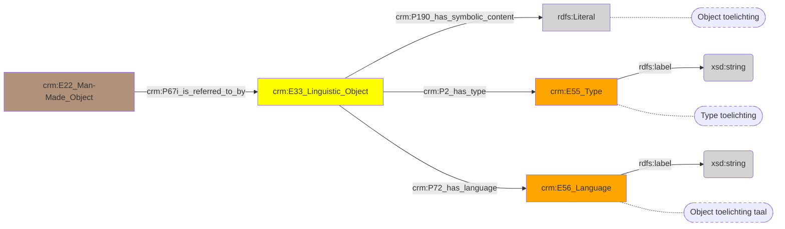

```mermaid
graph LR
35eb661e-ee5e-11ed-a1e6-00163e71351b["crm:E33_Linguistic_Object"]-->|"crm:P190_has_symbolic_content"|35eb71cc-ee5e-11ed-a1e6-00163e71351b(rdfs:Literal)
35eb6d76-ee5e-11ed-a1e6-00163e71351b["crm:E55_Type"]-->|"rdfs:label"|35eb7578-ee5e-11ed-a1e6-00163e71351b(xsd:string)
35eb6fce-ee5e-11ed-a1e6-00163e71351b["crm:E56_Language"]-->|"rdfs:label"|35eb73ac-ee5e-11ed-a1e6-00163e71351b(xsd:string)
099f196c-df80-11ed-9232-00163e71351b["crm:E22_Man-Made_Object"]-->|"crm:P67i_is_referred_to_by"|35eb661e-ee5e-11ed-a1e6-00163e71351b["crm:E33_Linguistic_Object"]
35eb661e-ee5e-11ed-a1e6-00163e71351b["crm:E33_Linguistic_Object"]-->|"crm:P2_has_type"|35eb6d76-ee5e-11ed-a1e6-00163e71351b["crm:E55_Type"]
35eb661e-ee5e-11ed-a1e6-00163e71351b["crm:E33_Linguistic_Object"]-->|"crm:P72_has_language"|35eb6fce-ee5e-11ed-a1e6-00163e71351b["crm:E56_Language"]
35eb71cc-ee5e-11ed-a1e6-00163e71351b["rdfs:Literal"]-.-35eb71cc-ee5e-11ed-a1e6-00163e71351b_s(["Object toelichting"])
35eb6d76-ee5e-11ed-a1e6-00163e71351b["crm:E55_Type"]-.-35eb6d76-ee5e-11ed-a1e6-00163e71351b_s(["Type "toelichting""])
35eb6fce-ee5e-11ed-a1e6-00163e71351b["crm:E56_Language"]-.-35eb6fce-ee5e-11ed-a1e6-00163e71351b_s(["Object toelichting taal"])
style 35eb71cc-ee5e-11ed-a1e6-00163e71351b_s stroke-dasharray: 5
style 35eb6d76-ee5e-11ed-a1e6-00163e71351b_s stroke-dasharray: 5
style 35eb6fce-ee5e-11ed-a1e6-00163e71351b_s stroke-dasharray: 5
style 099f196c-df80-11ed-9232-00163e71351b fill:#B0927A
style 35eb661e-ee5e-11ed-a1e6-00163e71351b fill:#ffff00
style 35eb6d76-ee5e-11ed-a1e6-00163e71351b fill:#ffa500
style 35eb6fce-ee5e-11ed-a1e6-00163e71351b fill:#ffa500
style 35eb71cc-ee5e-11ed-a1e6-00163e71351b fill:#D3D3D3
style 35eb73ac-ee5e-11ed-a1e6-00163e71351b fill:#D3D3D3
style 35eb7578-ee5e-11ed-a1e6-00163e71351b fill:#D3D3D3
```
