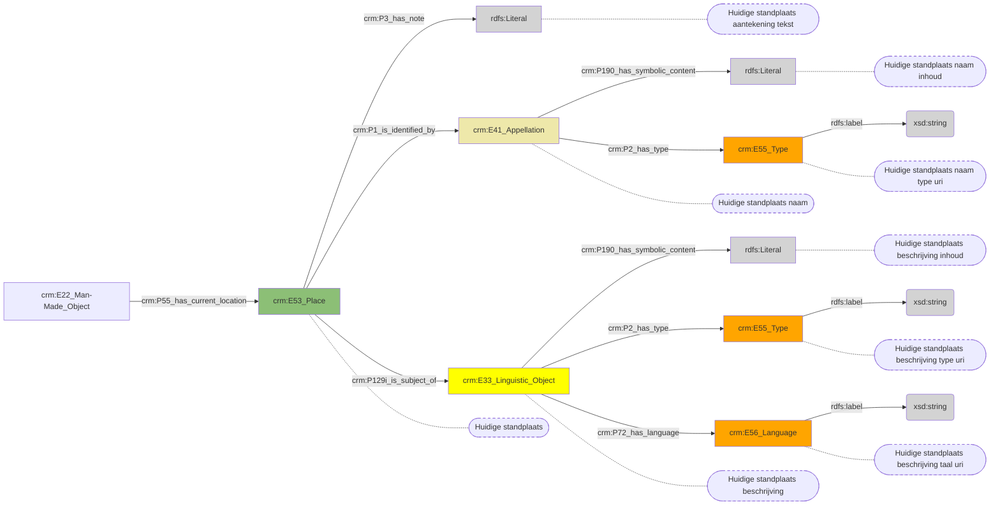

```mermaid
graph LR
0c435b50-4bbf-11ee-a9ac-00163e71351b["crm:E41_Appellation"]-->|"crm:P190_has_symbolic_content"|0c435f60-4bbf-11ee-a9ac-00163e71351b(rdfs:Literal)
0c4360a0-4bbf-11ee-a9ac-00163e71351b["crm:E55_Type"]-->|"rdfs:label"|0c43619a-4bbf-11ee-a9ac-00163e71351b(xsd:string)
3d7e5e70-ed7f-11ed-9064-00163e71351b["crm:E53_Place"]-->|"crm:P3_has_note"|3d7e632a-ed7f-11ed-9064-00163e71351b(rdfs:Literal)
652f9800-4bbf-11ee-b0c4-00163e71351b["crm:E33_Linguistic_Object"]-->|"crm:P190_has_symbolic_content"|652f9b98-4bbf-11ee-b0c4-00163e71351b(rdfs:Literal)
652f9dc8-4bbf-11ee-b0c4-00163e71351b["crm:E55_Type"]-->|"rdfs:label"|652f9cce-4bbf-11ee-b0c4-00163e71351b(xsd:string)
652f9f9e-4bbf-11ee-b0c4-00163e71351b["crm:E56_Language"]-->|"rdfs:label"|652f9eb8-4bbf-11ee-b0c4-00163e71351b(xsd:string)
099f196c-df80-11ed-9232-00163e71351b["crm:E22_Man-Made_Object"]-->|"crm:P55_has_current_location"|3d7e5e70-ed7f-11ed-9064-00163e71351b["crm:E53_Place"]
0c435b50-4bbf-11ee-a9ac-00163e71351b["crm:E41_Appellation"]-->|"crm:P2_has_type"|0c4360a0-4bbf-11ee-a9ac-00163e71351b["crm:E55_Type"]
3d7e5e70-ed7f-11ed-9064-00163e71351b["crm:E53_Place"]-->|"crm:P1_is_identified_by"|0c435b50-4bbf-11ee-a9ac-00163e71351b["crm:E41_Appellation"]
3d7e5e70-ed7f-11ed-9064-00163e71351b["crm:E53_Place"]-->|"crm:P129i_is_subject_of"|652f9800-4bbf-11ee-b0c4-00163e71351b["crm:E33_Linguistic_Object"]
652f9800-4bbf-11ee-b0c4-00163e71351b["crm:E33_Linguistic_Object"]-->|"crm:P2_has_type"|652f9dc8-4bbf-11ee-b0c4-00163e71351b["crm:E55_Type"]
652f9800-4bbf-11ee-b0c4-00163e71351b["crm:E33_Linguistic_Object"]-->|"crm:P72_has_language"|652f9f9e-4bbf-11ee-b0c4-00163e71351b["crm:E56_Language"]
3d7e5e70-ed7f-11ed-9064-00163e71351b["crm:E53_Place"]-.-3d7e5e70-ed7f-11ed-9064-00163e71351b_s(["Huidige standplaats"])
0c435f60-4bbf-11ee-a9ac-00163e71351b["rdfs:Literal"]-.-0c435f60-4bbf-11ee-a9ac-00163e71351b_s(["Huidige standplaats naam inhoud"])
0c4360a0-4bbf-11ee-a9ac-00163e71351b["crm:E55_Type"]-.-0c4360a0-4bbf-11ee-a9ac-00163e71351b_s(["Huidige standplaats naam type uri"])
0c435b50-4bbf-11ee-a9ac-00163e71351b["crm:E41_Appellation"]-.-0c435b50-4bbf-11ee-a9ac-00163e71351b_s(["Huidige standplaats naam"])
652f9800-4bbf-11ee-b0c4-00163e71351b["crm:E33_Linguistic_Object"]-.-652f9800-4bbf-11ee-b0c4-00163e71351b_s(["Huidige standplaats beschrijving"])
3d7e632a-ed7f-11ed-9064-00163e71351b["rdfs:Literal"]-.-3d7e632a-ed7f-11ed-9064-00163e71351b_s(["Huidige standplaats aantekening tekst"])
652f9b98-4bbf-11ee-b0c4-00163e71351b["rdfs:Literal"]-.-652f9b98-4bbf-11ee-b0c4-00163e71351b_s(["Huidige standplaats beschrijving inhoud"])
652f9dc8-4bbf-11ee-b0c4-00163e71351b["crm:E55_Type"]-.-652f9dc8-4bbf-11ee-b0c4-00163e71351b_s(["Huidige standplaats beschrijving type uri"])
652f9f9e-4bbf-11ee-b0c4-00163e71351b["crm:E56_Language"]-.-652f9f9e-4bbf-11ee-b0c4-00163e71351b_s(["Huidige standplaats beschrijving taal uri"])
style 3d7e5e70-ed7f-11ed-9064-00163e71351b_s stroke-dasharray: 5
style 0c435f60-4bbf-11ee-a9ac-00163e71351b_s stroke-dasharray: 5
style 0c4360a0-4bbf-11ee-a9ac-00163e71351b_s stroke-dasharray: 5
style 0c435b50-4bbf-11ee-a9ac-00163e71351b_s stroke-dasharray: 5
style 652f9800-4bbf-11ee-b0c4-00163e71351b_s stroke-dasharray: 5
style 3d7e632a-ed7f-11ed-9064-00163e71351b_s stroke-dasharray: 5
style 652f9b98-4bbf-11ee-b0c4-00163e71351b_s stroke-dasharray: 5
style 652f9dc8-4bbf-11ee-b0c4-00163e71351b_s stroke-dasharray: 5
style 652f9f9e-4bbf-11ee-b0c4-00163e71351b_s stroke-dasharray: 5
style 0c435b50-4bbf-11ee-a9ac-00163e71351b fill:#EEE8AA
style 0c435f60-4bbf-11ee-a9ac-00163e71351b fill:#D3D3D3
style 0c4360a0-4bbf-11ee-a9ac-00163e71351b fill:#ffa500
style 0c43619a-4bbf-11ee-a9ac-00163e71351b fill:#D3D3D3
style 3d7e5e70-ed7f-11ed-9064-00163e71351b fill:#8CBF76
style 3d7e632a-ed7f-11ed-9064-00163e71351b fill:#D3D3D3
style 652f9800-4bbf-11ee-b0c4-00163e71351b fill:#ffff00
style 652f9b98-4bbf-11ee-b0c4-00163e71351b fill:#D3D3D3
style 652f9cce-4bbf-11ee-b0c4-00163e71351b fill:#D3D3D3
style 652f9dc8-4bbf-11ee-b0c4-00163e71351b fill:#ffa500
style 652f9eb8-4bbf-11ee-b0c4-00163e71351b fill:#D3D3D3
style 652f9f9e-4bbf-11ee-b0c4-00163e71351b fill:#ffa500
```
