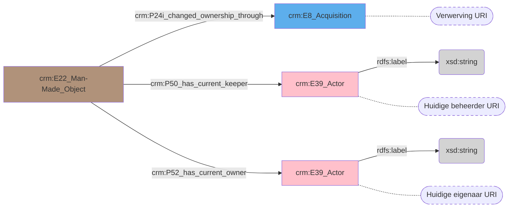

```mermaid
graph LR
4cf1af0e-df80-11ed-9655-00163e71351b["crm:E39_Actor"]-->|"rdfs:label"|4cf1b3a0-df80-11ed-9655-00163e71351b(xsd:string)
512ffd00-df80-11ed-9064-00163e71351b["crm:E39_Actor"]-->|"rdfs:label"|513001c4-df80-11ed-9064-00163e71351b(xsd:string)
099f196c-df80-11ed-9232-00163e71351b["crm:E22_Man-Made_Object"]-->|"crm:P24i_changed_ownership_through"|afd18e06-62c4-11ee-a9ac-00163e71351b["crm:E8_Acquisition"]
099f196c-df80-11ed-9232-00163e71351b["crm:E22_Man-Made_Object"]-->|"crm:P50_has_current_keeper"|4cf1af0e-df80-11ed-9655-00163e71351b["crm:E39_Actor"]
099f196c-df80-11ed-9232-00163e71351b["crm:E22_Man-Made_Object"]-->|"crm:P52_has_current_owner"|512ffd00-df80-11ed-9064-00163e71351b["crm:E39_Actor"]
afd18e06-62c4-11ee-a9ac-00163e71351b["crm:E8_Acquisition"]-.-afd18e06-62c4-11ee-a9ac-00163e71351b_s(["Verwerving URI"])
4cf1af0e-df80-11ed-9655-00163e71351b["crm:E39_Actor"]-.-4cf1af0e-df80-11ed-9655-00163e71351b_s(["Huidige beheerder URI"])
512ffd00-df80-11ed-9064-00163e71351b["crm:E39_Actor"]-.-512ffd00-df80-11ed-9064-00163e71351b_s(["Huidige eigenaar URI"])
style afd18e06-62c4-11ee-a9ac-00163e71351b_s stroke-dasharray: 5
style 4cf1af0e-df80-11ed-9655-00163e71351b_s stroke-dasharray: 5
style 512ffd00-df80-11ed-9064-00163e71351b_s stroke-dasharray: 5
style 099f196c-df80-11ed-9232-00163e71351b fill:#B0927A
style 4cf1af0e-df80-11ed-9655-00163e71351b fill:#ffc0cb
style 4cf1b3a0-df80-11ed-9655-00163e71351b fill:#D3D3D3
style 512ffd00-df80-11ed-9064-00163e71351b fill:#ffc0cb
style 513001c4-df80-11ed-9064-00163e71351b fill:#D3D3D3
style afd18e06-62c4-11ee-a9ac-00163e71351b fill:#5DAEEC
```
