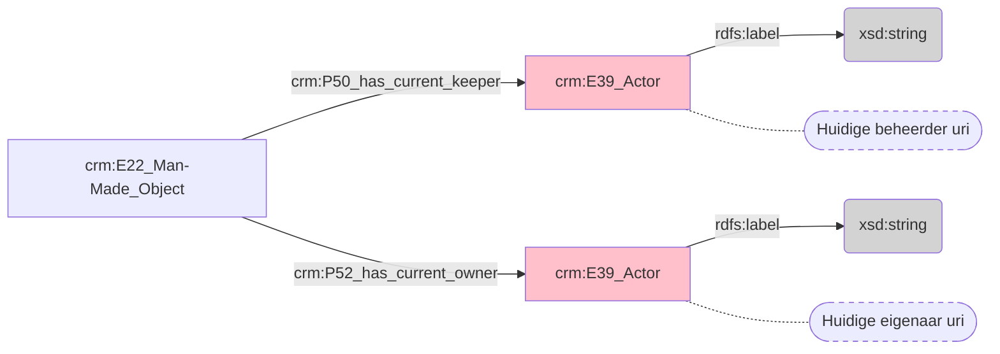

```mermaid
graph LR
4cf1af0e-df80-11ed-9655-00163e71351b["crm:E39_Actor"]-->|"rdfs:label"|4cf1b3a0-df80-11ed-9655-00163e71351b(xsd:string)
512ffd00-df80-11ed-9064-00163e71351b["crm:E39_Actor"]-->|"rdfs:label"|513001c4-df80-11ed-9064-00163e71351b(xsd:string)
099f196c-df80-11ed-9232-00163e71351b["crm:E22_Man-Made_Object"]-->|"crm:P50_has_current_keeper"|4cf1af0e-df80-11ed-9655-00163e71351b["crm:E39_Actor"]
099f196c-df80-11ed-9232-00163e71351b["crm:E22_Man-Made_Object"]-->|"crm:P52_has_current_owner"|512ffd00-df80-11ed-9064-00163e71351b["crm:E39_Actor"]
style 4cf1af0e-df80-11ed-9655-00163e71351b_s stroke-dasharray: 5
style 512ffd00-df80-11ed-9064-00163e71351b_s stroke-dasharray: 5
4cf1af0e-df80-11ed-9655-00163e71351b["crm:E39_Actor"]-.-4cf1af0e-df80-11ed-9655-00163e71351b_s(["Huidige beheerder uri"])
512ffd00-df80-11ed-9064-00163e71351b["crm:E39_Actor"]-.-512ffd00-df80-11ed-9064-00163e71351b_s(["Huidige eigenaar uri"])
style 4cf1af0e-df80-11ed-9655-00163e71351b fill:#ffc0cb
style 4cf1b3a0-df80-11ed-9655-00163e71351b fill:#D3D3D3
style 512ffd00-df80-11ed-9064-00163e71351b fill:#ffc0cb
style 513001c4-df80-11ed-9064-00163e71351b fill:#D3D3D3
```
