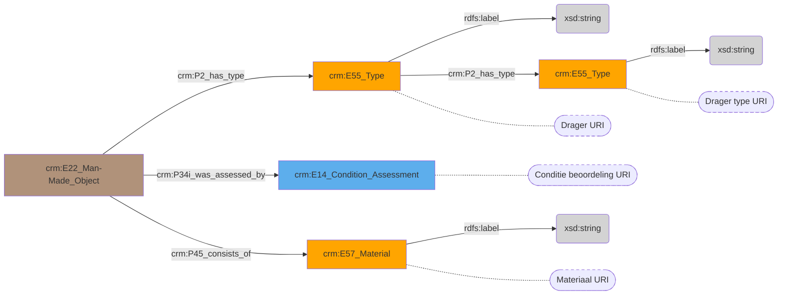

```mermaid
graph LR
97ac7060-4bbe-11ee-a9ac-00163e71351b["crm:E57_Material"]-->|"rdfs:label"|97ac7556-4bbe-11ee-a9ac-00163e71351b(xsd:string)
fad22e52-6296-11ee-b0c4-00163e71351b["crm:E55_Type"]-->|"rdfs:label"|fad2387a-6296-11ee-b0c4-00163e71351b(xsd:string)
fad23230-6296-11ee-b0c4-00163e71351b["crm:E55_Type"]-->|"rdfs:label"|fad23988-6296-11ee-b0c4-00163e71351b(xsd:string)
099f196c-df80-11ed-9232-00163e71351b["crm:E22_Man-Made_Object"]-->|"crm:P2_has_type"|fad22e52-6296-11ee-b0c4-00163e71351b["crm:E55_Type"]
099f196c-df80-11ed-9232-00163e71351b["crm:E22_Man-Made_Object"]-->|"crm:P34i_was_assessed_by"|d0818f0c-62c4-11ee-b0c4-00163e71351b["crm:E14_Condition_Assessment"]
099f196c-df80-11ed-9232-00163e71351b["crm:E22_Man-Made_Object"]-->|"crm:P45_consists_of"|97ac7060-4bbe-11ee-a9ac-00163e71351b["crm:E57_Material"]
fad22e52-6296-11ee-b0c4-00163e71351b["crm:E55_Type"]-->|"crm:P2_has_type"|fad23230-6296-11ee-b0c4-00163e71351b["crm:E55_Type"]
fad22e52-6296-11ee-b0c4-00163e71351b["crm:E55_Type"]-.-fad22e52-6296-11ee-b0c4-00163e71351b_s(["Drager URI"])
d0818f0c-62c4-11ee-b0c4-00163e71351b["crm:E14_Condition_Assessment"]-.-d0818f0c-62c4-11ee-b0c4-00163e71351b_s(["Conditie beoordeling URI"])
97ac7060-4bbe-11ee-a9ac-00163e71351b["crm:E57_Material"]-.-97ac7060-4bbe-11ee-a9ac-00163e71351b_s(["Materiaal URI"])
fad23230-6296-11ee-b0c4-00163e71351b["crm:E55_Type"]-.-fad23230-6296-11ee-b0c4-00163e71351b_s(["Drager type URI"])
style fad22e52-6296-11ee-b0c4-00163e71351b_s stroke-dasharray: 5
style d0818f0c-62c4-11ee-b0c4-00163e71351b_s stroke-dasharray: 5
style 97ac7060-4bbe-11ee-a9ac-00163e71351b_s stroke-dasharray: 5
style fad23230-6296-11ee-b0c4-00163e71351b_s stroke-dasharray: 5
style 099f196c-df80-11ed-9232-00163e71351b fill:#B0927A
style 97ac7060-4bbe-11ee-a9ac-00163e71351b fill:#ffa500
style 97ac7556-4bbe-11ee-a9ac-00163e71351b fill:#D3D3D3
style d0818f0c-62c4-11ee-b0c4-00163e71351b fill:#5DAEEC
style fad22e52-6296-11ee-b0c4-00163e71351b fill:#ffa500
style fad23230-6296-11ee-b0c4-00163e71351b fill:#ffa500
style fad2387a-6296-11ee-b0c4-00163e71351b fill:#D3D3D3
style fad23988-6296-11ee-b0c4-00163e71351b fill:#D3D3D3
```
