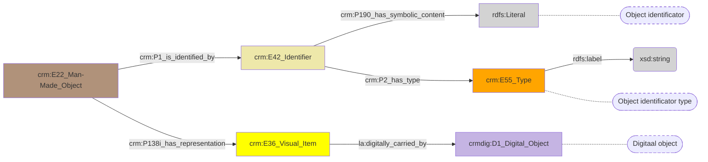

```mermaid
graph LR
31fafa48-df80-11ed-9064-00163e71351b["crm:E42_Identifier"]-->|"crm:P190_has_symbolic_content"|31faff2a-df80-11ed-9064-00163e71351b(rdfs:Literal)
31fb00ec-df80-11ed-9064-00163e71351b["crm:E55_Type"]-->|"rdfs:label"|31fb051a-df80-11ed-9064-00163e71351b(xsd:string)
099f196c-df80-11ed-9232-00163e71351b["crm:E22_Man-Made_Object"]-->|"crm:P1_is_identified_by"|31fafa48-df80-11ed-9064-00163e71351b["crm:E42_Identifier"]
099f196c-df80-11ed-9232-00163e71351b["crm:E22_Man-Made_Object"]-->|"crm:P138i_has_representation"|643c66b8-df80-11ed-9655-00163e71351b["crm:E36_Visual_Item"]
31fafa48-df80-11ed-9064-00163e71351b["crm:E42_Identifier"]-->|"crm:P2_has_type"|31fb00ec-df80-11ed-9064-00163e71351b["crm:E55_Type"]
643c66b8-df80-11ed-9655-00163e71351b["crm:E36_Visual_Item"]-->|"la:digitally_carried_by"|643c6a00-df80-11ed-9655-00163e71351b["crmdig:D1_Digital_Object"]
31faff2a-df80-11ed-9064-00163e71351b["rdfs:Literal"]-.-31faff2a-df80-11ed-9064-00163e71351b_s(["Object identificator"])
31fb00ec-df80-11ed-9064-00163e71351b["crm:E55_Type"]-.-31fb00ec-df80-11ed-9064-00163e71351b_s(["Object identificator type"])
643c6a00-df80-11ed-9655-00163e71351b["crmdig:D1_Digital_Object"]-.-643c6a00-df80-11ed-9655-00163e71351b_s(["Digitaal object"])
style 31faff2a-df80-11ed-9064-00163e71351b_s stroke-dasharray: 5
style 31fb00ec-df80-11ed-9064-00163e71351b_s stroke-dasharray: 5
style 643c6a00-df80-11ed-9655-00163e71351b_s stroke-dasharray: 5
style 099f196c-df80-11ed-9232-00163e71351b fill:#B0927A
style 31fafa48-df80-11ed-9064-00163e71351b fill:#EEE8AA
style 31faff2a-df80-11ed-9064-00163e71351b fill:#D3D3D3
style 31fb00ec-df80-11ed-9064-00163e71351b fill:#ffa500
style 31fb051a-df80-11ed-9064-00163e71351b fill:#D3D3D3
style 643c66b8-df80-11ed-9655-00163e71351b fill:#ffff00
style 643c6a00-df80-11ed-9655-00163e71351b fill:#C5B4E3
```
