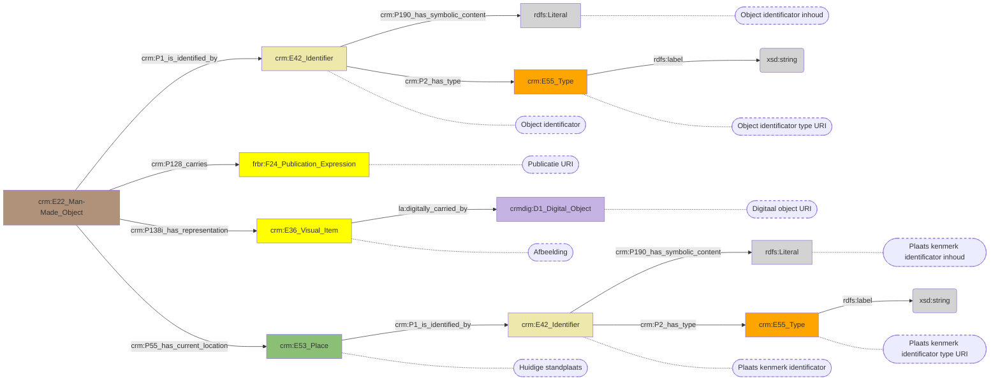

```mermaid
graph LR
31fafa48-df80-11ed-9064-00163e71351b["crm:E42_Identifier"]-->|"crm:P190_has_symbolic_content"|31faff2a-df80-11ed-9064-00163e71351b(rdfs:Literal)
31fb00ec-df80-11ed-9064-00163e71351b["crm:E55_Type"]-->|"rdfs:label"|31fb051a-df80-11ed-9064-00163e71351b(xsd:string)
d1f83454-62b4-11ee-a9ac-00163e71351b["crm:E42_Identifier"]-->|"crm:P190_has_symbolic_content"|d1f83922-62b4-11ee-a9ac-00163e71351b(rdfs:Literal)
d1f83a1c-62b4-11ee-a9ac-00163e71351b["crm:E55_Type"]-->|"rdfs:label"|d1f837ec-62b4-11ee-a9ac-00163e71351b(xsd:string)
099f196c-df80-11ed-9232-00163e71351b["crm:E22_Man-Made_Object"]-->|"crm:P1_is_identified_by"|31fafa48-df80-11ed-9064-00163e71351b["crm:E42_Identifier"]
099f196c-df80-11ed-9232-00163e71351b["crm:E22_Man-Made_Object"]-->|"crm:P128_carries"|0e6665b8-e435-11ed-9655-00163e71351b["frbr:F24_Publication_Expression"]
099f196c-df80-11ed-9232-00163e71351b["crm:E22_Man-Made_Object"]-->|"crm:P138i_has_representation"|643c66b8-df80-11ed-9655-00163e71351b["crm:E36_Visual_Item"]
099f196c-df80-11ed-9232-00163e71351b["crm:E22_Man-Made_Object"]-->|"crm:P55_has_current_location"|3d7e5e70-ed7f-11ed-9064-00163e71351b["crm:E53_Place"]
31fafa48-df80-11ed-9064-00163e71351b["crm:E42_Identifier"]-->|"crm:P2_has_type"|31fb00ec-df80-11ed-9064-00163e71351b["crm:E55_Type"]
3d7e5e70-ed7f-11ed-9064-00163e71351b["crm:E53_Place"]-->|"crm:P1_is_identified_by"|d1f83454-62b4-11ee-a9ac-00163e71351b["crm:E42_Identifier"]
643c66b8-df80-11ed-9655-00163e71351b["crm:E36_Visual_Item"]-->|"la:digitally_carried_by"|643c6a00-df80-11ed-9655-00163e71351b["crmdig:D1_Digital_Object"]
d1f83454-62b4-11ee-a9ac-00163e71351b["crm:E42_Identifier"]-->|"crm:P2_has_type"|d1f83a1c-62b4-11ee-a9ac-00163e71351b["crm:E55_Type"]
31fafa48-df80-11ed-9064-00163e71351b["crm:E42_Identifier"]-.-31fafa48-df80-11ed-9064-00163e71351b_s(["Object identificator"])
0e6665b8-e435-11ed-9655-00163e71351b["frbr:F24_Publication_Expression"]-.-0e6665b8-e435-11ed-9655-00163e71351b_s(["Publicatie URI"])
643c66b8-df80-11ed-9655-00163e71351b["crm:E36_Visual_Item"]-.-643c66b8-df80-11ed-9655-00163e71351b_s(["Afbeelding"])
3d7e5e70-ed7f-11ed-9064-00163e71351b["crm:E53_Place"]-.-3d7e5e70-ed7f-11ed-9064-00163e71351b_s(["Huidige standplaats"])
31faff2a-df80-11ed-9064-00163e71351b["rdfs:Literal"]-.-31faff2a-df80-11ed-9064-00163e71351b_s(["Object identificator inhoud"])
31fb00ec-df80-11ed-9064-00163e71351b["crm:E55_Type"]-.-31fb00ec-df80-11ed-9064-00163e71351b_s(["Object identificator type URI"])
d1f83454-62b4-11ee-a9ac-00163e71351b["crm:E42_Identifier"]-.-d1f83454-62b4-11ee-a9ac-00163e71351b_s(["Plaats kenmerk identificator"])
643c6a00-df80-11ed-9655-00163e71351b["crmdig:D1_Digital_Object"]-.-643c6a00-df80-11ed-9655-00163e71351b_s(["Digitaal object URI"])
d1f83922-62b4-11ee-a9ac-00163e71351b["rdfs:Literal"]-.-d1f83922-62b4-11ee-a9ac-00163e71351b_s(["Plaats kenmerk identificator inhoud"])
d1f83a1c-62b4-11ee-a9ac-00163e71351b["crm:E55_Type"]-.-d1f83a1c-62b4-11ee-a9ac-00163e71351b_s(["Plaats kenmerk identificator type URI"])
style 31fafa48-df80-11ed-9064-00163e71351b_s stroke-dasharray: 5
style 0e6665b8-e435-11ed-9655-00163e71351b_s stroke-dasharray: 5
style 643c66b8-df80-11ed-9655-00163e71351b_s stroke-dasharray: 5
style 3d7e5e70-ed7f-11ed-9064-00163e71351b_s stroke-dasharray: 5
style 31faff2a-df80-11ed-9064-00163e71351b_s stroke-dasharray: 5
style 31fb00ec-df80-11ed-9064-00163e71351b_s stroke-dasharray: 5
style d1f83454-62b4-11ee-a9ac-00163e71351b_s stroke-dasharray: 5
style 643c6a00-df80-11ed-9655-00163e71351b_s stroke-dasharray: 5
style d1f83922-62b4-11ee-a9ac-00163e71351b_s stroke-dasharray: 5
style d1f83a1c-62b4-11ee-a9ac-00163e71351b_s stroke-dasharray: 5
style 099f196c-df80-11ed-9232-00163e71351b fill:#B0927A
style 0e6665b8-e435-11ed-9655-00163e71351b fill:#ffff00
style 31fafa48-df80-11ed-9064-00163e71351b fill:#EEE8AA
style 31faff2a-df80-11ed-9064-00163e71351b fill:#D3D3D3
style 31fb00ec-df80-11ed-9064-00163e71351b fill:#ffa500
style 31fb051a-df80-11ed-9064-00163e71351b fill:#D3D3D3
style 3d7e5e70-ed7f-11ed-9064-00163e71351b fill:#8CBF76
style 643c66b8-df80-11ed-9655-00163e71351b fill:#ffff00
style 643c6a00-df80-11ed-9655-00163e71351b fill:#C5B4E3
style d1f83454-62b4-11ee-a9ac-00163e71351b fill:#EEE8AA
style d1f837ec-62b4-11ee-a9ac-00163e71351b fill:#D3D3D3
style d1f83922-62b4-11ee-a9ac-00163e71351b fill:#D3D3D3
style d1f83a1c-62b4-11ee-a9ac-00163e71351b fill:#ffa500
```
