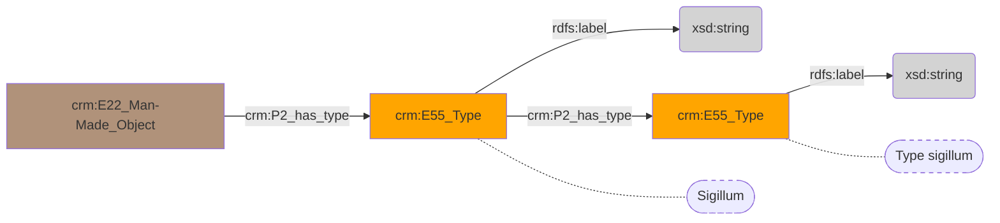

```mermaid
graph LR
5f7d3f52-62b7-11ee-bc5c-00163e71351b["crm:E55_Type"]-->|"rdfs:label"|5f7d466e-62b7-11ee-bc5c-00163e71351b(xsd:string)
5f7d44a2-62b7-11ee-bc5c-00163e71351b["crm:E55_Type"]-->|"rdfs:label"|5f7d47e0-62b7-11ee-bc5c-00163e71351b(xsd:string)
style 5f7d3f52-62b7-11ee-bc5c-00163e71351b_s stroke-dasharray: 5
style 5f7d44a2-62b7-11ee-bc5c-00163e71351b_s stroke-dasharray: 5
style 099f196c-df80-11ed-9232-00163e71351b fill:#B0927A
style 5f7d3f52-62b7-11ee-bc5c-00163e71351b fill:#ffa500
style 5f7d44a2-62b7-11ee-bc5c-00163e71351b fill:#ffa500
style 5f7d466e-62b7-11ee-bc5c-00163e71351b fill:#D3D3D3
style 5f7d47e0-62b7-11ee-bc5c-00163e71351b fill:#D3D3D3
099f196c-df80-11ed-9232-00163e71351b["crm:E22_Man-Made_Object"]-->|"crm:P2_has_type"|5f7d3f52-62b7-11ee-bc5c-00163e71351b["crm:E55_Type"]
5f7d3f52-62b7-11ee-bc5c-00163e71351b["crm:E55_Type"]-->|"crm:P2_has_type"|5f7d44a2-62b7-11ee-bc5c-00163e71351b["crm:E55_Type"]
5f7d3f52-62b7-11ee-bc5c-00163e71351b["crm:E55_Type"]-.-5f7d3f52-62b7-11ee-bc5c-00163e71351b_s(["Sigillum"])
5f7d44a2-62b7-11ee-bc5c-00163e71351b["crm:E55_Type"]-.-5f7d44a2-62b7-11ee-bc5c-00163e71351b_s(["Type "sigillum""])
```
