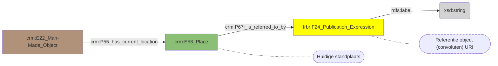

```mermaid
graph LR
832f6a8a-62b5-11ee-a9ac-00163e71351b["frbr:F24_Publication_Expression"]-->|"rdfs:label"|832f6e04-62b5-11ee-a9ac-00163e71351b(xsd:string)
099f196c-df80-11ed-9232-00163e71351b["crm:E22_Man-Made_Object"]-->|"crm:P55_has_current_location"|3d7e5e70-ed7f-11ed-9064-00163e71351b["crm:E53_Place"]
3d7e5e70-ed7f-11ed-9064-00163e71351b["crm:E53_Place"]-->|"crm:P67i_is_referred_to_by"|832f6a8a-62b5-11ee-a9ac-00163e71351b["frbr:F24_Publication_Expression"]
3d7e5e70-ed7f-11ed-9064-00163e71351b["crm:E53_Place"]-.-3d7e5e70-ed7f-11ed-9064-00163e71351b_s(["Huidige standplaats"])
832f6a8a-62b5-11ee-a9ac-00163e71351b["frbr:F24_Publication_Expression"]-.-832f6a8a-62b5-11ee-a9ac-00163e71351b_s(["Referentie object (convoluten) URI"])
style 3d7e5e70-ed7f-11ed-9064-00163e71351b_s stroke-dasharray: 5
style 832f6a8a-62b5-11ee-a9ac-00163e71351b_s stroke-dasharray: 5
style 099f196c-df80-11ed-9232-00163e71351b fill:#B0927A
style 3d7e5e70-ed7f-11ed-9064-00163e71351b fill:#8CBF76
style 832f6a8a-62b5-11ee-a9ac-00163e71351b fill:#ffff00
style 832f6e04-62b5-11ee-a9ac-00163e71351b fill:#D3D3D3
```
