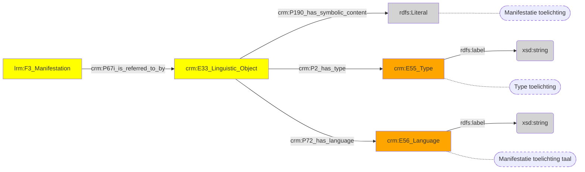

```mermaid
graph LR
17e0ec04-8e93-11ee-8f9d-96a6d245525a["crm:E33_Linguistic_Object"]-->|"crm:P190_has_symbolic_content"|17e11724-8e93-11ee-8f9d-96a6d245525a(rdfs:Literal)
17e11698-8e93-11ee-8f9d-96a6d245525a["crm:E55_Type"]-->|"rdfs:label"|17e117b0-8e93-11ee-8f9d-96a6d245525a(xsd:string)
17e116de-8e93-11ee-8f9d-96a6d245525a["crm:E56_Language"]-->|"rdfs:label"|17e1176a-8e93-11ee-8f9d-96a6d245525a(xsd:string)
17e0ec04-8e93-11ee-8f9d-96a6d245525a["crm:E33_Linguistic_Object"]-->|"crm:P2_has_type"|17e11698-8e93-11ee-8f9d-96a6d245525a["crm:E55_Type"]
17e0ec04-8e93-11ee-8f9d-96a6d245525a["crm:E33_Linguistic_Object"]-->|"crm:P72_has_language"|17e116de-8e93-11ee-8f9d-96a6d245525a["crm:E56_Language"]
17e0efec-8e93-11ee-8f9d-96a6d245525a["lrm:F3_Manifestation"]-->|"crm:P67i_is_referred_to_by"|17e0ec04-8e93-11ee-8f9d-96a6d245525a["crm:E33_Linguistic_Object"]
17e11724-8e93-11ee-8f9d-96a6d245525a["rdfs:Literal"]-.-17e11724-8e93-11ee-8f9d-96a6d245525a_s(["Manifestatie toelichting"])
17e11698-8e93-11ee-8f9d-96a6d245525a["crm:E55_Type"]-.-17e11698-8e93-11ee-8f9d-96a6d245525a_s(["Type "toelichting""])
17e116de-8e93-11ee-8f9d-96a6d245525a["crm:E56_Language"]-.-17e116de-8e93-11ee-8f9d-96a6d245525a_s(["Manifestatie toelichting taal"])
style 17e11724-8e93-11ee-8f9d-96a6d245525a_s stroke-dasharray: 5
style 17e11698-8e93-11ee-8f9d-96a6d245525a_s stroke-dasharray: 5
style 17e116de-8e93-11ee-8f9d-96a6d245525a_s stroke-dasharray: 5
style 17e0ec04-8e93-11ee-8f9d-96a6d245525a fill:#ffff00
style 17e0efec-8e93-11ee-8f9d-96a6d245525a fill:#ffff00
style 17e11698-8e93-11ee-8f9d-96a6d245525a fill:#ffa500
style 17e116de-8e93-11ee-8f9d-96a6d245525a fill:#ffa500
style 17e11724-8e93-11ee-8f9d-96a6d245525a fill:#D3D3D3
style 17e1176a-8e93-11ee-8f9d-96a6d245525a fill:#D3D3D3
style 17e117b0-8e93-11ee-8f9d-96a6d245525a fill:#D3D3D3
```
