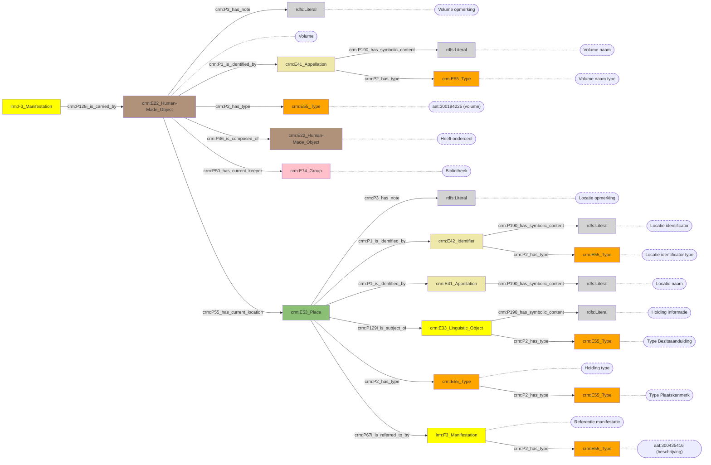

```mermaid
graph LR
style 17e0efec-8e93-11ee-8f9d-96a6d245525a fill:#ffff00
style 4519ed02-18d5-11ef-bd5f-960002548b4f fill:#D3D3D3
style 6ea9566d-1850-11ef-8bfd-960002548b4f fill:#D3D3D3
style 6ea958ba-1850-11ef-90f2-960002548b4f fill:#B0927A
style 6ea95aef-1850-11ef-bd06-960002548b4f fill:#ffff00
style 6ea95b74-1850-11ef-be72-960002548b4f fill:#EEE8AA
style 6ea95beb-1850-11ef-bfe2-960002548b4f fill:#EEE8AA
style 6ea95c5f-1850-11ef-ba08-960002548b4f fill:#B0927A
style 6ea95d40-1850-11ef-a095-960002548b4f fill:#8CBF76
style 6ea95dae-1850-11ef-a778-960002548b4f fill:#ffc0cb
style 6ea95efc-1850-11ef-a0d2-960002548b4f fill:#EEE8AA
style 6ea95f6b-1850-11ef-b856-960002548b4f fill:#ffa500
style 6ea96045-1850-11ef-9e90-960002548b4f fill:#D3D3D3
style 6ea96123-1850-11ef-89fe-960002548b4f fill:#ffa500
style 6ea9619a-1850-11ef-bfe6-960002548b4f fill:#ffa500
style 6ea9620d-1850-11ef-a13e-960002548b4f fill:#ffa500
style 6ea962ea-1850-11ef-8668-960002548b4f fill:#ffa500
style 6ea96361-1850-11ef-b007-960002548b4f fill:#D3D3D3
style 6ea963d0-1850-11ef-8f5f-960002548b4f fill:#ffa500
style 6ea9643d-1850-11ef-8209-960002548b4f fill:#D3D3D3
style 6ea9651a-1850-11ef-bd49-960002548b4f fill:#D3D3D3
style 6ea9658c-1850-11ef-93b0-960002548b4f fill:#ffff00
style 6ea965fc-1850-11ef-8c85-960002548b4f fill:#ffa500
6ea958ba-1850-11ef-90f2-960002548b4f["crm:E22_Human-Made_Object"]-->|"crm:P3_has_note"|4519ed02-18d5-11ef-bd5f-960002548b4f(rdfs:Literal)
6ea95aef-1850-11ef-bd06-960002548b4f["crm:E33_Linguistic_Object"]-->|"crm:P190_has_symbolic_content"|6ea9643d-1850-11ef-8209-960002548b4f(rdfs:Literal)
6ea95b74-1850-11ef-be72-960002548b4f["crm:E42_Identifier"]-->|"crm:P190_has_symbolic_content"|6ea9651a-1850-11ef-bd49-960002548b4f(rdfs:Literal)
6ea95beb-1850-11ef-bfe2-960002548b4f["crm:E41_Appellation"]-->|"crm:P190_has_symbolic_content"|6ea96361-1850-11ef-b007-960002548b4f(rdfs:Literal)
6ea95d40-1850-11ef-a095-960002548b4f["crm:E53_Place"]-->|"crm:P3_has_note"|6ea9566d-1850-11ef-8bfd-960002548b4f(rdfs:Literal)
6ea95efc-1850-11ef-a0d2-960002548b4f["crm:E41_Appellation"]-->|"crm:P190_has_symbolic_content"|6ea96045-1850-11ef-9e90-960002548b4f(rdfs:Literal)
6ea958ba-1850-11ef-90f2-960002548b4f["crm:E22_Human-Made_Object"]-.-6ea958ba-1850-11ef-90f2-960002548b4f_s(["Volume"])
6ea96123-1850-11ef-89fe-960002548b4f["crm:E55_Type"]-.-6ea96123-1850-11ef-89fe-960002548b4f_s(["aat:300194225 (volume)"])
4519ed02-18d5-11ef-bd5f-960002548b4f["rdfs:Literal"]-.-4519ed02-18d5-11ef-bd5f-960002548b4f_s(["Volume opmerking"])
6ea95c5f-1850-11ef-ba08-960002548b4f["crm:E22_Human-Made_Object"]-.-6ea95c5f-1850-11ef-ba08-960002548b4f_s(["Heeft onderdeel"])
6ea95dae-1850-11ef-a778-960002548b4f["crm:E74_Group"]-.-6ea95dae-1850-11ef-a778-960002548b4f_s(["Bibliotheek"])
6ea9643d-1850-11ef-8209-960002548b4f["rdfs:Literal"]-.-6ea9643d-1850-11ef-8209-960002548b4f_s(["Holding informatie"])
6ea9619a-1850-11ef-bfe6-960002548b4f["crm:E55_Type"]-.-6ea9619a-1850-11ef-bfe6-960002548b4f_s(["Type "Bezitsaanduiding""])
6ea9651a-1850-11ef-bd49-960002548b4f["rdfs:Literal"]-.-6ea9651a-1850-11ef-bd49-960002548b4f_s(["Locatie identificator"])
6ea962ea-1850-11ef-8668-960002548b4f["crm:E55_Type"]-.-6ea962ea-1850-11ef-8668-960002548b4f_s(["Locatie identificator type"])
6ea96361-1850-11ef-b007-960002548b4f["rdfs:Literal"]-.-6ea96361-1850-11ef-b007-960002548b4f_s(["Locatie naam"])
6ea9620d-1850-11ef-a13e-960002548b4f["crm:E55_Type"]-.-6ea9620d-1850-11ef-a13e-960002548b4f_s(["Holding type"])
6ea9566d-1850-11ef-8bfd-960002548b4f["rdfs:Literal"]-.-6ea9566d-1850-11ef-8bfd-960002548b4f_s(["Locatie opmerking"])
6ea9658c-1850-11ef-93b0-960002548b4f["lrm:F3_Manifestation"]-.-6ea9658c-1850-11ef-93b0-960002548b4f_s(["Referentie manifestatie"])
6ea96045-1850-11ef-9e90-960002548b4f["rdfs:Literal"]-.-6ea96045-1850-11ef-9e90-960002548b4f_s(["Volume naam"])
6ea95f6b-1850-11ef-b856-960002548b4f["crm:E55_Type"]-.-6ea95f6b-1850-11ef-b856-960002548b4f_s(["Volume naam type"])
6ea963d0-1850-11ef-8f5f-960002548b4f["crm:E55_Type"]-.-6ea963d0-1850-11ef-8f5f-960002548b4f_s(["Type "Plaatskenmerk""])
6ea965fc-1850-11ef-8c85-960002548b4f["crm:E55_Type"]-.-6ea965fc-1850-11ef-8c85-960002548b4f_s(["aat:300435416 (beschrijving)"])
style 6ea958ba-1850-11ef-90f2-960002548b4f_s stroke-dasharray: 5
style 6ea96123-1850-11ef-89fe-960002548b4f_s stroke-dasharray: 5
style 4519ed02-18d5-11ef-bd5f-960002548b4f_s stroke-dasharray: 5
style 6ea95c5f-1850-11ef-ba08-960002548b4f_s stroke-dasharray: 5
style 6ea95dae-1850-11ef-a778-960002548b4f_s stroke-dasharray: 5
style 6ea9643d-1850-11ef-8209-960002548b4f_s stroke-dasharray: 5
style 6ea9619a-1850-11ef-bfe6-960002548b4f_s stroke-dasharray: 5
style 6ea9651a-1850-11ef-bd49-960002548b4f_s stroke-dasharray: 5
style 6ea962ea-1850-11ef-8668-960002548b4f_s stroke-dasharray: 5
style 6ea96361-1850-11ef-b007-960002548b4f_s stroke-dasharray: 5
style 6ea9620d-1850-11ef-a13e-960002548b4f_s stroke-dasharray: 5
style 6ea9566d-1850-11ef-8bfd-960002548b4f_s stroke-dasharray: 5
style 6ea9658c-1850-11ef-93b0-960002548b4f_s stroke-dasharray: 5
style 6ea96045-1850-11ef-9e90-960002548b4f_s stroke-dasharray: 5
style 6ea95f6b-1850-11ef-b856-960002548b4f_s stroke-dasharray: 5
style 6ea963d0-1850-11ef-8f5f-960002548b4f_s stroke-dasharray: 5
style 6ea965fc-1850-11ef-8c85-960002548b4f_s stroke-dasharray: 5
17e0efec-8e93-11ee-8f9d-96a6d245525a["lrm:F3_Manifestation"]-->|"crm:P128i_is_carried_by"|6ea958ba-1850-11ef-90f2-960002548b4f["crm:E22_Human-Made_Object"]
6ea958ba-1850-11ef-90f2-960002548b4f["crm:E22_Human-Made_Object"]-->|"crm:P1_is_identified_by"|6ea95efc-1850-11ef-a0d2-960002548b4f["crm:E41_Appellation"]
6ea958ba-1850-11ef-90f2-960002548b4f["crm:E22_Human-Made_Object"]-->|"crm:P2_has_type"|6ea96123-1850-11ef-89fe-960002548b4f["crm:E55_Type"]
6ea958ba-1850-11ef-90f2-960002548b4f["crm:E22_Human-Made_Object"]-->|"crm:P46_is_composed_of"|6ea95c5f-1850-11ef-ba08-960002548b4f["crm:E22_Human-Made_Object"]
6ea958ba-1850-11ef-90f2-960002548b4f["crm:E22_Human-Made_Object"]-->|"crm:P50_has_current_keeper"|6ea95dae-1850-11ef-a778-960002548b4f["crm:E74_Group"]
6ea958ba-1850-11ef-90f2-960002548b4f["crm:E22_Human-Made_Object"]-->|"crm:P55_has_current_location"|6ea95d40-1850-11ef-a095-960002548b4f["crm:E53_Place"]
6ea95aef-1850-11ef-bd06-960002548b4f["crm:E33_Linguistic_Object"]-->|"crm:P2_has_type"|6ea9619a-1850-11ef-bfe6-960002548b4f["crm:E55_Type"]
6ea95b74-1850-11ef-be72-960002548b4f["crm:E42_Identifier"]-->|"crm:P2_has_type"|6ea962ea-1850-11ef-8668-960002548b4f["crm:E55_Type"]
6ea95d40-1850-11ef-a095-960002548b4f["crm:E53_Place"]-->|"crm:P1_is_identified_by"|6ea95b74-1850-11ef-be72-960002548b4f["crm:E42_Identifier"]
6ea95d40-1850-11ef-a095-960002548b4f["crm:E53_Place"]-->|"crm:P1_is_identified_by"|6ea95beb-1850-11ef-bfe2-960002548b4f["crm:E41_Appellation"]
6ea95d40-1850-11ef-a095-960002548b4f["crm:E53_Place"]-->|"crm:P129i_is_subject_of"|6ea95aef-1850-11ef-bd06-960002548b4f["crm:E33_Linguistic_Object"]
6ea95d40-1850-11ef-a095-960002548b4f["crm:E53_Place"]-->|"crm:P2_has_type"|6ea9620d-1850-11ef-a13e-960002548b4f["crm:E55_Type"]
6ea95d40-1850-11ef-a095-960002548b4f["crm:E53_Place"]-->|"crm:P67i_is_referred_to_by"|6ea9658c-1850-11ef-93b0-960002548b4f["lrm:F3_Manifestation"]
6ea95efc-1850-11ef-a0d2-960002548b4f["crm:E41_Appellation"]-->|"crm:P2_has_type"|6ea95f6b-1850-11ef-b856-960002548b4f["crm:E55_Type"]
6ea9620d-1850-11ef-a13e-960002548b4f["crm:E55_Type"]-->|"crm:P2_has_type"|6ea963d0-1850-11ef-8f5f-960002548b4f["crm:E55_Type"]
6ea9658c-1850-11ef-93b0-960002548b4f["lrm:F3_Manifestation"]-->|"crm:P2_has_type"|6ea965fc-1850-11ef-8c85-960002548b4f["crm:E55_Type"]
```
