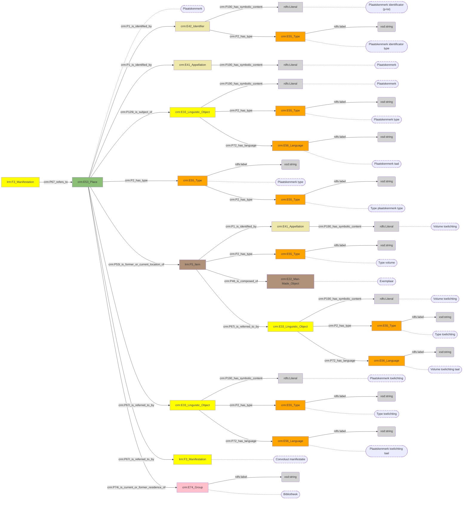

```mermaid
graph LR
024f06e7-94e9-11ee-b10b-960002548b4f["crm:E74_Group"]-->|"rdfs:label"|024f08dd-94e9-11ee-a867-960002548b4f(xsd:string)
1025ca6d-94ea-11ee-b6c8-960002548b4f["crm:E33_Linguistic_Object"]-->|"crm:P190_has_symbolic_content"|1025cda9-94ea-11ee-ac93-960002548b4f(rdfs:Literal)
1025cd00-94ea-11ee-b23b-960002548b4f["crm:E55_Type"]-->|"rdfs:label"|1025cf17-94ea-11ee-b0ea-960002548b4f(xsd:string)
1025ce29-94ea-11ee-97f2-960002548b4f["crm:E56_Language"]-->|"rdfs:label"|1025cea2-94ea-11ee-9b0f-960002548b4f(xsd:string)
1353d187-94e9-11ee-a929-960002548b4f["crm:E33_Linguistic_Object"]-->|"crm:P190_has_symbolic_content"|1353d5ab-94e9-11ee-ba06-960002548b4f(rdfs:Literal)
1353d387-94e9-11ee-aed3-960002548b4f["crm:E56_Language"]-->|"rdfs:label"|1353d445-94e9-11ee-aeb6-960002548b4f(xsd:string)
1353d4c6-94e9-11ee-b2f7-960002548b4f["crm:E55_Type"]-->|"rdfs:label"|1353d539-94e9-11ee-b7c9-960002548b4f(xsd:string)
2d1ec11f-94f8-11ee-a675-960002548b4f["crm:E33_Linguistic_Object"]-->|"crm:P190_has_symbolic_content"|2d1ec47d-94f8-11ee-b762-960002548b4f(rdfs:Literal)
2d1ec336-94f8-11ee-9c4b-960002548b4f["crm:E55_Type"]-->|"rdfs:label"|2d1ec584-94f8-11ee-8a85-960002548b4f(xsd:string)
2d1ec3e7-94f8-11ee-96de-960002548b4f["crm:E56_Language"]-->|"rdfs:label"|2d1ec50a-94f8-11ee-b549-960002548b4f(xsd:string)
30725f2f-94e9-11ee-85c8-960002548b4f["crm:E42_Identifier"]-->|"crm:P190_has_symbolic_content"|30726293-94e9-11ee-8137-960002548b4f(rdfs:Literal)
3072613d-94e9-11ee-99cf-960002548b4f["crm:E55_Type"]-->|"rdfs:label"|30726213-94e9-11ee-9f22-960002548b4f(xsd:string)
a5ab2f50-94fa-11ee-a37e-960002548b4f["crm:E41_Appellation"]-->|"crm:P190_has_symbolic_content"|b9ff70f4-94fa-11ee-8c90-960002548b4f(rdfs:Literal)
b26c0ceb-94f9-11ee-8f0f-960002548b4f["crm:E41_Appellation"]-->|"crm:P190_has_symbolic_content"|c49a56a0-94f9-11ee-9be8-960002548b4f(rdfs:Literal)
f5911ec5-94e8-11ee-ad8d-960002548b4f["crm:E55_Type"]-->|"rdfs:label"|f59120f1-94e8-11ee-a417-960002548b4f(xsd:string)
f59121a0-94e8-11ee-b33b-960002548b4f["crm:E55_Type"]-->|"rdfs:label"|f5912226-94e8-11ee-94e7-960002548b4f(xsd:string)
f5e2e871-94fa-11ee-bc5a-960002548b4f["crm:E55_Type"]-->|"rdfs:label"|f5e2ebc1-94fa-11ee-b1d8-960002548b4f(xsd:string)
style f5911ec5-94e8-11ee-ad8d-960002548b4f_s stroke-dasharray: 5
style 4124c22a-94e9-11ee-baab-960002548b4f_s stroke-dasharray: 5
style 024f06e7-94e9-11ee-b10b-960002548b4f_s stroke-dasharray: 5
style 1025cda9-94ea-11ee-ac93-960002548b4f_s stroke-dasharray: 5
style 1025cd00-94ea-11ee-b23b-960002548b4f_s stroke-dasharray: 5
style 1025ce29-94ea-11ee-97f2-960002548b4f_s stroke-dasharray: 5
style 1353d5ab-94e9-11ee-ba06-960002548b4f_s stroke-dasharray: 5
style 1353d4c6-94e9-11ee-b2f7-960002548b4f_s stroke-dasharray: 5
style 1353d387-94e9-11ee-aed3-960002548b4f_s stroke-dasharray: 5
style 09e43c33-9363-11ee-814c-960002548b4f_s stroke-dasharray: 5
style 2d1ec47d-94f8-11ee-b762-960002548b4f_s stroke-dasharray: 5
style 2d1ec336-94f8-11ee-9c4b-960002548b4f_s stroke-dasharray: 5
style 2d1ec3e7-94f8-11ee-96de-960002548b4f_s stroke-dasharray: 5
style 30726293-94e9-11ee-8137-960002548b4f_s stroke-dasharray: 5
style 3072613d-94e9-11ee-99cf-960002548b4f_s stroke-dasharray: 5
style f5e2e871-94fa-11ee-bc5a-960002548b4f_s stroke-dasharray: 5
style 43608edc-94f2-11ee-b4b5-960002548b4f_s stroke-dasharray: 5
style b9ff70f4-94fa-11ee-8c90-960002548b4f_s stroke-dasharray: 5
style c49a56a0-94f9-11ee-9be8-960002548b4f_s stroke-dasharray: 5
style f59121a0-94e8-11ee-b33b-960002548b4f_s stroke-dasharray: 5
style 024f06e7-94e9-11ee-b10b-960002548b4f fill:#ffc0cb
style 024f08dd-94e9-11ee-a867-960002548b4f fill:#D3D3D3
style 09e43c33-9363-11ee-814c-960002548b4f fill:#8CBF76
style 1025ca6d-94ea-11ee-b6c8-960002548b4f fill:#ffff00
style 1025cd00-94ea-11ee-b23b-960002548b4f fill:#ffa500
style 1025cda9-94ea-11ee-ac93-960002548b4f fill:#D3D3D3
style 1025ce29-94ea-11ee-97f2-960002548b4f fill:#ffa500
style 1025cea2-94ea-11ee-9b0f-960002548b4f fill:#D3D3D3
style 1025cf17-94ea-11ee-b0ea-960002548b4f fill:#D3D3D3
style 1353d187-94e9-11ee-a929-960002548b4f fill:#ffff00
style 1353d387-94e9-11ee-aed3-960002548b4f fill:#ffa500
style 1353d445-94e9-11ee-aeb6-960002548b4f fill:#D3D3D3
style 1353d4c6-94e9-11ee-b2f7-960002548b4f fill:#ffa500
style 1353d539-94e9-11ee-b7c9-960002548b4f fill:#D3D3D3
style 1353d5ab-94e9-11ee-ba06-960002548b4f fill:#D3D3D3
style 17e0efec-8e93-11ee-8f9d-96a6d245525a fill:#ffff00
style 2d1ec11f-94f8-11ee-a675-960002548b4f fill:#ffff00
style 2d1ec336-94f8-11ee-9c4b-960002548b4f fill:#ffa500
style 2d1ec3e7-94f8-11ee-96de-960002548b4f fill:#ffa500
style 2d1ec47d-94f8-11ee-b762-960002548b4f fill:#D3D3D3
style 2d1ec50a-94f8-11ee-b549-960002548b4f fill:#D3D3D3
style 2d1ec584-94f8-11ee-8a85-960002548b4f fill:#D3D3D3
style 30725f2f-94e9-11ee-85c8-960002548b4f fill:#EEE8AA
style 3072613d-94e9-11ee-99cf-960002548b4f fill:#ffa500
style 30726213-94e9-11ee-9f22-960002548b4f fill:#D3D3D3
style 30726293-94e9-11ee-8137-960002548b4f fill:#D3D3D3
style 4124c22a-94e9-11ee-baab-960002548b4f fill:#ffff00
style 43608edc-94f2-11ee-b4b5-960002548b4f fill:#B0927A
style 5a62c11c-94f1-11ee-9220-960002548b4f fill:#B0927A
style a5ab2f50-94fa-11ee-a37e-960002548b4f fill:#EEE8AA
style b26c0ceb-94f9-11ee-8f0f-960002548b4f fill:#EEE8AA
style b9ff70f4-94fa-11ee-8c90-960002548b4f fill:#D3D3D3
style c49a56a0-94f9-11ee-9be8-960002548b4f fill:#D3D3D3
style f5911ec5-94e8-11ee-ad8d-960002548b4f fill:#ffa500
style f59120f1-94e8-11ee-a417-960002548b4f fill:#D3D3D3
style f59121a0-94e8-11ee-b33b-960002548b4f fill:#ffa500
style f5912226-94e8-11ee-94e7-960002548b4f fill:#D3D3D3
style f5e2e871-94fa-11ee-bc5a-960002548b4f fill:#ffa500
style f5e2ebc1-94fa-11ee-b1d8-960002548b4f fill:#D3D3D3
f5911ec5-94e8-11ee-ad8d-960002548b4f["crm:E55_Type"]-.-f5911ec5-94e8-11ee-ad8d-960002548b4f_s(["Plaatskenmerk type"])
4124c22a-94e9-11ee-baab-960002548b4f["lrm:F3_Manifestation"]-.-4124c22a-94e9-11ee-baab-960002548b4f_s(["Convoluut manifestatie"])
024f06e7-94e9-11ee-b10b-960002548b4f["crm:E74_Group"]-.-024f06e7-94e9-11ee-b10b-960002548b4f_s(["Bibliotheek"])
1025cda9-94ea-11ee-ac93-960002548b4f["rdfs:Literal"]-.-1025cda9-94ea-11ee-ac93-960002548b4f_s(["Plaatskenmerk"])
1025cd00-94ea-11ee-b23b-960002548b4f["crm:E55_Type"]-.-1025cd00-94ea-11ee-b23b-960002548b4f_s(["Plaatskenmerk type"])
1025ce29-94ea-11ee-97f2-960002548b4f["crm:E56_Language"]-.-1025ce29-94ea-11ee-97f2-960002548b4f_s(["Plaatskenmerk taal"])
1353d5ab-94e9-11ee-ba06-960002548b4f["rdfs:Literal"]-.-1353d5ab-94e9-11ee-ba06-960002548b4f_s(["Plaatskenmerk toelichting"])
1353d4c6-94e9-11ee-b2f7-960002548b4f["crm:E55_Type"]-.-1353d4c6-94e9-11ee-b2f7-960002548b4f_s(["Type "toelichting""])
1353d387-94e9-11ee-aed3-960002548b4f["crm:E56_Language"]-.-1353d387-94e9-11ee-aed3-960002548b4f_s(["Plaatskenmerk toelichting taal"])
09e43c33-9363-11ee-814c-960002548b4f["crm:E53_Place"]-.-09e43c33-9363-11ee-814c-960002548b4f_s(["Plaatskenmerk"])
2d1ec47d-94f8-11ee-b762-960002548b4f["rdfs:Literal"]-.-2d1ec47d-94f8-11ee-b762-960002548b4f_s(["Volume toelichting"])
2d1ec336-94f8-11ee-9c4b-960002548b4f["crm:E55_Type"]-.-2d1ec336-94f8-11ee-9c4b-960002548b4f_s(["Type "toelichting""])
2d1ec3e7-94f8-11ee-96de-960002548b4f["crm:E56_Language"]-.-2d1ec3e7-94f8-11ee-96de-960002548b4f_s(["Volume toelichting taal"])
30726293-94e9-11ee-8137-960002548b4f["rdfs:Literal"]-.-30726293-94e9-11ee-8137-960002548b4f_s(["Plaatskenmerk identificator (p-loi)"])
3072613d-94e9-11ee-99cf-960002548b4f["crm:E55_Type"]-.-3072613d-94e9-11ee-99cf-960002548b4f_s(["Plaatskenmerk identificator type"])
f5e2e871-94fa-11ee-bc5a-960002548b4f["crm:E55_Type"]-.-f5e2e871-94fa-11ee-bc5a-960002548b4f_s(["Type "volume""])
43608edc-94f2-11ee-b4b5-960002548b4f["crm:E22_Man-Made_Object"]-.-43608edc-94f2-11ee-b4b5-960002548b4f_s(["Exemplaar"])
b9ff70f4-94fa-11ee-8c90-960002548b4f["rdfs:Literal"]-.-b9ff70f4-94fa-11ee-8c90-960002548b4f_s(["Volume toelichting"])
c49a56a0-94f9-11ee-9be8-960002548b4f["rdfs:Literal"]-.-c49a56a0-94f9-11ee-9be8-960002548b4f_s(["Plaatskenmerk"])
f59121a0-94e8-11ee-b33b-960002548b4f["crm:E55_Type"]-.-f59121a0-94e8-11ee-b33b-960002548b4f_s(["Type "plaatskenmerk type""])
09e43c33-9363-11ee-814c-960002548b4f["crm:E53_Place"]-->|"crm:P1_is_identified_by"|30725f2f-94e9-11ee-85c8-960002548b4f["crm:E42_Identifier"]
09e43c33-9363-11ee-814c-960002548b4f["crm:E53_Place"]-->|"crm:P1_is_identified_by"|b26c0ceb-94f9-11ee-8f0f-960002548b4f["crm:E41_Appellation"]
09e43c33-9363-11ee-814c-960002548b4f["crm:E53_Place"]-->|"crm:P129i_is_subject_of"|1025ca6d-94ea-11ee-b6c8-960002548b4f["crm:E33_Linguistic_Object"]
09e43c33-9363-11ee-814c-960002548b4f["crm:E53_Place"]-->|"crm:P2_has_type"|f5911ec5-94e8-11ee-ad8d-960002548b4f["crm:E55_Type"]
09e43c33-9363-11ee-814c-960002548b4f["crm:E53_Place"]-->|"crm:P53i_is_former_or_current_location_of"|5a62c11c-94f1-11ee-9220-960002548b4f["lrm:F5_Item"]
09e43c33-9363-11ee-814c-960002548b4f["crm:E53_Place"]-->|"crm:P67i_is_referred_to_by"|1353d187-94e9-11ee-a929-960002548b4f["crm:E33_Linguistic_Object"]
09e43c33-9363-11ee-814c-960002548b4f["crm:E53_Place"]-->|"crm:P67i_is_referred_to_by"|4124c22a-94e9-11ee-baab-960002548b4f["lrm:F3_Manifestation"]
09e43c33-9363-11ee-814c-960002548b4f["crm:E53_Place"]-->|"crm:P74i_is_current_or_former_residence_of"|024f06e7-94e9-11ee-b10b-960002548b4f["crm:E74_Group"]
1025ca6d-94ea-11ee-b6c8-960002548b4f["crm:E33_Linguistic_Object"]-->|"crm:P2_has_type"|1025cd00-94ea-11ee-b23b-960002548b4f["crm:E55_Type"]
1025ca6d-94ea-11ee-b6c8-960002548b4f["crm:E33_Linguistic_Object"]-->|"crm:P72_has_language"|1025ce29-94ea-11ee-97f2-960002548b4f["crm:E56_Language"]
1353d187-94e9-11ee-a929-960002548b4f["crm:E33_Linguistic_Object"]-->|"crm:P2_has_type"|1353d4c6-94e9-11ee-b2f7-960002548b4f["crm:E55_Type"]
1353d187-94e9-11ee-a929-960002548b4f["crm:E33_Linguistic_Object"]-->|"crm:P72_has_language"|1353d387-94e9-11ee-aed3-960002548b4f["crm:E56_Language"]
17e0efec-8e93-11ee-8f9d-96a6d245525a["lrm:F3_Manifestation"]-->|"crm:P67_refers_to"|09e43c33-9363-11ee-814c-960002548b4f["crm:E53_Place"]
2d1ec11f-94f8-11ee-a675-960002548b4f["crm:E33_Linguistic_Object"]-->|"crm:P2_has_type"|2d1ec336-94f8-11ee-9c4b-960002548b4f["crm:E55_Type"]
2d1ec11f-94f8-11ee-a675-960002548b4f["crm:E33_Linguistic_Object"]-->|"crm:P72_has_language"|2d1ec3e7-94f8-11ee-96de-960002548b4f["crm:E56_Language"]
30725f2f-94e9-11ee-85c8-960002548b4f["crm:E42_Identifier"]-->|"crm:P2_has_type"|3072613d-94e9-11ee-99cf-960002548b4f["crm:E55_Type"]
5a62c11c-94f1-11ee-9220-960002548b4f["lrm:F5_Item"]-->|"crm:P1_is_identified_by"|a5ab2f50-94fa-11ee-a37e-960002548b4f["crm:E41_Appellation"]
5a62c11c-94f1-11ee-9220-960002548b4f["lrm:F5_Item"]-->|"crm:P2_has_type"|f5e2e871-94fa-11ee-bc5a-960002548b4f["crm:E55_Type"]
5a62c11c-94f1-11ee-9220-960002548b4f["lrm:F5_Item"]-->|"crm:P46_is_composed_of"|43608edc-94f2-11ee-b4b5-960002548b4f["crm:E22_Man-Made_Object"]
5a62c11c-94f1-11ee-9220-960002548b4f["lrm:F5_Item"]-->|"crm:P67i_is_referred_to_by"|2d1ec11f-94f8-11ee-a675-960002548b4f["crm:E33_Linguistic_Object"]
f5911ec5-94e8-11ee-ad8d-960002548b4f["crm:E55_Type"]-->|"crm:P2_has_type"|f59121a0-94e8-11ee-b33b-960002548b4f["crm:E55_Type"]
```
