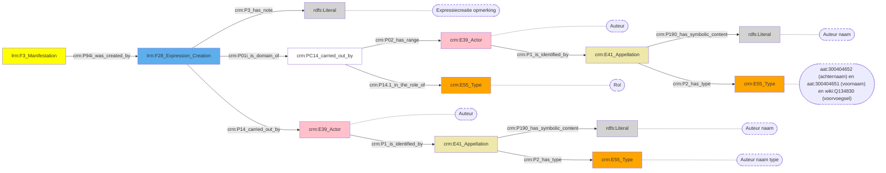

```mermaid
graph LR
style 17e0efec-8e93-11ee-8f9d-96a6d245525a fill:#ffff00
style 3d7e775f-1848-11ef-a147-960002548b4f fill:#ffc0cb
style 69462efa-1848-11ef-914b-960002548b4f fill:#EEE8AA
style 69463102-1848-11ef-a693-960002548b4f fill:#ffa500
style 69463232-1848-11ef-ae1a-960002548b4f fill:#D3D3D3
style af0a497a-8e9a-11ee-8f9d-96a6d245525a fill:#5DAEEC
style af0a4df8-8e9a-11ee-8f9d-96a6d245525a fill:#ffa500
style af0a5226-8e9a-11ee-8f9d-96a6d245525a fill:#EEE8AA
style af0a5294-8e9a-11ee-8f9d-96a6d245525a fill:#D3D3D3
style af0a52ee-8e9a-11ee-8f9d-96a6d245525a fill:#ffa500
style af0a53c0-8e9a-11ee-8f9d-96a6d245525a fill:#ffffff
style af0a564a-8e9a-11ee-8f9d-96a6d245525a fill:#ffc0cb
style c33ed099-18d5-11ef-9bf2-960002548b4f fill:#D3D3D3
69462efa-1848-11ef-914b-960002548b4f["crm:E41_Appellation"]-->|"crm:P190_has_symbolic_content"|69463232-1848-11ef-ae1a-960002548b4f(rdfs:Literal)
af0a497a-8e9a-11ee-8f9d-96a6d245525a["lrm:F28_Expression_Creation"]-->|"crm:P3_has_note"|c33ed099-18d5-11ef-9bf2-960002548b4f(rdfs:Literal)
af0a5226-8e9a-11ee-8f9d-96a6d245525a["crm:E41_Appellation"]-->|"crm:P190_has_symbolic_content"|af0a5294-8e9a-11ee-8f9d-96a6d245525a(rdfs:Literal)
69463232-1848-11ef-ae1a-960002548b4f["rdfs:Literal"]-.-69463232-1848-11ef-ae1a-960002548b4f_s(["Auteur naam"])
69463102-1848-11ef-a693-960002548b4f["crm:E55_Type"]-.-69463102-1848-11ef-a693-960002548b4f_s(["Auteur naam type"])
3d7e775f-1848-11ef-a147-960002548b4f["crm:E39_Actor"]-.-3d7e775f-1848-11ef-a147-960002548b4f_s(["Auteur"])
c33ed099-18d5-11ef-9bf2-960002548b4f["rdfs:Literal"]-.-c33ed099-18d5-11ef-9bf2-960002548b4f_s(["Expressiecreatie opmerking"])
af0a5294-8e9a-11ee-8f9d-96a6d245525a["rdfs:Literal"]-.-af0a5294-8e9a-11ee-8f9d-96a6d245525a_s(["Auteur naam"])
af0a52ee-8e9a-11ee-8f9d-96a6d245525a["crm:E55_Type"]-.-af0a52ee-8e9a-11ee-8f9d-96a6d245525a_s(["aat:300404652 (achternaam) en aat:300404651 (voornaam) en wiki:Q134830 (voorvoegsel)"])
af0a564a-8e9a-11ee-8f9d-96a6d245525a["crm:E39_Actor"]-.-af0a564a-8e9a-11ee-8f9d-96a6d245525a_s(["Auteur"])
af0a4df8-8e9a-11ee-8f9d-96a6d245525a["crm:E55_Type"]-.-af0a4df8-8e9a-11ee-8f9d-96a6d245525a_s(["Rol"])
style 69463232-1848-11ef-ae1a-960002548b4f_s stroke-dasharray: 5
style 69463102-1848-11ef-a693-960002548b4f_s stroke-dasharray: 5
style 3d7e775f-1848-11ef-a147-960002548b4f_s stroke-dasharray: 5
style c33ed099-18d5-11ef-9bf2-960002548b4f_s stroke-dasharray: 5
style af0a5294-8e9a-11ee-8f9d-96a6d245525a_s stroke-dasharray: 5
style af0a52ee-8e9a-11ee-8f9d-96a6d245525a_s stroke-dasharray: 5
style af0a564a-8e9a-11ee-8f9d-96a6d245525a_s stroke-dasharray: 5
style af0a4df8-8e9a-11ee-8f9d-96a6d245525a_s stroke-dasharray: 5
17e0efec-8e93-11ee-8f9d-96a6d245525a["lrm:F3_Manifestation"]-->|"crm:P94i_was_created_by"|af0a497a-8e9a-11ee-8f9d-96a6d245525a["lrm:F28_Expression_Creation"]
3d7e775f-1848-11ef-a147-960002548b4f["crm:E39_Actor"]-->|"crm:P1_is_identified_by"|69462efa-1848-11ef-914b-960002548b4f["crm:E41_Appellation"]
69462efa-1848-11ef-914b-960002548b4f["crm:E41_Appellation"]-->|"crm:P2_has_type"|69463102-1848-11ef-a693-960002548b4f["crm:E55_Type"]
af0a497a-8e9a-11ee-8f9d-96a6d245525a["lrm:F28_Expression_Creation"]-->|"crm:P01i_is_domain_of"|af0a53c0-8e9a-11ee-8f9d-96a6d245525a["crm:PC14_carried_out_by"]
af0a497a-8e9a-11ee-8f9d-96a6d245525a["lrm:F28_Expression_Creation"]-->|"crm:P14_carried_out_by"|3d7e775f-1848-11ef-a147-960002548b4f["crm:E39_Actor"]
af0a5226-8e9a-11ee-8f9d-96a6d245525a["crm:E41_Appellation"]-->|"crm:P2_has_type"|af0a52ee-8e9a-11ee-8f9d-96a6d245525a["crm:E55_Type"]
af0a53c0-8e9a-11ee-8f9d-96a6d245525a["crm:PC14_carried_out_by"]-->|"crm:P02_has_range"|af0a564a-8e9a-11ee-8f9d-96a6d245525a["crm:E39_Actor"]
af0a53c0-8e9a-11ee-8f9d-96a6d245525a["crm:PC14_carried_out_by"]-->|"crm:P14.1_in_the_role_of"|af0a4df8-8e9a-11ee-8f9d-96a6d245525a["crm:E55_Type"]
af0a564a-8e9a-11ee-8f9d-96a6d245525a["crm:E39_Actor"]-->|"crm:P1_is_identified_by"|af0a5226-8e9a-11ee-8f9d-96a6d245525a["crm:E41_Appellation"]
```
