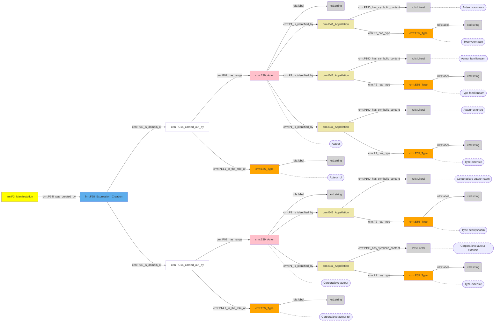

```mermaid
graph LR
af0a4c36-8e9a-11ee-8f9d-96a6d245525a["crm:E41_Appellation"]-->|"crm:P190_has_symbolic_content"|af0a4cb8-8e9a-11ee-8f9d-96a6d245525a(rdfs:Literal)
af0a4d1c-8e9a-11ee-8f9d-96a6d245525a["crm:E55_Type"]-->|"rdfs:label"|af0a4d94-8e9a-11ee-8f9d-96a6d245525a(xsd:string)
af0a4df8-8e9a-11ee-8f9d-96a6d245525a["crm:E55_Type"]-->|"rdfs:label"|af0a4b96-8e9a-11ee-8f9d-96a6d245525a(xsd:string)
af0a4e70-8e9a-11ee-8f9d-96a6d245525a["crm:E41_Appellation"]-->|"crm:P190_has_symbolic_content"|af0a4ed4-8e9a-11ee-8f9d-96a6d245525a(rdfs:Literal)
af0a4f42-8e9a-11ee-8f9d-96a6d245525a["crm:E55_Type"]-->|"rdfs:label"|af0a4fb0-8e9a-11ee-8f9d-96a6d245525a(xsd:string)
af0a508c-8e9a-11ee-8f9d-96a6d245525a["crm:E41_Appellation"]-->|"crm:P190_has_symbolic_content"|af0a50f0-8e9a-11ee-8f9d-96a6d245525a(rdfs:Literal)
af0a515e-8e9a-11ee-8f9d-96a6d245525a["crm:E55_Type"]-->|"rdfs:label"|af0a51b8-8e9a-11ee-8f9d-96a6d245525a(xsd:string)
af0a5226-8e9a-11ee-8f9d-96a6d245525a["crm:E41_Appellation"]-->|"crm:P190_has_symbolic_content"|af0a5294-8e9a-11ee-8f9d-96a6d245525a(rdfs:Literal)
af0a52ee-8e9a-11ee-8f9d-96a6d245525a["crm:E55_Type"]-->|"rdfs:label"|af0a5366-8e9a-11ee-8f9d-96a6d245525a(xsd:string)
af0a542e-8e9a-11ee-8f9d-96a6d245525a["crm:E41_Appellation"]-->|"crm:P190_has_symbolic_content"|af0a54a6-8e9a-11ee-8f9d-96a6d245525a(rdfs:Literal)
af0a550a-8e9a-11ee-8f9d-96a6d245525a["crm:E55_Type"]-->|"rdfs:label"|af0a5578-8e9a-11ee-8f9d-96a6d245525a(xsd:string)
af0a564a-8e9a-11ee-8f9d-96a6d245525a["crm:E39_Actor"]-->|"rdfs:label"|af0a56ae-8e9a-11ee-8f9d-96a6d245525a(xsd:string)
af0a5712-8e9a-11ee-8f9d-96a6d245525a["crm:E55_Type"]-->|"rdfs:label"|af0a55dc-8e9a-11ee-8f9d-96a6d245525a(xsd:string)
af0a5780-8e9a-11ee-8f9d-96a6d245525a["crm:E39_Actor"]-->|"rdfs:label"|af0a501e-8e9a-11ee-8f9d-96a6d245525a(xsd:string)
style af0a4cb8-8e9a-11ee-8f9d-96a6d245525a_s stroke-dasharray: 5
style af0a4d1c-8e9a-11ee-8f9d-96a6d245525a_s stroke-dasharray: 5
style af0a4ed4-8e9a-11ee-8f9d-96a6d245525a_s stroke-dasharray: 5
style af0a4f42-8e9a-11ee-8f9d-96a6d245525a_s stroke-dasharray: 5
style af0a50f0-8e9a-11ee-8f9d-96a6d245525a_s stroke-dasharray: 5
style af0a515e-8e9a-11ee-8f9d-96a6d245525a_s stroke-dasharray: 5
style af0a5294-8e9a-11ee-8f9d-96a6d245525a_s stroke-dasharray: 5
style af0a52ee-8e9a-11ee-8f9d-96a6d245525a_s stroke-dasharray: 5
style af0a564a-8e9a-11ee-8f9d-96a6d245525a_s stroke-dasharray: 5
style af0a4df8-8e9a-11ee-8f9d-96a6d245525a_s stroke-dasharray: 5
style af0a54a6-8e9a-11ee-8f9d-96a6d245525a_s stroke-dasharray: 5
style af0a550a-8e9a-11ee-8f9d-96a6d245525a_s stroke-dasharray: 5
style af0a5780-8e9a-11ee-8f9d-96a6d245525a_s stroke-dasharray: 5
style af0a5712-8e9a-11ee-8f9d-96a6d245525a_s stroke-dasharray: 5
style 17e0efec-8e93-11ee-8f9d-96a6d245525a fill:#ffff00
style af0a497a-8e9a-11ee-8f9d-96a6d245525a fill:#5DAEEC
style af0a4b96-8e9a-11ee-8f9d-96a6d245525a fill:#D3D3D3
style af0a4c36-8e9a-11ee-8f9d-96a6d245525a fill:#EEE8AA
style af0a4cb8-8e9a-11ee-8f9d-96a6d245525a fill:#D3D3D3
style af0a4d1c-8e9a-11ee-8f9d-96a6d245525a fill:#ffa500
style af0a4d94-8e9a-11ee-8f9d-96a6d245525a fill:#D3D3D3
style af0a4df8-8e9a-11ee-8f9d-96a6d245525a fill:#ffa500
style af0a4e70-8e9a-11ee-8f9d-96a6d245525a fill:#EEE8AA
style af0a4ed4-8e9a-11ee-8f9d-96a6d245525a fill:#D3D3D3
style af0a4f42-8e9a-11ee-8f9d-96a6d245525a fill:#ffa500
style af0a4fb0-8e9a-11ee-8f9d-96a6d245525a fill:#D3D3D3
style af0a501e-8e9a-11ee-8f9d-96a6d245525a fill:#D3D3D3
style af0a508c-8e9a-11ee-8f9d-96a6d245525a fill:#EEE8AA
style af0a50f0-8e9a-11ee-8f9d-96a6d245525a fill:#D3D3D3
style af0a515e-8e9a-11ee-8f9d-96a6d245525a fill:#ffa500
style af0a51b8-8e9a-11ee-8f9d-96a6d245525a fill:#D3D3D3
style af0a5226-8e9a-11ee-8f9d-96a6d245525a fill:#EEE8AA
style af0a5294-8e9a-11ee-8f9d-96a6d245525a fill:#D3D3D3
style af0a52ee-8e9a-11ee-8f9d-96a6d245525a fill:#ffa500
style af0a5366-8e9a-11ee-8f9d-96a6d245525a fill:#D3D3D3
style af0a53c0-8e9a-11ee-8f9d-96a6d245525a fill:#ffffff
style af0a542e-8e9a-11ee-8f9d-96a6d245525a fill:#EEE8AA
style af0a54a6-8e9a-11ee-8f9d-96a6d245525a fill:#D3D3D3
style af0a550a-8e9a-11ee-8f9d-96a6d245525a fill:#ffa500
style af0a5578-8e9a-11ee-8f9d-96a6d245525a fill:#D3D3D3
style af0a55dc-8e9a-11ee-8f9d-96a6d245525a fill:#D3D3D3
style af0a564a-8e9a-11ee-8f9d-96a6d245525a fill:#ffc0cb
style af0a56ae-8e9a-11ee-8f9d-96a6d245525a fill:#D3D3D3
style af0a5712-8e9a-11ee-8f9d-96a6d245525a fill:#ffa500
style af0a5780-8e9a-11ee-8f9d-96a6d245525a fill:#ffc0cb
style af0a57da-8e9a-11ee-8f9d-96a6d245525a fill:#ffffff
17e0efec-8e93-11ee-8f9d-96a6d245525a["lrm:F3_Manifestation"]-->|"crm:P94i_was_created_by"|af0a497a-8e9a-11ee-8f9d-96a6d245525a["lrm:F28_Expression_Creation"]
af0a497a-8e9a-11ee-8f9d-96a6d245525a["lrm:F28_Expression_Creation"]-->|"crm:P01i_is_domain_of"|af0a53c0-8e9a-11ee-8f9d-96a6d245525a["crm:PC14_carried_out_by"]
af0a497a-8e9a-11ee-8f9d-96a6d245525a["lrm:F28_Expression_Creation"]-->|"crm:P01i_is_domain_of"|af0a57da-8e9a-11ee-8f9d-96a6d245525a["crm:PC14_carried_out_by"]
af0a4c36-8e9a-11ee-8f9d-96a6d245525a["crm:E41_Appellation"]-->|"crm:P2_has_type"|af0a4d1c-8e9a-11ee-8f9d-96a6d245525a["crm:E55_Type"]
af0a4e70-8e9a-11ee-8f9d-96a6d245525a["crm:E41_Appellation"]-->|"crm:P2_has_type"|af0a4f42-8e9a-11ee-8f9d-96a6d245525a["crm:E55_Type"]
af0a508c-8e9a-11ee-8f9d-96a6d245525a["crm:E41_Appellation"]-->|"crm:P2_has_type"|af0a515e-8e9a-11ee-8f9d-96a6d245525a["crm:E55_Type"]
af0a5226-8e9a-11ee-8f9d-96a6d245525a["crm:E41_Appellation"]-->|"crm:P2_has_type"|af0a52ee-8e9a-11ee-8f9d-96a6d245525a["crm:E55_Type"]
af0a53c0-8e9a-11ee-8f9d-96a6d245525a["crm:PC14_carried_out_by"]-->|"crm:P02_has_range"|af0a564a-8e9a-11ee-8f9d-96a6d245525a["crm:E39_Actor"]
af0a53c0-8e9a-11ee-8f9d-96a6d245525a["crm:PC14_carried_out_by"]-->|"crm:P14.1_in_the_role_of"|af0a4df8-8e9a-11ee-8f9d-96a6d245525a["crm:E55_Type"]
af0a542e-8e9a-11ee-8f9d-96a6d245525a["crm:E41_Appellation"]-->|"crm:P2_has_type"|af0a550a-8e9a-11ee-8f9d-96a6d245525a["crm:E55_Type"]
af0a564a-8e9a-11ee-8f9d-96a6d245525a["crm:E39_Actor"]-->|"crm:P1_is_identified_by"|af0a4c36-8e9a-11ee-8f9d-96a6d245525a["crm:E41_Appellation"]
af0a564a-8e9a-11ee-8f9d-96a6d245525a["crm:E39_Actor"]-->|"crm:P1_is_identified_by"|af0a508c-8e9a-11ee-8f9d-96a6d245525a["crm:E41_Appellation"]
af0a564a-8e9a-11ee-8f9d-96a6d245525a["crm:E39_Actor"]-->|"crm:P1_is_identified_by"|af0a5226-8e9a-11ee-8f9d-96a6d245525a["crm:E41_Appellation"]
af0a5780-8e9a-11ee-8f9d-96a6d245525a["crm:E39_Actor"]-->|"crm:P1_is_identified_by"|af0a4e70-8e9a-11ee-8f9d-96a6d245525a["crm:E41_Appellation"]
af0a5780-8e9a-11ee-8f9d-96a6d245525a["crm:E39_Actor"]-->|"crm:P1_is_identified_by"|af0a542e-8e9a-11ee-8f9d-96a6d245525a["crm:E41_Appellation"]
af0a57da-8e9a-11ee-8f9d-96a6d245525a["crm:PC14_carried_out_by"]-->|"crm:P02_has_range"|af0a5780-8e9a-11ee-8f9d-96a6d245525a["crm:E39_Actor"]
af0a57da-8e9a-11ee-8f9d-96a6d245525a["crm:PC14_carried_out_by"]-->|"crm:P14.1_in_the_role_of"|af0a5712-8e9a-11ee-8f9d-96a6d245525a["crm:E55_Type"]
af0a4cb8-8e9a-11ee-8f9d-96a6d245525a["rdfs:Literal"]-.-af0a4cb8-8e9a-11ee-8f9d-96a6d245525a_s(["Auteur voornaam"])
af0a4d1c-8e9a-11ee-8f9d-96a6d245525a["crm:E55_Type"]-.-af0a4d1c-8e9a-11ee-8f9d-96a6d245525a_s(["Type "voornaam""])
af0a4ed4-8e9a-11ee-8f9d-96a6d245525a["rdfs:Literal"]-.-af0a4ed4-8e9a-11ee-8f9d-96a6d245525a_s(["Corporatieve auteur naam"])
af0a4f42-8e9a-11ee-8f9d-96a6d245525a["crm:E55_Type"]-.-af0a4f42-8e9a-11ee-8f9d-96a6d245525a_s(["Type "bedrijfsnaam""])
af0a50f0-8e9a-11ee-8f9d-96a6d245525a["rdfs:Literal"]-.-af0a50f0-8e9a-11ee-8f9d-96a6d245525a_s(["Auteur familienaam"])
af0a515e-8e9a-11ee-8f9d-96a6d245525a["crm:E55_Type"]-.-af0a515e-8e9a-11ee-8f9d-96a6d245525a_s(["Type "familienaam""])
af0a5294-8e9a-11ee-8f9d-96a6d245525a["rdfs:Literal"]-.-af0a5294-8e9a-11ee-8f9d-96a6d245525a_s(["Auteur extensie"])
af0a52ee-8e9a-11ee-8f9d-96a6d245525a["crm:E55_Type"]-.-af0a52ee-8e9a-11ee-8f9d-96a6d245525a_s(["Type "extensie""])
af0a564a-8e9a-11ee-8f9d-96a6d245525a["crm:E39_Actor"]-.-af0a564a-8e9a-11ee-8f9d-96a6d245525a_s(["Auteur"])
af0a4df8-8e9a-11ee-8f9d-96a6d245525a["crm:E55_Type"]-.-af0a4df8-8e9a-11ee-8f9d-96a6d245525a_s(["Auteur rol"])
af0a54a6-8e9a-11ee-8f9d-96a6d245525a["rdfs:Literal"]-.-af0a54a6-8e9a-11ee-8f9d-96a6d245525a_s(["Corporatieve auteur extensie"])
af0a550a-8e9a-11ee-8f9d-96a6d245525a["crm:E55_Type"]-.-af0a550a-8e9a-11ee-8f9d-96a6d245525a_s(["Type "extensie""])
af0a5780-8e9a-11ee-8f9d-96a6d245525a["crm:E39_Actor"]-.-af0a5780-8e9a-11ee-8f9d-96a6d245525a_s(["Corporatieve auteur"])
af0a5712-8e9a-11ee-8f9d-96a6d245525a["crm:E55_Type"]-.-af0a5712-8e9a-11ee-8f9d-96a6d245525a_s(["Corporatieve auteur rol"])
```
