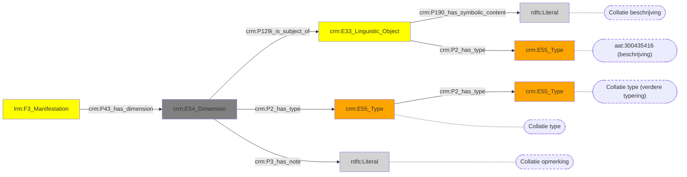

```mermaid
graph LR
style 17e0d156-8e93-11ee-8f9d-96a6d245525a fill:#808080
style 17e0efec-8e93-11ee-8f9d-96a6d245525a fill:#ffff00
style 17e0f820-8e93-11ee-8f9d-96a6d245525a fill:#ffa500
style 17e10d92-8e93-11ee-8f9d-96a6d245525a fill:#ffa500
style 59bc74da-18d5-11ef-b466-960002548b4f fill:#D3D3D3
style 9d4900a5-1850-11ef-a136-960002548b4f fill:#ffff00
style 9d490592-1850-11ef-b05e-960002548b4f fill:#D3D3D3
style 9d49071f-1850-11ef-9bfb-960002548b4f fill:#ffa500
17e0d156-8e93-11ee-8f9d-96a6d245525a["crm:E54_Dimension"]-->|"crm:P3_has_note"|59bc74da-18d5-11ef-b466-960002548b4f(rdfs:Literal)
9d4900a5-1850-11ef-a136-960002548b4f["crm:E33_Linguistic_Object"]-->|"crm:P190_has_symbolic_content"|9d490592-1850-11ef-b05e-960002548b4f(rdfs:Literal)
17e10d92-8e93-11ee-8f9d-96a6d245525a["crm:E55_Type"]-.-17e10d92-8e93-11ee-8f9d-96a6d245525a_s(["Collatie type"])
59bc74da-18d5-11ef-b466-960002548b4f["rdfs:Literal"]-.-59bc74da-18d5-11ef-b466-960002548b4f_s(["Collatie opmerking"])
17e0f820-8e93-11ee-8f9d-96a6d245525a["crm:E55_Type"]-.-17e0f820-8e93-11ee-8f9d-96a6d245525a_s(["Collatie type (verdere typering)"])
9d490592-1850-11ef-b05e-960002548b4f["rdfs:Literal"]-.-9d490592-1850-11ef-b05e-960002548b4f_s(["Collatie beschrijving"])
9d49071f-1850-11ef-9bfb-960002548b4f["crm:E55_Type"]-.-9d49071f-1850-11ef-9bfb-960002548b4f_s(["aat:300435416 (beschrijving)"])
style 17e10d92-8e93-11ee-8f9d-96a6d245525a_s stroke-dasharray: 5
style 59bc74da-18d5-11ef-b466-960002548b4f_s stroke-dasharray: 5
style 17e0f820-8e93-11ee-8f9d-96a6d245525a_s stroke-dasharray: 5
style 9d490592-1850-11ef-b05e-960002548b4f_s stroke-dasharray: 5
style 9d49071f-1850-11ef-9bfb-960002548b4f_s stroke-dasharray: 5
17e0d156-8e93-11ee-8f9d-96a6d245525a["crm:E54_Dimension"]-->|"crm:P129i_is_subject_of"|9d4900a5-1850-11ef-a136-960002548b4f["crm:E33_Linguistic_Object"]
17e0d156-8e93-11ee-8f9d-96a6d245525a["crm:E54_Dimension"]-->|"crm:P2_has_type"|17e10d92-8e93-11ee-8f9d-96a6d245525a["crm:E55_Type"]
17e0efec-8e93-11ee-8f9d-96a6d245525a["lrm:F3_Manifestation"]-->|"crm:P43_has_dimension"|17e0d156-8e93-11ee-8f9d-96a6d245525a["crm:E54_Dimension"]
17e10d92-8e93-11ee-8f9d-96a6d245525a["crm:E55_Type"]-->|"crm:P2_has_type"|17e0f820-8e93-11ee-8f9d-96a6d245525a["crm:E55_Type"]
9d4900a5-1850-11ef-a136-960002548b4f["crm:E33_Linguistic_Object"]-->|"crm:P2_has_type"|9d49071f-1850-11ef-9bfb-960002548b4f["crm:E55_Type"]
```
