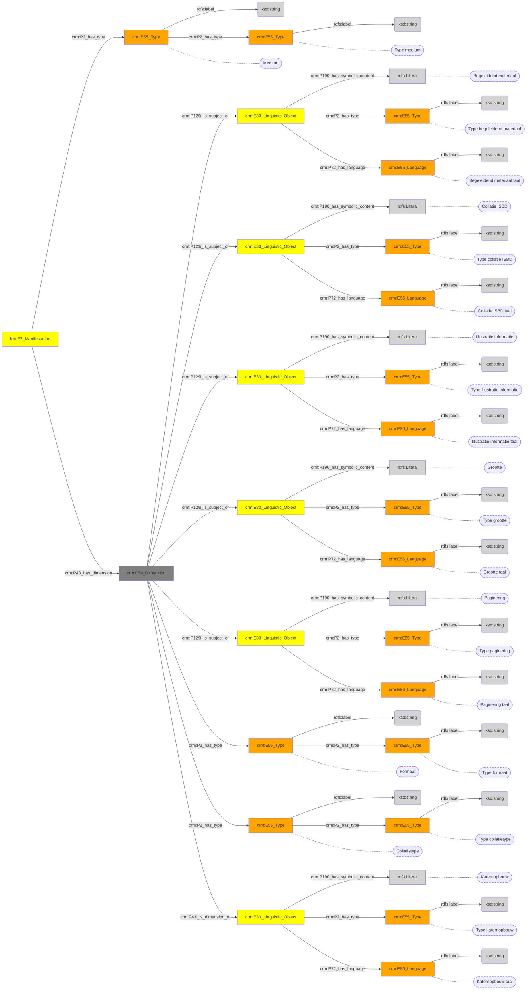

```mermaid
graph LR
0990a97a-936e-11ee-a1bf-960002548b4f["crm:E55_Type"]-->|"rdfs:label"|0990acbf-936e-11ee-8fa2-960002548b4f(xsd:string)
0990ab90-936e-11ee-8276-960002548b4f["crm:E55_Type"]-->|"rdfs:label"|0990ac3a-936e-11ee-b5b1-960002548b4f(xsd:string)
17e0f820-8e93-11ee-8f9d-96a6d245525a["crm:E55_Type"]-->|"rdfs:label"|17e0f866-8e93-11ee-8f9d-96a6d245525a(xsd:string)
17e0f8f2-8e93-11ee-8f9d-96a6d245525a["crm:E33_Linguistic_Object"]-->|"crm:P190_has_symbolic_content"|17e0f938-8e93-11ee-8f9d-96a6d245525a(rdfs:Literal)
17e0f9c4-8e93-11ee-8f9d-96a6d245525a["crm:E55_Type"]-->|"rdfs:label"|17e0f97e-8e93-11ee-8f9d-96a6d245525a(xsd:string)
17e0fa96-8e93-11ee-8f9d-96a6d245525a["crm:E56_Language"]-->|"rdfs:label"|17e0fa0a-8e93-11ee-8f9d-96a6d245525a(xsd:string)
17e0fcee-8e93-11ee-8f9d-96a6d245525a["crm:E33_Linguistic_Object"]-->|"crm:P190_has_symbolic_content"|17e0fd34-8e93-11ee-8f9d-96a6d245525a(rdfs:Literal)
17e0fdc0-8e93-11ee-8f9d-96a6d245525a["crm:E55_Type"]-->|"rdfs:label"|17e0fd7a-8e93-11ee-8f9d-96a6d245525a(xsd:string)
17e0fe60-8e93-11ee-8f9d-96a6d245525a["crm:E56_Language"]-->|"rdfs:label"|17e0fe06-8e93-11ee-8f9d-96a6d245525a(xsd:string)
17e0fff0-8e93-11ee-8f9d-96a6d245525a["crm:E55_Type"]-->|"rdfs:label"|17e1007c-8e93-11ee-8f9d-96a6d245525a(xsd:string)
17e10036-8e93-11ee-8f9d-96a6d245525a["crm:E55_Type"]-->|"rdfs:label"|17e100c2-8e93-11ee-8f9d-96a6d245525a(xsd:string)
17e1059a-8e93-11ee-8f9d-96a6d245525a["crm:E33_Linguistic_Object"]-->|"crm:P190_has_symbolic_content"|17e105e0-8e93-11ee-8f9d-96a6d245525a(rdfs:Literal)
17e10676-8e93-11ee-8f9d-96a6d245525a["crm:E55_Type"]-->|"rdfs:label"|17e10626-8e93-11ee-8f9d-96a6d245525a(xsd:string)
17e10702-8e93-11ee-8f9d-96a6d245525a["crm:E56_Language"]-->|"rdfs:label"|17e106bc-8e93-11ee-8f9d-96a6d245525a(xsd:string)
17e10798-8e93-11ee-8f9d-96a6d245525a["crm:E33_Linguistic_Object"]-->|"crm:P190_has_symbolic_content"|17e107de-8e93-11ee-8f9d-96a6d245525a(rdfs:Literal)
17e1086a-8e93-11ee-8f9d-96a6d245525a["crm:E55_Type"]-->|"rdfs:label"|17e10824-8e93-11ee-8f9d-96a6d245525a(xsd:string)
17e108f6-8e93-11ee-8f9d-96a6d245525a["crm:E56_Language"]-->|"rdfs:label"|17e108b0-8e93-11ee-8f9d-96a6d245525a(xsd:string)
17e10a4a-8e93-11ee-8f9d-96a6d245525a["crm:E33_Linguistic_Object"]-->|"crm:P190_has_symbolic_content"|17e10a90-8e93-11ee-8f9d-96a6d245525a(rdfs:Literal)
17e10b1c-8e93-11ee-8f9d-96a6d245525a["crm:E55_Type"]-->|"rdfs:label"|17e10ad6-8e93-11ee-8f9d-96a6d245525a(xsd:string)
17e10bee-8e93-11ee-8f9d-96a6d245525a["crm:E56_Language"]-->|"rdfs:label"|17e10b62-8e93-11ee-8f9d-96a6d245525a(xsd:string)
17e10d4c-8e93-11ee-8f9d-96a6d245525a["crm:E33_Linguistic_Object"]-->|"crm:P190_has_symbolic_content"|17e10e28-8e93-11ee-8f9d-96a6d245525a(rdfs:Literal)
17e10d92-8e93-11ee-8f9d-96a6d245525a["crm:E55_Type"]-->|"rdfs:label"|17e10dd8-8e93-11ee-8f9d-96a6d245525a(xsd:string)
17e10eaa-8e93-11ee-8f9d-96a6d245525a["crm:E55_Type"]-->|"rdfs:label"|17e10ef0-8e93-11ee-8f9d-96a6d245525a(xsd:string)
17e10f36-8e93-11ee-8f9d-96a6d245525a["crm:E56_Language"]-->|"rdfs:label"|17e10e6e-8e93-11ee-8f9d-96a6d245525a(xsd:string)
style 0990ab90-936e-11ee-8276-960002548b4f_s stroke-dasharray: 5
style 17e0fff0-8e93-11ee-8f9d-96a6d245525a_s stroke-dasharray: 5
style 17e10d92-8e93-11ee-8f9d-96a6d245525a_s stroke-dasharray: 5
style 0990a97a-936e-11ee-a1bf-960002548b4f_s stroke-dasharray: 5
style 17e0f938-8e93-11ee-8f9d-96a6d245525a_s stroke-dasharray: 5
style 17e0f9c4-8e93-11ee-8f9d-96a6d245525a_s stroke-dasharray: 5
style 17e0fa96-8e93-11ee-8f9d-96a6d245525a_s stroke-dasharray: 5
style 17e0fd34-8e93-11ee-8f9d-96a6d245525a_s stroke-dasharray: 5
style 17e0fdc0-8e93-11ee-8f9d-96a6d245525a_s stroke-dasharray: 5
style 17e0fe60-8e93-11ee-8f9d-96a6d245525a_s stroke-dasharray: 5
style 17e10036-8e93-11ee-8f9d-96a6d245525a_s stroke-dasharray: 5
style 17e105e0-8e93-11ee-8f9d-96a6d245525a_s stroke-dasharray: 5
style 17e10676-8e93-11ee-8f9d-96a6d245525a_s stroke-dasharray: 5
style 17e10702-8e93-11ee-8f9d-96a6d245525a_s stroke-dasharray: 5
style 17e107de-8e93-11ee-8f9d-96a6d245525a_s stroke-dasharray: 5
style 17e1086a-8e93-11ee-8f9d-96a6d245525a_s stroke-dasharray: 5
style 17e108f6-8e93-11ee-8f9d-96a6d245525a_s stroke-dasharray: 5
style 17e10a90-8e93-11ee-8f9d-96a6d245525a_s stroke-dasharray: 5
style 17e10b1c-8e93-11ee-8f9d-96a6d245525a_s stroke-dasharray: 5
style 17e10bee-8e93-11ee-8f9d-96a6d245525a_s stroke-dasharray: 5
style 17e10e28-8e93-11ee-8f9d-96a6d245525a_s stroke-dasharray: 5
style 17e10eaa-8e93-11ee-8f9d-96a6d245525a_s stroke-dasharray: 5
style 17e10f36-8e93-11ee-8f9d-96a6d245525a_s stroke-dasharray: 5
style 17e0f820-8e93-11ee-8f9d-96a6d245525a_s stroke-dasharray: 5
style 17e1007c-8e93-11ee-8f9d-96a6d245525a fill:#D3D3D3
style 17e0f938-8e93-11ee-8f9d-96a6d245525a fill:#D3D3D3
style 17e10d92-8e93-11ee-8f9d-96a6d245525a fill:#ffa500
style 17e0fd7a-8e93-11ee-8f9d-96a6d245525a fill:#D3D3D3
style 17e10824-8e93-11ee-8f9d-96a6d245525a fill:#D3D3D3
style 17e0fff0-8e93-11ee-8f9d-96a6d245525a fill:#ffa500
style 17e106bc-8e93-11ee-8f9d-96a6d245525a fill:#D3D3D3
style 17e10e28-8e93-11ee-8f9d-96a6d245525a fill:#D3D3D3
style 17e108f6-8e93-11ee-8f9d-96a6d245525a fill:#ffa500
style 17e0f9c4-8e93-11ee-8f9d-96a6d245525a fill:#ffa500
style 17e107de-8e93-11ee-8f9d-96a6d245525a fill:#D3D3D3
style 17e0fa0a-8e93-11ee-8f9d-96a6d245525a fill:#D3D3D3
style 0990a97a-936e-11ee-a1bf-960002548b4f fill:#ffa500
style 17e10a4a-8e93-11ee-8f9d-96a6d245525a fill:#ffff00
style 0990acbf-936e-11ee-8fa2-960002548b4f fill:#D3D3D3
style 17e1059a-8e93-11ee-8f9d-96a6d245525a fill:#ffff00
style 17e0fd34-8e93-11ee-8f9d-96a6d245525a fill:#D3D3D3
style 17e10702-8e93-11ee-8f9d-96a6d245525a fill:#ffa500
style 17e10626-8e93-11ee-8f9d-96a6d245525a fill:#D3D3D3
style 17e10d4c-8e93-11ee-8f9d-96a6d245525a fill:#ffff00
style 0990ab90-936e-11ee-8276-960002548b4f fill:#ffa500
style 17e10eaa-8e93-11ee-8f9d-96a6d245525a fill:#ffa500
style 17e10798-8e93-11ee-8f9d-96a6d245525a fill:#ffff00
style 17e10ef0-8e93-11ee-8f9d-96a6d245525a fill:#D3D3D3
style 17e105e0-8e93-11ee-8f9d-96a6d245525a fill:#D3D3D3
style 17e10a90-8e93-11ee-8f9d-96a6d245525a fill:#D3D3D3
style 17e1086a-8e93-11ee-8f9d-96a6d245525a fill:#ffa500
style 17e0fe06-8e93-11ee-8f9d-96a6d245525a fill:#D3D3D3
style 17e10676-8e93-11ee-8f9d-96a6d245525a fill:#ffa500
style 17e100c2-8e93-11ee-8f9d-96a6d245525a fill:#D3D3D3
style 17e0fdc0-8e93-11ee-8f9d-96a6d245525a fill:#ffa500
style 17e0efec-8e93-11ee-8f9d-96a6d245525a fill:#ffff00
style 17e10bee-8e93-11ee-8f9d-96a6d245525a fill:#ffa500
style 17e10036-8e93-11ee-8f9d-96a6d245525a fill:#ffa500
style 17e10dd8-8e93-11ee-8f9d-96a6d245525a fill:#D3D3D3
style 17e0f866-8e93-11ee-8f9d-96a6d245525a fill:#D3D3D3
style 17e108b0-8e93-11ee-8f9d-96a6d245525a fill:#D3D3D3
style 17e0f820-8e93-11ee-8f9d-96a6d245525a fill:#ffa500
style 17e10ad6-8e93-11ee-8f9d-96a6d245525a fill:#D3D3D3
style 17e0f97e-8e93-11ee-8f9d-96a6d245525a fill:#D3D3D3
style 17e0fcee-8e93-11ee-8f9d-96a6d245525a fill:#ffff00
style 17e10b62-8e93-11ee-8f9d-96a6d245525a fill:#D3D3D3
style 17e10f36-8e93-11ee-8f9d-96a6d245525a fill:#ffa500
style 17e0f8f2-8e93-11ee-8f9d-96a6d245525a fill:#ffff00
style 17e0d156-8e93-11ee-8f9d-96a6d245525a fill:#808080
style 17e10e6e-8e93-11ee-8f9d-96a6d245525a fill:#D3D3D3
style 17e0fa96-8e93-11ee-8f9d-96a6d245525a fill:#ffa500
style 17e0fe60-8e93-11ee-8f9d-96a6d245525a fill:#ffa500
style 17e10b1c-8e93-11ee-8f9d-96a6d245525a fill:#ffa500
style 0990ac3a-936e-11ee-b5b1-960002548b4f fill:#D3D3D3
0990a97a-936e-11ee-a1bf-960002548b4f["crm:E55_Type"]-->|"crm:P2_has_type"|0990ab90-936e-11ee-8276-960002548b4f["crm:E55_Type"]
17e0d156-8e93-11ee-8f9d-96a6d245525a["crm:E54_Dimension"]-->|"crm:P129i_is_subject_of"|17e0f8f2-8e93-11ee-8f9d-96a6d245525a["crm:E33_Linguistic_Object"]
17e0d156-8e93-11ee-8f9d-96a6d245525a["crm:E54_Dimension"]-->|"crm:P129i_is_subject_of"|17e0fcee-8e93-11ee-8f9d-96a6d245525a["crm:E33_Linguistic_Object"]
17e0d156-8e93-11ee-8f9d-96a6d245525a["crm:E54_Dimension"]-->|"crm:P129i_is_subject_of"|17e1059a-8e93-11ee-8f9d-96a6d245525a["crm:E33_Linguistic_Object"]
17e0d156-8e93-11ee-8f9d-96a6d245525a["crm:E54_Dimension"]-->|"crm:P129i_is_subject_of"|17e10798-8e93-11ee-8f9d-96a6d245525a["crm:E33_Linguistic_Object"]
17e0d156-8e93-11ee-8f9d-96a6d245525a["crm:E54_Dimension"]-->|"crm:P129i_is_subject_of"|17e10d4c-8e93-11ee-8f9d-96a6d245525a["crm:E33_Linguistic_Object"]
17e0d156-8e93-11ee-8f9d-96a6d245525a["crm:E54_Dimension"]-->|"crm:P2_has_type"|17e0fff0-8e93-11ee-8f9d-96a6d245525a["crm:E55_Type"]
17e0d156-8e93-11ee-8f9d-96a6d245525a["crm:E54_Dimension"]-->|"crm:P2_has_type"|17e10d92-8e93-11ee-8f9d-96a6d245525a["crm:E55_Type"]
17e0d156-8e93-11ee-8f9d-96a6d245525a["crm:E54_Dimension"]-->|"crm:P43i_is_dimension_of"|17e10a4a-8e93-11ee-8f9d-96a6d245525a["crm:E33_Linguistic_Object"]
17e0efec-8e93-11ee-8f9d-96a6d245525a["lrm:F3_Manifestation"]-->|"crm:P2_has_type"|0990a97a-936e-11ee-a1bf-960002548b4f["crm:E55_Type"]
17e0efec-8e93-11ee-8f9d-96a6d245525a["lrm:F3_Manifestation"]-->|"crm:P43_has_dimension"|17e0d156-8e93-11ee-8f9d-96a6d245525a["crm:E54_Dimension"]
17e0f8f2-8e93-11ee-8f9d-96a6d245525a["crm:E33_Linguistic_Object"]-->|"crm:P2_has_type"|17e0f9c4-8e93-11ee-8f9d-96a6d245525a["crm:E55_Type"]
17e0f8f2-8e93-11ee-8f9d-96a6d245525a["crm:E33_Linguistic_Object"]-->|"crm:P72_has_language"|17e0fa96-8e93-11ee-8f9d-96a6d245525a["crm:E56_Language"]
17e0fcee-8e93-11ee-8f9d-96a6d245525a["crm:E33_Linguistic_Object"]-->|"crm:P2_has_type"|17e0fdc0-8e93-11ee-8f9d-96a6d245525a["crm:E55_Type"]
17e0fcee-8e93-11ee-8f9d-96a6d245525a["crm:E33_Linguistic_Object"]-->|"crm:P72_has_language"|17e0fe60-8e93-11ee-8f9d-96a6d245525a["crm:E56_Language"]
17e0fff0-8e93-11ee-8f9d-96a6d245525a["crm:E55_Type"]-->|"crm:P2_has_type"|17e10036-8e93-11ee-8f9d-96a6d245525a["crm:E55_Type"]
17e1059a-8e93-11ee-8f9d-96a6d245525a["crm:E33_Linguistic_Object"]-->|"crm:P2_has_type"|17e10676-8e93-11ee-8f9d-96a6d245525a["crm:E55_Type"]
17e1059a-8e93-11ee-8f9d-96a6d245525a["crm:E33_Linguistic_Object"]-->|"crm:P72_has_language"|17e10702-8e93-11ee-8f9d-96a6d245525a["crm:E56_Language"]
17e10798-8e93-11ee-8f9d-96a6d245525a["crm:E33_Linguistic_Object"]-->|"crm:P2_has_type"|17e1086a-8e93-11ee-8f9d-96a6d245525a["crm:E55_Type"]
17e10798-8e93-11ee-8f9d-96a6d245525a["crm:E33_Linguistic_Object"]-->|"crm:P72_has_language"|17e108f6-8e93-11ee-8f9d-96a6d245525a["crm:E56_Language"]
17e10a4a-8e93-11ee-8f9d-96a6d245525a["crm:E33_Linguistic_Object"]-->|"crm:P2_has_type"|17e10b1c-8e93-11ee-8f9d-96a6d245525a["crm:E55_Type"]
17e10a4a-8e93-11ee-8f9d-96a6d245525a["crm:E33_Linguistic_Object"]-->|"crm:P72_has_language"|17e10bee-8e93-11ee-8f9d-96a6d245525a["crm:E56_Language"]
17e10d4c-8e93-11ee-8f9d-96a6d245525a["crm:E33_Linguistic_Object"]-->|"crm:P2_has_type"|17e10eaa-8e93-11ee-8f9d-96a6d245525a["crm:E55_Type"]
17e10d4c-8e93-11ee-8f9d-96a6d245525a["crm:E33_Linguistic_Object"]-->|"crm:P72_has_language"|17e10f36-8e93-11ee-8f9d-96a6d245525a["crm:E56_Language"]
17e10d92-8e93-11ee-8f9d-96a6d245525a["crm:E55_Type"]-->|"crm:P2_has_type"|17e0f820-8e93-11ee-8f9d-96a6d245525a["crm:E55_Type"]
0990ab90-936e-11ee-8276-960002548b4f["crm:E55_Type"]-.-0990ab90-936e-11ee-8276-960002548b4f_s(["Type "medium""])
17e0fff0-8e93-11ee-8f9d-96a6d245525a["crm:E55_Type"]-.-17e0fff0-8e93-11ee-8f9d-96a6d245525a_s(["Formaat"])
17e10d92-8e93-11ee-8f9d-96a6d245525a["crm:E55_Type"]-.-17e10d92-8e93-11ee-8f9d-96a6d245525a_s(["Collatietype"])
0990a97a-936e-11ee-a1bf-960002548b4f["crm:E55_Type"]-.-0990a97a-936e-11ee-a1bf-960002548b4f_s(["Medium"])
17e0f938-8e93-11ee-8f9d-96a6d245525a["rdfs:Literal"]-.-17e0f938-8e93-11ee-8f9d-96a6d245525a_s(["Begeleidend materiaal"])
17e0f9c4-8e93-11ee-8f9d-96a6d245525a["crm:E55_Type"]-.-17e0f9c4-8e93-11ee-8f9d-96a6d245525a_s(["Type "begeleidend materiaal""])
17e0fa96-8e93-11ee-8f9d-96a6d245525a["crm:E56_Language"]-.-17e0fa96-8e93-11ee-8f9d-96a6d245525a_s(["Begeleidend materiaal taal"])
17e0fd34-8e93-11ee-8f9d-96a6d245525a["rdfs:Literal"]-.-17e0fd34-8e93-11ee-8f9d-96a6d245525a_s(["Collatie ISBD"])
17e0fdc0-8e93-11ee-8f9d-96a6d245525a["crm:E55_Type"]-.-17e0fdc0-8e93-11ee-8f9d-96a6d245525a_s(["Type "collatie ISBD""])
17e0fe60-8e93-11ee-8f9d-96a6d245525a["crm:E56_Language"]-.-17e0fe60-8e93-11ee-8f9d-96a6d245525a_s(["Collatie ISBD taal"])
17e10036-8e93-11ee-8f9d-96a6d245525a["crm:E55_Type"]-.-17e10036-8e93-11ee-8f9d-96a6d245525a_s(["Type "formaat""])
17e105e0-8e93-11ee-8f9d-96a6d245525a["rdfs:Literal"]-.-17e105e0-8e93-11ee-8f9d-96a6d245525a_s(["Illustratie informatie"])
17e10676-8e93-11ee-8f9d-96a6d245525a["crm:E55_Type"]-.-17e10676-8e93-11ee-8f9d-96a6d245525a_s(["Type "illustratie informatie""])
17e10702-8e93-11ee-8f9d-96a6d245525a["crm:E56_Language"]-.-17e10702-8e93-11ee-8f9d-96a6d245525a_s(["Illustratie informatie taal"])
17e107de-8e93-11ee-8f9d-96a6d245525a["rdfs:Literal"]-.-17e107de-8e93-11ee-8f9d-96a6d245525a_s(["Grootte"])
17e1086a-8e93-11ee-8f9d-96a6d245525a["crm:E55_Type"]-.-17e1086a-8e93-11ee-8f9d-96a6d245525a_s(["Type "grootte""])
17e108f6-8e93-11ee-8f9d-96a6d245525a["crm:E56_Language"]-.-17e108f6-8e93-11ee-8f9d-96a6d245525a_s(["Grootte taal"])
17e10a90-8e93-11ee-8f9d-96a6d245525a["rdfs:Literal"]-.-17e10a90-8e93-11ee-8f9d-96a6d245525a_s(["Katernopbouw"])
17e10b1c-8e93-11ee-8f9d-96a6d245525a["crm:E55_Type"]-.-17e10b1c-8e93-11ee-8f9d-96a6d245525a_s(["Type "katernopbouw""])
17e10bee-8e93-11ee-8f9d-96a6d245525a["crm:E56_Language"]-.-17e10bee-8e93-11ee-8f9d-96a6d245525a_s(["Katernopbouw taal"])
17e10e28-8e93-11ee-8f9d-96a6d245525a["rdfs:Literal"]-.-17e10e28-8e93-11ee-8f9d-96a6d245525a_s(["Paginering"])
17e10eaa-8e93-11ee-8f9d-96a6d245525a["crm:E55_Type"]-.-17e10eaa-8e93-11ee-8f9d-96a6d245525a_s(["Type "paginering""])
17e10f36-8e93-11ee-8f9d-96a6d245525a["crm:E56_Language"]-.-17e10f36-8e93-11ee-8f9d-96a6d245525a_s(["Paginering taal"])
17e0f820-8e93-11ee-8f9d-96a6d245525a["crm:E55_Type"]-.-17e0f820-8e93-11ee-8f9d-96a6d245525a_s(["Type "collatietype""])
```
