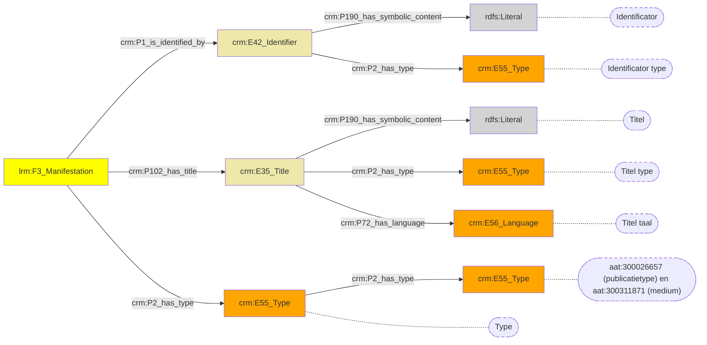

```mermaid
graph LR
style 17e0d502-8e93-11ee-8f9d-96a6d245525a fill:#EEE8AA
style 17e0d8b8-8e93-11ee-8f9d-96a6d245525a fill:#ffa500
style 17e0da7a-8e93-11ee-8f9d-96a6d245525a fill:#EEE8AA
style 17e0efec-8e93-11ee-8f9d-96a6d245525a fill:#ffff00
style 17e11008-8e93-11ee-8f9d-96a6d245525a fill:#ffa500
style 17e11094-8e93-11ee-8f9d-96a6d245525a fill:#ffa500
style 17e110da-8e93-11ee-8f9d-96a6d245525a fill:#D3D3D3
style 17e111f2-8e93-11ee-8f9d-96a6d245525a fill:#ffa500
style 17e112ba-8e93-11ee-8f9d-96a6d245525a fill:#D3D3D3
style 17e11300-8e93-11ee-8f9d-96a6d245525a fill:#ffa500
17e0d502-8e93-11ee-8f9d-96a6d245525a["crm:E35_Title"]-->|"crm:P190_has_symbolic_content"|17e110da-8e93-11ee-8f9d-96a6d245525a(rdfs:Literal)
17e0da7a-8e93-11ee-8f9d-96a6d245525a["crm:E42_Identifier"]-->|"crm:P190_has_symbolic_content"|17e112ba-8e93-11ee-8f9d-96a6d245525a(rdfs:Literal)
style 17e110da-8e93-11ee-8f9d-96a6d245525a_s stroke-dasharray: 5
style 17e11094-8e93-11ee-8f9d-96a6d245525a_s stroke-dasharray: 5
style 17e11008-8e93-11ee-8f9d-96a6d245525a_s stroke-dasharray: 5
style 17e111f2-8e93-11ee-8f9d-96a6d245525a_s stroke-dasharray: 5
style 17e112ba-8e93-11ee-8f9d-96a6d245525a_s stroke-dasharray: 5
style 17e11300-8e93-11ee-8f9d-96a6d245525a_s stroke-dasharray: 5
style 17e0d8b8-8e93-11ee-8f9d-96a6d245525a_s stroke-dasharray: 5
17e110da-8e93-11ee-8f9d-96a6d245525a["rdfs:Literal"]-.-17e110da-8e93-11ee-8f9d-96a6d245525a_s(["Titel"])
17e11094-8e93-11ee-8f9d-96a6d245525a["crm:E55_Type"]-.-17e11094-8e93-11ee-8f9d-96a6d245525a_s(["Titel type"])
17e11008-8e93-11ee-8f9d-96a6d245525a["crm:E56_Language"]-.-17e11008-8e93-11ee-8f9d-96a6d245525a_s(["Titel taal"])
17e111f2-8e93-11ee-8f9d-96a6d245525a["crm:E55_Type"]-.-17e111f2-8e93-11ee-8f9d-96a6d245525a_s(["aat:300026657 (publicatietype) en aat:300311871 (medium)"])
17e112ba-8e93-11ee-8f9d-96a6d245525a["rdfs:Literal"]-.-17e112ba-8e93-11ee-8f9d-96a6d245525a_s(["Identificator"])
17e11300-8e93-11ee-8f9d-96a6d245525a["crm:E55_Type"]-.-17e11300-8e93-11ee-8f9d-96a6d245525a_s(["Identificator type"])
17e0d8b8-8e93-11ee-8f9d-96a6d245525a["crm:E55_Type"]-.-17e0d8b8-8e93-11ee-8f9d-96a6d245525a_s(["Type"])
17e0d502-8e93-11ee-8f9d-96a6d245525a["crm:E35_Title"]-->|"crm:P2_has_type"|17e11094-8e93-11ee-8f9d-96a6d245525a["crm:E55_Type"]
17e0d502-8e93-11ee-8f9d-96a6d245525a["crm:E35_Title"]-->|"crm:P72_has_language"|17e11008-8e93-11ee-8f9d-96a6d245525a["crm:E56_Language"]
17e0d8b8-8e93-11ee-8f9d-96a6d245525a["crm:E55_Type"]-->|"crm:P2_has_type"|17e111f2-8e93-11ee-8f9d-96a6d245525a["crm:E55_Type"]
17e0da7a-8e93-11ee-8f9d-96a6d245525a["crm:E42_Identifier"]-->|"crm:P2_has_type"|17e11300-8e93-11ee-8f9d-96a6d245525a["crm:E55_Type"]
17e0efec-8e93-11ee-8f9d-96a6d245525a["lrm:F3_Manifestation"]-->|"crm:P1_is_identified_by"|17e0da7a-8e93-11ee-8f9d-96a6d245525a["crm:E42_Identifier"]
17e0efec-8e93-11ee-8f9d-96a6d245525a["lrm:F3_Manifestation"]-->|"crm:P102_has_title"|17e0d502-8e93-11ee-8f9d-96a6d245525a["crm:E35_Title"]
17e0efec-8e93-11ee-8f9d-96a6d245525a["lrm:F3_Manifestation"]-->|"crm:P2_has_type"|17e0d8b8-8e93-11ee-8f9d-96a6d245525a["crm:E55_Type"]
```
