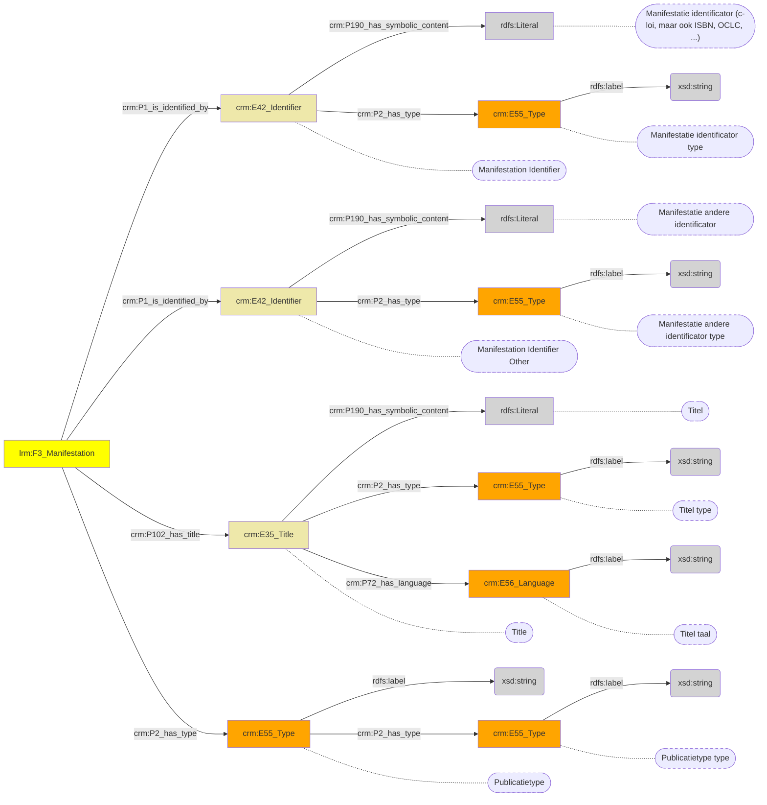

```mermaid
graph LR
17e0d502-8e93-11ee-8f9d-96a6d245525a["crm:E35_Title"]-->|"crm:P190_has_symbolic_content"|17e110da-8e93-11ee-8f9d-96a6d245525a(rdfs:Literal)
17e0d8b8-8e93-11ee-8f9d-96a6d245525a["crm:E55_Type"]-->|"rdfs:label"|17e1127e-8e93-11ee-8f9d-96a6d245525a(xsd:string)
17e0da7a-8e93-11ee-8f9d-96a6d245525a["crm:E42_Identifier"]-->|"crm:P190_has_symbolic_content"|17e112ba-8e93-11ee-8f9d-96a6d245525a(rdfs:Literal)
17e11008-8e93-11ee-8f9d-96a6d245525a["crm:E56_Language"]-->|"rdfs:label"|17e11120-8e93-11ee-8f9d-96a6d245525a(xsd:string)
17e11094-8e93-11ee-8f9d-96a6d245525a["crm:E55_Type"]-->|"rdfs:label"|17e1104e-8e93-11ee-8f9d-96a6d245525a(xsd:string)
17e111f2-8e93-11ee-8f9d-96a6d245525a["crm:E55_Type"]-->|"rdfs:label"|17e11238-8e93-11ee-8f9d-96a6d245525a(xsd:string)
17e11300-8e93-11ee-8f9d-96a6d245525a["crm:E55_Type"]-->|"rdfs:label"|17e11346-8e93-11ee-8f9d-96a6d245525a(xsd:string)
c538dbd4-cf15-11ee-aabf-960002548b4f["crm:E42_Identifier"]-->|"crm:P190_has_symbolic_content"|c538dea4-cf15-11ee-971a-960002548b4f(rdfs:Literal)
c538df27-cf15-11ee-be5d-960002548b4f["crm:E55_Type"]-->|"rdfs:label"|c538ddf8-cf15-11ee-b62b-960002548b4f(xsd:string)
17e0d502-8e93-11ee-8f9d-96a6d245525a["crm:E35_Title"]-->|"crm:P2_has_type"|17e11094-8e93-11ee-8f9d-96a6d245525a["crm:E55_Type"]
17e0d502-8e93-11ee-8f9d-96a6d245525a["crm:E35_Title"]-->|"crm:P72_has_language"|17e11008-8e93-11ee-8f9d-96a6d245525a["crm:E56_Language"]
17e0d8b8-8e93-11ee-8f9d-96a6d245525a["crm:E55_Type"]-->|"crm:P2_has_type"|17e111f2-8e93-11ee-8f9d-96a6d245525a["crm:E55_Type"]
17e0da7a-8e93-11ee-8f9d-96a6d245525a["crm:E42_Identifier"]-->|"crm:P2_has_type"|17e11300-8e93-11ee-8f9d-96a6d245525a["crm:E55_Type"]
17e0efec-8e93-11ee-8f9d-96a6d245525a["lrm:F3_Manifestation"]-->|"crm:P1_is_identified_by"|17e0da7a-8e93-11ee-8f9d-96a6d245525a["crm:E42_Identifier"]
17e0efec-8e93-11ee-8f9d-96a6d245525a["lrm:F3_Manifestation"]-->|"crm:P1_is_identified_by"|c538dbd4-cf15-11ee-aabf-960002548b4f["crm:E42_Identifier"]
17e0efec-8e93-11ee-8f9d-96a6d245525a["lrm:F3_Manifestation"]-->|"crm:P102_has_title"|17e0d502-8e93-11ee-8f9d-96a6d245525a["crm:E35_Title"]
17e0efec-8e93-11ee-8f9d-96a6d245525a["lrm:F3_Manifestation"]-->|"crm:P2_has_type"|17e0d8b8-8e93-11ee-8f9d-96a6d245525a["crm:E55_Type"]
c538dbd4-cf15-11ee-aabf-960002548b4f["crm:E42_Identifier"]-->|"crm:P2_has_type"|c538df27-cf15-11ee-be5d-960002548b4f["crm:E55_Type"]
17e110da-8e93-11ee-8f9d-96a6d245525a["rdfs:Literal"]-.-17e110da-8e93-11ee-8f9d-96a6d245525a_s(["Titel"])
17e11094-8e93-11ee-8f9d-96a6d245525a["crm:E55_Type"]-.-17e11094-8e93-11ee-8f9d-96a6d245525a_s(["Titel type"])
17e11008-8e93-11ee-8f9d-96a6d245525a["crm:E56_Language"]-.-17e11008-8e93-11ee-8f9d-96a6d245525a_s(["Titel taal"])
17e111f2-8e93-11ee-8f9d-96a6d245525a["crm:E55_Type"]-.-17e111f2-8e93-11ee-8f9d-96a6d245525a_s(["Publicatietype type"])
17e112ba-8e93-11ee-8f9d-96a6d245525a["rdfs:Literal"]-.-17e112ba-8e93-11ee-8f9d-96a6d245525a_s(["Manifestatie identificator (c-loi, maar ook ISBN, OCLC, ...)"])
17e11300-8e93-11ee-8f9d-96a6d245525a["crm:E55_Type"]-.-17e11300-8e93-11ee-8f9d-96a6d245525a_s(["Manifestatie identificator type"])
17e0da7a-8e93-11ee-8f9d-96a6d245525a["crm:E42_Identifier"]-.-17e0da7a-8e93-11ee-8f9d-96a6d245525a_s(["Manifestation Identifier"])
c538dbd4-cf15-11ee-aabf-960002548b4f["crm:E42_Identifier"]-.-c538dbd4-cf15-11ee-aabf-960002548b4f_s(["Manifestation Identifier Other"])
17e0d502-8e93-11ee-8f9d-96a6d245525a["crm:E35_Title"]-.-17e0d502-8e93-11ee-8f9d-96a6d245525a_s(["Title"])
17e0d8b8-8e93-11ee-8f9d-96a6d245525a["crm:E55_Type"]-.-17e0d8b8-8e93-11ee-8f9d-96a6d245525a_s(["Publicatietype"])
c538dea4-cf15-11ee-971a-960002548b4f["rdfs:Literal"]-.-c538dea4-cf15-11ee-971a-960002548b4f_s(["Manifestatie andere identificator"])
c538df27-cf15-11ee-be5d-960002548b4f["crm:E55_Type"]-.-c538df27-cf15-11ee-be5d-960002548b4f_s(["Manifestatie andere identificator type"])
style 17e110da-8e93-11ee-8f9d-96a6d245525a_s stroke-dasharray: 5
style 17e11094-8e93-11ee-8f9d-96a6d245525a_s stroke-dasharray: 5
style 17e11008-8e93-11ee-8f9d-96a6d245525a_s stroke-dasharray: 5
style 17e111f2-8e93-11ee-8f9d-96a6d245525a_s stroke-dasharray: 5
style 17e112ba-8e93-11ee-8f9d-96a6d245525a_s stroke-dasharray: 5
style 17e11300-8e93-11ee-8f9d-96a6d245525a_s stroke-dasharray: 5
style 17e0da7a-8e93-11ee-8f9d-96a6d245525a_s stroke-dasharray: 5
style c538dbd4-cf15-11ee-aabf-960002548b4f_s stroke-dasharray: 5
style 17e0d502-8e93-11ee-8f9d-96a6d245525a_s stroke-dasharray: 5
style 17e0d8b8-8e93-11ee-8f9d-96a6d245525a_s stroke-dasharray: 5
style c538dea4-cf15-11ee-971a-960002548b4f_s stroke-dasharray: 5
style c538df27-cf15-11ee-be5d-960002548b4f_s stroke-dasharray: 5
style 17e0d502-8e93-11ee-8f9d-96a6d245525a fill:#EEE8AA
style 17e0d8b8-8e93-11ee-8f9d-96a6d245525a fill:#ffa500
style 17e0da7a-8e93-11ee-8f9d-96a6d245525a fill:#EEE8AA
style 17e0efec-8e93-11ee-8f9d-96a6d245525a fill:#ffff00
style 17e11008-8e93-11ee-8f9d-96a6d245525a fill:#ffa500
style 17e1104e-8e93-11ee-8f9d-96a6d245525a fill:#D3D3D3
style 17e11094-8e93-11ee-8f9d-96a6d245525a fill:#ffa500
style 17e110da-8e93-11ee-8f9d-96a6d245525a fill:#D3D3D3
style 17e11120-8e93-11ee-8f9d-96a6d245525a fill:#D3D3D3
style 17e111f2-8e93-11ee-8f9d-96a6d245525a fill:#ffa500
style 17e11238-8e93-11ee-8f9d-96a6d245525a fill:#D3D3D3
style 17e1127e-8e93-11ee-8f9d-96a6d245525a fill:#D3D3D3
style 17e112ba-8e93-11ee-8f9d-96a6d245525a fill:#D3D3D3
style 17e11300-8e93-11ee-8f9d-96a6d245525a fill:#ffa500
style 17e11346-8e93-11ee-8f9d-96a6d245525a fill:#D3D3D3
style c538dbd4-cf15-11ee-aabf-960002548b4f fill:#EEE8AA
style c538ddf8-cf15-11ee-b62b-960002548b4f fill:#D3D3D3
style c538dea4-cf15-11ee-971a-960002548b4f fill:#D3D3D3
style c538df27-cf15-11ee-be5d-960002548b4f fill:#ffa500
```
