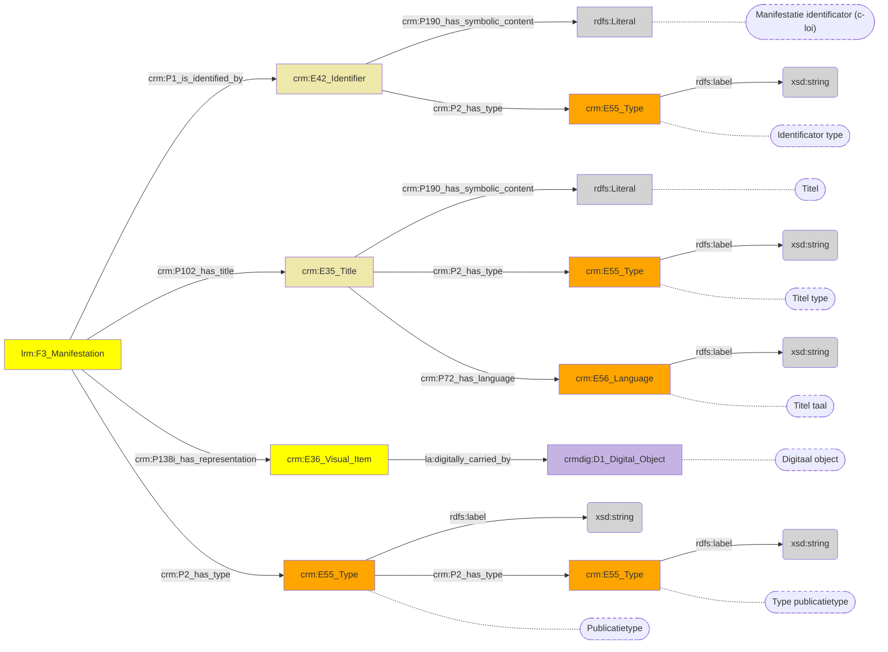

```mermaid
graph LR
17e0d502-8e93-11ee-8f9d-96a6d245525a["crm:E35_Title"]-->|"crm:P190_has_symbolic_content"|17e110da-8e93-11ee-8f9d-96a6d245525a(rdfs:Literal)
17e0d8b8-8e93-11ee-8f9d-96a6d245525a["crm:E55_Type"]-->|"rdfs:label"|17e1127e-8e93-11ee-8f9d-96a6d245525a(xsd:string)
17e0da7a-8e93-11ee-8f9d-96a6d245525a["crm:E42_Identifier"]-->|"crm:P190_has_symbolic_content"|17e112ba-8e93-11ee-8f9d-96a6d245525a(rdfs:Literal)
17e11008-8e93-11ee-8f9d-96a6d245525a["crm:E56_Language"]-->|"rdfs:label"|17e11120-8e93-11ee-8f9d-96a6d245525a(xsd:string)
17e11094-8e93-11ee-8f9d-96a6d245525a["crm:E55_Type"]-->|"rdfs:label"|17e1104e-8e93-11ee-8f9d-96a6d245525a(xsd:string)
17e111f2-8e93-11ee-8f9d-96a6d245525a["crm:E55_Type"]-->|"rdfs:label"|17e11238-8e93-11ee-8f9d-96a6d245525a(xsd:string)
17e11300-8e93-11ee-8f9d-96a6d245525a["crm:E55_Type"]-->|"rdfs:label"|17e11346-8e93-11ee-8f9d-96a6d245525a(xsd:string)
style 17e110da-8e93-11ee-8f9d-96a6d245525a_s stroke-dasharray: 5
style 17e11094-8e93-11ee-8f9d-96a6d245525a_s stroke-dasharray: 5
style 17e11008-8e93-11ee-8f9d-96a6d245525a_s stroke-dasharray: 5
style 17e111f2-8e93-11ee-8f9d-96a6d245525a_s stroke-dasharray: 5
style 17e112ba-8e93-11ee-8f9d-96a6d245525a_s stroke-dasharray: 5
style 17e11300-8e93-11ee-8f9d-96a6d245525a_s stroke-dasharray: 5
style 17e0f078-8e93-11ee-8f9d-96a6d245525a_s stroke-dasharray: 5
style 17e0d8b8-8e93-11ee-8f9d-96a6d245525a_s stroke-dasharray: 5
style 17e11346-8e93-11ee-8f9d-96a6d245525a fill:#D3D3D3
style 17e0de08-8e93-11ee-8f9d-96a6d245525a fill:#ffff00
style 17e11238-8e93-11ee-8f9d-96a6d245525a fill:#D3D3D3
style 17e11300-8e93-11ee-8f9d-96a6d245525a fill:#ffa500
style 17e11094-8e93-11ee-8f9d-96a6d245525a fill:#ffa500
style 17e112ba-8e93-11ee-8f9d-96a6d245525a fill:#D3D3D3
style 17e0d502-8e93-11ee-8f9d-96a6d245525a fill:#EEE8AA
style 17e0f078-8e93-11ee-8f9d-96a6d245525a fill:#C5B4E3
style 17e0efec-8e93-11ee-8f9d-96a6d245525a fill:#ffff00
style 17e111f2-8e93-11ee-8f9d-96a6d245525a fill:#ffa500
style 17e1127e-8e93-11ee-8f9d-96a6d245525a fill:#D3D3D3
style 17e11120-8e93-11ee-8f9d-96a6d245525a fill:#D3D3D3
style 17e0d8b8-8e93-11ee-8f9d-96a6d245525a fill:#ffa500
style 17e110da-8e93-11ee-8f9d-96a6d245525a fill:#D3D3D3
style 17e0da7a-8e93-11ee-8f9d-96a6d245525a fill:#EEE8AA
style 17e11008-8e93-11ee-8f9d-96a6d245525a fill:#ffa500
style 17e1104e-8e93-11ee-8f9d-96a6d245525a fill:#D3D3D3
17e0d502-8e93-11ee-8f9d-96a6d245525a["crm:E35_Title"]-->|"crm:P2_has_type"|17e11094-8e93-11ee-8f9d-96a6d245525a["crm:E55_Type"]
17e0d502-8e93-11ee-8f9d-96a6d245525a["crm:E35_Title"]-->|"crm:P72_has_language"|17e11008-8e93-11ee-8f9d-96a6d245525a["crm:E56_Language"]
17e0d8b8-8e93-11ee-8f9d-96a6d245525a["crm:E55_Type"]-->|"crm:P2_has_type"|17e111f2-8e93-11ee-8f9d-96a6d245525a["crm:E55_Type"]
17e0da7a-8e93-11ee-8f9d-96a6d245525a["crm:E42_Identifier"]-->|"crm:P2_has_type"|17e11300-8e93-11ee-8f9d-96a6d245525a["crm:E55_Type"]
17e0de08-8e93-11ee-8f9d-96a6d245525a["crm:E36_Visual_Item"]-->|"la:digitally_carried_by"|17e0f078-8e93-11ee-8f9d-96a6d245525a["crmdig:D1_Digital_Object"]
17e0efec-8e93-11ee-8f9d-96a6d245525a["lrm:F3_Manifestation"]-->|"crm:P1_is_identified_by"|17e0da7a-8e93-11ee-8f9d-96a6d245525a["crm:E42_Identifier"]
17e0efec-8e93-11ee-8f9d-96a6d245525a["lrm:F3_Manifestation"]-->|"crm:P102_has_title"|17e0d502-8e93-11ee-8f9d-96a6d245525a["crm:E35_Title"]
17e0efec-8e93-11ee-8f9d-96a6d245525a["lrm:F3_Manifestation"]-->|"crm:P138i_has_representation"|17e0de08-8e93-11ee-8f9d-96a6d245525a["crm:E36_Visual_Item"]
17e0efec-8e93-11ee-8f9d-96a6d245525a["lrm:F3_Manifestation"]-->|"crm:P2_has_type"|17e0d8b8-8e93-11ee-8f9d-96a6d245525a["crm:E55_Type"]
17e110da-8e93-11ee-8f9d-96a6d245525a["rdfs:Literal"]-.-17e110da-8e93-11ee-8f9d-96a6d245525a_s(["Titel"])
17e11094-8e93-11ee-8f9d-96a6d245525a["crm:E55_Type"]-.-17e11094-8e93-11ee-8f9d-96a6d245525a_s(["Titel type"])
17e11008-8e93-11ee-8f9d-96a6d245525a["crm:E56_Language"]-.-17e11008-8e93-11ee-8f9d-96a6d245525a_s(["Titel taal"])
17e111f2-8e93-11ee-8f9d-96a6d245525a["crm:E55_Type"]-.-17e111f2-8e93-11ee-8f9d-96a6d245525a_s(["Type "publicatietype""])
17e112ba-8e93-11ee-8f9d-96a6d245525a["rdfs:Literal"]-.-17e112ba-8e93-11ee-8f9d-96a6d245525a_s(["Manifestatie identificator (c-loi)"])
17e11300-8e93-11ee-8f9d-96a6d245525a["crm:E55_Type"]-.-17e11300-8e93-11ee-8f9d-96a6d245525a_s(["Identificator type"])
17e0f078-8e93-11ee-8f9d-96a6d245525a["crmdig:D1_Digital_Object"]-.-17e0f078-8e93-11ee-8f9d-96a6d245525a_s(["Digitaal object"])
17e0d8b8-8e93-11ee-8f9d-96a6d245525a["crm:E55_Type"]-.-17e0d8b8-8e93-11ee-8f9d-96a6d245525a_s(["Publicatietype"])
```
