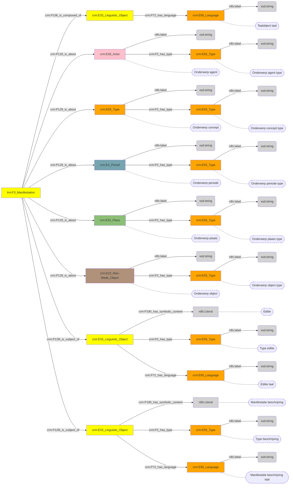

```mermaid
graph LR
17e0cbc0-8e93-11ee-8f9d-96a6d245525a["crm:E33_Linguistic_Object"]-->|"crm:P190_has_symbolic_content"|17e10388-8e93-11ee-8f9d-96a6d245525a(rdfs:Literal)
17e0dfca-8e93-11ee-8f9d-96a6d245525a["crm:E39_Actor"]-->|"rdfs:label"|17e0f10e-8e93-11ee-8f9d-96a6d245525a(xsd:string)
17e0e34e-8e93-11ee-8f9d-96a6d245525a["crm:E55_Type"]-->|"rdfs:label"|17e11530-8e93-11ee-8f9d-96a6d245525a(xsd:string)
17e0e894-8e93-11ee-8f9d-96a6d245525a["crm:E4_Period"]-->|"rdfs:label"|17e115c6-8e93-11ee-8f9d-96a6d245525a(xsd:string)
17e0ea4c-8e93-11ee-8f9d-96a6d245525a["crm:E53_Place"]-->|"rdfs:label"|17e11652-8e93-11ee-8f9d-96a6d245525a(xsd:string)
17e0edc6-8e93-11ee-8f9d-96a6d245525a["crm:E33_Linguistic_Object"]-->|"crm:P190_has_symbolic_content"|17e117f6-8e93-11ee-8f9d-96a6d245525a(rdfs:Literal)
17e102c0-8e93-11ee-8f9d-96a6d245525a["crm:E55_Type"]-->|"rdfs:label"|17e10414-8e93-11ee-8f9d-96a6d245525a(xsd:string)
17e10324-8e93-11ee-8f9d-96a6d245525a["crm:E56_Language"]-->|"rdfs:label"|17e103ce-8e93-11ee-8f9d-96a6d245525a(xsd:string)
17e10752-8e93-11ee-8f9d-96a6d245525a["crm:E56_Language"]-->|"rdfs:label"|17e1194a-8e93-11ee-8f9d-96a6d245525a(xsd:string)
17e11878-8e93-11ee-8f9d-96a6d245525a["crm:E55_Type"]-->|"rdfs:label"|17e1183c-8e93-11ee-8f9d-96a6d245525a(xsd:string)
17e11904-8e93-11ee-8f9d-96a6d245525a["crm:E56_Language"]-->|"rdfs:label"|17e118be-8e93-11ee-8f9d-96a6d245525a(xsd:string)
18620f96-934b-11ee-b409-960002548b4f["crm:E55_Type"]-->|"rdfs:label"|186212b9-934b-11ee-afd4-960002548b4f(xsd:string)
5ccfc3f7-934c-11ee-8da1-960002548b4f["crm:E55_Type"]-->|"rdfs:label"|8239f35e-934c-11ee-9e1e-960002548b4f(xsd:string)
7f378e46-934b-11ee-8649-960002548b4f["crm:E22_Man-Made_Object"]-->|"rdfs:label"|1ddfcd21-934c-11ee-bd20-960002548b4f(xsd:string)
a93af378-934a-11ee-a78f-960002548b4f["crm:E55_Type"]-->|"rdfs:label"|a93af6be-934a-11ee-97cd-960002548b4f(xsd:string)
c8e6299f-934a-11ee-ba61-960002548b4f["crm:E55_Type"]-->|"rdfs:label"|c8e62cfe-934a-11ee-bd35-960002548b4f(xsd:string)
e4f6427b-934a-11ee-a55c-960002548b4f["crm:E55_Type"]-->|"rdfs:label"|e4f645cb-934a-11ee-b60e-960002548b4f(xsd:string)
style 17e10752-8e93-11ee-8f9d-96a6d245525a_s stroke-dasharray: 5
style 17e10388-8e93-11ee-8f9d-96a6d245525a_s stroke-dasharray: 5
style 17e102c0-8e93-11ee-8f9d-96a6d245525a_s stroke-dasharray: 5
style 17e10324-8e93-11ee-8f9d-96a6d245525a_s stroke-dasharray: 5
style 18620f96-934b-11ee-b409-960002548b4f_s stroke-dasharray: 5
style a93af378-934a-11ee-a78f-960002548b4f_s stroke-dasharray: 5
style e4f6427b-934a-11ee-a55c-960002548b4f_s stroke-dasharray: 5
style c8e6299f-934a-11ee-ba61-960002548b4f_s stroke-dasharray: 5
style 17e117f6-8e93-11ee-8f9d-96a6d245525a_s stroke-dasharray: 5
style 17e11878-8e93-11ee-8f9d-96a6d245525a_s stroke-dasharray: 5
style 17e11904-8e93-11ee-8f9d-96a6d245525a_s stroke-dasharray: 5
style 17e0dfca-8e93-11ee-8f9d-96a6d245525a_s stroke-dasharray: 5
style 17e0e34e-8e93-11ee-8f9d-96a6d245525a_s stroke-dasharray: 5
style 17e0e894-8e93-11ee-8f9d-96a6d245525a_s stroke-dasharray: 5
style 17e0ea4c-8e93-11ee-8f9d-96a6d245525a_s stroke-dasharray: 5
style 7f378e46-934b-11ee-8649-960002548b4f_s stroke-dasharray: 5
style 5ccfc3f7-934c-11ee-8da1-960002548b4f_s stroke-dasharray: 5
style 17e11652-8e93-11ee-8f9d-96a6d245525a fill:#D3D3D3
style c8e62cfe-934a-11ee-bd35-960002548b4f fill:#D3D3D3
style 7f378e46-934b-11ee-8649-960002548b4f fill:#B0927A
style 17e11878-8e93-11ee-8f9d-96a6d245525a fill:#ffa500
style 17e0cbc0-8e93-11ee-8f9d-96a6d245525a fill:#ffff00
style 17e0ea4c-8e93-11ee-8f9d-96a6d245525a fill:#8CBF76
style 17e0e894-8e93-11ee-8f9d-96a6d245525a fill:#76A5AF
style 17e1194a-8e93-11ee-8f9d-96a6d245525a fill:#D3D3D3
style 17e115c6-8e93-11ee-8f9d-96a6d245525a fill:#D3D3D3
style 17e103ce-8e93-11ee-8f9d-96a6d245525a fill:#D3D3D3
style 17e117f6-8e93-11ee-8f9d-96a6d245525a fill:#D3D3D3
style 8239f35e-934c-11ee-9e1e-960002548b4f fill:#D3D3D3
style 17e0edc6-8e93-11ee-8f9d-96a6d245525a fill:#ffff00
style e4f645cb-934a-11ee-b60e-960002548b4f fill:#D3D3D3
style a93af6be-934a-11ee-97cd-960002548b4f fill:#D3D3D3
style a93af378-934a-11ee-a78f-960002548b4f fill:#ffa500
style 17e0e34e-8e93-11ee-8f9d-96a6d245525a fill:#ffa500
style 17e1183c-8e93-11ee-8f9d-96a6d245525a fill:#D3D3D3
style 17e0c936-8e93-11ee-8f9d-96a6d245525a fill:#ffff00
style 17e10414-8e93-11ee-8f9d-96a6d245525a fill:#D3D3D3
style c8e6299f-934a-11ee-ba61-960002548b4f fill:#ffa500
style 5ccfc3f7-934c-11ee-8da1-960002548b4f fill:#ffa500
style 17e102c0-8e93-11ee-8f9d-96a6d245525a fill:#ffa500
style 17e0f10e-8e93-11ee-8f9d-96a6d245525a fill:#D3D3D3
style 17e11904-8e93-11ee-8f9d-96a6d245525a fill:#ffa500
style 17e10752-8e93-11ee-8f9d-96a6d245525a fill:#ffa500
style 17e0efec-8e93-11ee-8f9d-96a6d245525a fill:#ffff00
style 17e0dfca-8e93-11ee-8f9d-96a6d245525a fill:#ffc0cb
style 18620f96-934b-11ee-b409-960002548b4f fill:#ffa500
style 17e11530-8e93-11ee-8f9d-96a6d245525a fill:#D3D3D3
style 17e10388-8e93-11ee-8f9d-96a6d245525a fill:#D3D3D3
style 186212b9-934b-11ee-afd4-960002548b4f fill:#D3D3D3
style 1ddfcd21-934c-11ee-bd20-960002548b4f fill:#D3D3D3
style 17e10324-8e93-11ee-8f9d-96a6d245525a fill:#ffa500
style 17e118be-8e93-11ee-8f9d-96a6d245525a fill:#D3D3D3
style e4f6427b-934a-11ee-a55c-960002548b4f fill:#ffa500
17e0c936-8e93-11ee-8f9d-96a6d245525a["crm:E33_Linguistic_Object"]-->|"crm:P72_has_language"|17e10752-8e93-11ee-8f9d-96a6d245525a["crm:E56_Language"]
17e0cbc0-8e93-11ee-8f9d-96a6d245525a["crm:E33_Linguistic_Object"]-->|"crm:P2_has_type"|17e102c0-8e93-11ee-8f9d-96a6d245525a["crm:E55_Type"]
17e0cbc0-8e93-11ee-8f9d-96a6d245525a["crm:E33_Linguistic_Object"]-->|"crm:P72_has_language"|17e10324-8e93-11ee-8f9d-96a6d245525a["crm:E56_Language"]
17e0dfca-8e93-11ee-8f9d-96a6d245525a["crm:E39_Actor"]-->|"crm:P2_has_type"|18620f96-934b-11ee-b409-960002548b4f["crm:E55_Type"]
17e0e34e-8e93-11ee-8f9d-96a6d245525a["crm:E55_Type"]-->|"crm:P2_has_type"|a93af378-934a-11ee-a78f-960002548b4f["crm:E55_Type"]
17e0e894-8e93-11ee-8f9d-96a6d245525a["crm:E4_Period"]-->|"crm:P2_has_type"|e4f6427b-934a-11ee-a55c-960002548b4f["crm:E55_Type"]
17e0ea4c-8e93-11ee-8f9d-96a6d245525a["crm:E53_Place"]-->|"crm:P2_has_type"|c8e6299f-934a-11ee-ba61-960002548b4f["crm:E55_Type"]
17e0edc6-8e93-11ee-8f9d-96a6d245525a["crm:E33_Linguistic_Object"]-->|"crm:P2_has_type"|17e11878-8e93-11ee-8f9d-96a6d245525a["crm:E55_Type"]
17e0edc6-8e93-11ee-8f9d-96a6d245525a["crm:E33_Linguistic_Object"]-->|"crm:P72_has_language"|17e11904-8e93-11ee-8f9d-96a6d245525a["crm:E56_Language"]
17e0efec-8e93-11ee-8f9d-96a6d245525a["lrm:F3_Manifestation"]-->|"crm:P106_is_composed_of"|17e0c936-8e93-11ee-8f9d-96a6d245525a["crm:E33_Linguistic_Object"]
17e0efec-8e93-11ee-8f9d-96a6d245525a["lrm:F3_Manifestation"]-->|"crm:P129_is_about"|17e0dfca-8e93-11ee-8f9d-96a6d245525a["crm:E39_Actor"]
17e0efec-8e93-11ee-8f9d-96a6d245525a["lrm:F3_Manifestation"]-->|"crm:P129_is_about"|17e0e34e-8e93-11ee-8f9d-96a6d245525a["crm:E55_Type"]
17e0efec-8e93-11ee-8f9d-96a6d245525a["lrm:F3_Manifestation"]-->|"crm:P129_is_about"|17e0e894-8e93-11ee-8f9d-96a6d245525a["crm:E4_Period"]
17e0efec-8e93-11ee-8f9d-96a6d245525a["lrm:F3_Manifestation"]-->|"crm:P129_is_about"|17e0ea4c-8e93-11ee-8f9d-96a6d245525a["crm:E53_Place"]
17e0efec-8e93-11ee-8f9d-96a6d245525a["lrm:F3_Manifestation"]-->|"crm:P129_is_about"|7f378e46-934b-11ee-8649-960002548b4f["crm:E22_Man-Made_Object"]
17e0efec-8e93-11ee-8f9d-96a6d245525a["lrm:F3_Manifestation"]-->|"crm:P129i_is_subject_of"|17e0cbc0-8e93-11ee-8f9d-96a6d245525a["crm:E33_Linguistic_Object"]
17e0efec-8e93-11ee-8f9d-96a6d245525a["lrm:F3_Manifestation"]-->|"crm:P129i_is_subject_of"|17e0edc6-8e93-11ee-8f9d-96a6d245525a["crm:E33_Linguistic_Object"]
7f378e46-934b-11ee-8649-960002548b4f["crm:E22_Man-Made_Object"]-->|"crm:P2_has_type"|5ccfc3f7-934c-11ee-8da1-960002548b4f["crm:E55_Type"]
17e10752-8e93-11ee-8f9d-96a6d245525a["crm:E56_Language"]-.-17e10752-8e93-11ee-8f9d-96a6d245525a_s(["Taalobject taal"])
17e10388-8e93-11ee-8f9d-96a6d245525a["rdfs:Literal"]-.-17e10388-8e93-11ee-8f9d-96a6d245525a_s(["Editie"])
17e102c0-8e93-11ee-8f9d-96a6d245525a["crm:E55_Type"]-.-17e102c0-8e93-11ee-8f9d-96a6d245525a_s(["Type "editie""])
17e10324-8e93-11ee-8f9d-96a6d245525a["crm:E56_Language"]-.-17e10324-8e93-11ee-8f9d-96a6d245525a_s(["Editie taal"])
18620f96-934b-11ee-b409-960002548b4f["crm:E55_Type"]-.-18620f96-934b-11ee-b409-960002548b4f_s(["Onderwerp agent type"])
a93af378-934a-11ee-a78f-960002548b4f["crm:E55_Type"]-.-a93af378-934a-11ee-a78f-960002548b4f_s(["Onderwerp concept type"])
e4f6427b-934a-11ee-a55c-960002548b4f["crm:E55_Type"]-.-e4f6427b-934a-11ee-a55c-960002548b4f_s(["Onderwerp periode type"])
c8e6299f-934a-11ee-ba61-960002548b4f["crm:E55_Type"]-.-c8e6299f-934a-11ee-ba61-960002548b4f_s(["Onderwerp plaats type"])
17e117f6-8e93-11ee-8f9d-96a6d245525a["rdfs:Literal"]-.-17e117f6-8e93-11ee-8f9d-96a6d245525a_s(["Manifestatie beschrijving"])
17e11878-8e93-11ee-8f9d-96a6d245525a["crm:E55_Type"]-.-17e11878-8e93-11ee-8f9d-96a6d245525a_s(["Type "beschrijving""])
17e11904-8e93-11ee-8f9d-96a6d245525a["crm:E56_Language"]-.-17e11904-8e93-11ee-8f9d-96a6d245525a_s(["Manifestatie beschrijving taal"])
17e0dfca-8e93-11ee-8f9d-96a6d245525a["crm:E39_Actor"]-.-17e0dfca-8e93-11ee-8f9d-96a6d245525a_s(["Onderwerp agent"])
17e0e34e-8e93-11ee-8f9d-96a6d245525a["crm:E55_Type"]-.-17e0e34e-8e93-11ee-8f9d-96a6d245525a_s(["Onderwerp concept"])
17e0e894-8e93-11ee-8f9d-96a6d245525a["crm:E4_Period"]-.-17e0e894-8e93-11ee-8f9d-96a6d245525a_s(["Onderwerp periode"])
17e0ea4c-8e93-11ee-8f9d-96a6d245525a["crm:E53_Place"]-.-17e0ea4c-8e93-11ee-8f9d-96a6d245525a_s(["Onderwerp plaats"])
7f378e46-934b-11ee-8649-960002548b4f["crm:E22_Man-Made_Object"]-.-7f378e46-934b-11ee-8649-960002548b4f_s(["Onderwerp object"])
5ccfc3f7-934c-11ee-8da1-960002548b4f["crm:E55_Type"]-.-5ccfc3f7-934c-11ee-8da1-960002548b4f_s(["Onderwerp object type"])
```
