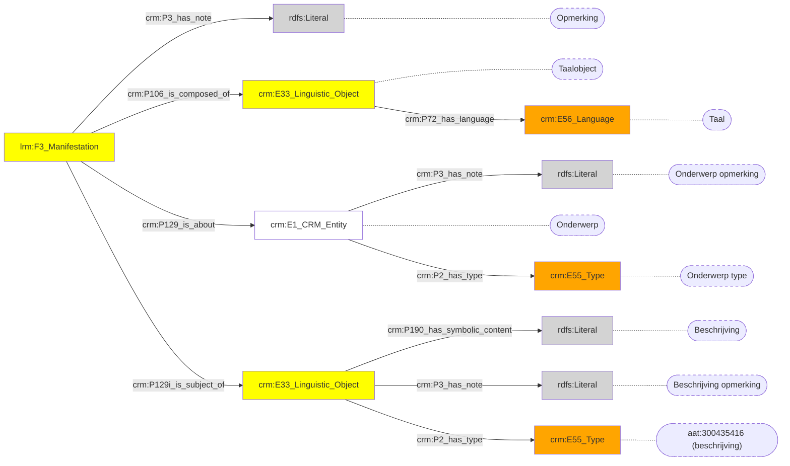

```mermaid
graph LR
style 0c5415eb-18d5-11ef-af57-960002548b4f fill:#D3D3D3
style 17e0c936-8e93-11ee-8f9d-96a6d245525a fill:#ffff00
style 17e0edc6-8e93-11ee-8f9d-96a6d245525a fill:#ffff00
style 17e0efec-8e93-11ee-8f9d-96a6d245525a fill:#ffff00
style 17e10752-8e93-11ee-8f9d-96a6d245525a fill:#ffa500
style 17e117f6-8e93-11ee-8f9d-96a6d245525a fill:#D3D3D3
style 17e11878-8e93-11ee-8f9d-96a6d245525a fill:#ffa500
style 432b38af-233f-11ef-94a6-960002548b4f fill:#D3D3D3
style 69a9afa9-1844-11ef-ab56-960002548b4f fill:#ffa500
style c52bc746-183a-11ef-975b-960002548b4f fill:#ffffff
style cb795e8e-cb07-11ee-b504-960002548b4f fill:#D3D3D3
17e0edc6-8e93-11ee-8f9d-96a6d245525a["crm:E33_Linguistic_Object"]-->|"crm:P190_has_symbolic_content"|17e117f6-8e93-11ee-8f9d-96a6d245525a(rdfs:Literal)
17e0edc6-8e93-11ee-8f9d-96a6d245525a["crm:E33_Linguistic_Object"]-->|"crm:P3_has_note"|432b38af-233f-11ef-94a6-960002548b4f(rdfs:Literal)
17e0efec-8e93-11ee-8f9d-96a6d245525a["lrm:F3_Manifestation"]-->|"crm:P3_has_note"|cb795e8e-cb07-11ee-b504-960002548b4f(rdfs:Literal)
c52bc746-183a-11ef-975b-960002548b4f["crm:E1_CRM_Entity"]-->|"crm:P3_has_note"|0c5415eb-18d5-11ef-af57-960002548b4f(rdfs:Literal)
style 17e10752-8e93-11ee-8f9d-96a6d245525a_s stroke-dasharray: 5
style 17e117f6-8e93-11ee-8f9d-96a6d245525a_s stroke-dasharray: 5
style 17e11878-8e93-11ee-8f9d-96a6d245525a_s stroke-dasharray: 5
style 432b38af-233f-11ef-94a6-960002548b4f_s stroke-dasharray: 5
style 17e0c936-8e93-11ee-8f9d-96a6d245525a_s stroke-dasharray: 5
style c52bc746-183a-11ef-975b-960002548b4f_s stroke-dasharray: 5
style cb795e8e-cb07-11ee-b504-960002548b4f_s stroke-dasharray: 5
style 69a9afa9-1844-11ef-ab56-960002548b4f_s stroke-dasharray: 5
style 0c5415eb-18d5-11ef-af57-960002548b4f_s stroke-dasharray: 5
17e10752-8e93-11ee-8f9d-96a6d245525a["crm:E56_Language"]-.-17e10752-8e93-11ee-8f9d-96a6d245525a_s(["Taal"])
17e117f6-8e93-11ee-8f9d-96a6d245525a["rdfs:Literal"]-.-17e117f6-8e93-11ee-8f9d-96a6d245525a_s(["Beschrijving"])
17e11878-8e93-11ee-8f9d-96a6d245525a["crm:E55_Type"]-.-17e11878-8e93-11ee-8f9d-96a6d245525a_s(["aat:300435416 (beschrijving)"])
432b38af-233f-11ef-94a6-960002548b4f["rdfs:Literal"]-.-432b38af-233f-11ef-94a6-960002548b4f_s(["Beschrijving opmerking"])
17e0c936-8e93-11ee-8f9d-96a6d245525a["crm:E33_Linguistic_Object"]-.-17e0c936-8e93-11ee-8f9d-96a6d245525a_s(["Taalobject"])
c52bc746-183a-11ef-975b-960002548b4f["crm:E1_CRM_Entity"]-.-c52bc746-183a-11ef-975b-960002548b4f_s(["Onderwerp"])
cb795e8e-cb07-11ee-b504-960002548b4f["rdfs:Literal"]-.-cb795e8e-cb07-11ee-b504-960002548b4f_s(["Opmerking"])
69a9afa9-1844-11ef-ab56-960002548b4f["crm:E55_Type"]-.-69a9afa9-1844-11ef-ab56-960002548b4f_s(["Onderwerp type"])
0c5415eb-18d5-11ef-af57-960002548b4f["rdfs:Literal"]-.-0c5415eb-18d5-11ef-af57-960002548b4f_s(["Onderwerp opmerking"])
17e0c936-8e93-11ee-8f9d-96a6d245525a["crm:E33_Linguistic_Object"]-->|"crm:P72_has_language"|17e10752-8e93-11ee-8f9d-96a6d245525a["crm:E56_Language"]
17e0edc6-8e93-11ee-8f9d-96a6d245525a["crm:E33_Linguistic_Object"]-->|"crm:P2_has_type"|17e11878-8e93-11ee-8f9d-96a6d245525a["crm:E55_Type"]
17e0efec-8e93-11ee-8f9d-96a6d245525a["lrm:F3_Manifestation"]-->|"crm:P106_is_composed_of"|17e0c936-8e93-11ee-8f9d-96a6d245525a["crm:E33_Linguistic_Object"]
17e0efec-8e93-11ee-8f9d-96a6d245525a["lrm:F3_Manifestation"]-->|"crm:P129_is_about"|c52bc746-183a-11ef-975b-960002548b4f["crm:E1_CRM_Entity"]
17e0efec-8e93-11ee-8f9d-96a6d245525a["lrm:F3_Manifestation"]-->|"crm:P129i_is_subject_of"|17e0edc6-8e93-11ee-8f9d-96a6d245525a["crm:E33_Linguistic_Object"]
c52bc746-183a-11ef-975b-960002548b4f["crm:E1_CRM_Entity"]-->|"crm:P2_has_type"|69a9afa9-1844-11ef-ab56-960002548b4f["crm:E55_Type"]
```
