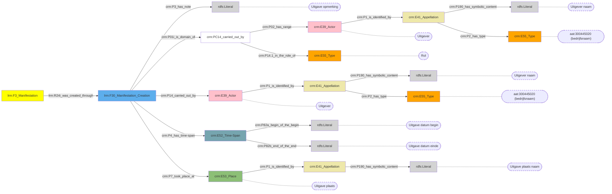

```mermaid
graph LR
style 17e0efec-8e93-11ee-8f9d-96a6d245525a fill:#ffff00
style 89faf5a9-e11a-11ee-bef5-960002548b4f fill:#EEE8AA
style 89faf828-e11a-11ee-b77e-960002548b4f fill:#D3D3D3
style 960a47dc-94fe-11ee-9c98-960002548b4f fill:#ffa500
style a277ec73-e119-11ee-91ab-960002548b4f fill:#ffc0cb
style b2832db2-8e98-11ee-8f9d-96a6d245525a fill:#5DAEEC
style b2832f1a-8e98-11ee-8f9d-96a6d245525a fill:#ffc0cb
style b2833154-8e98-11ee-8f9d-96a6d245525a fill:#EEE8AA
style b283319a-8e98-11ee-8f9d-96a6d245525a fill:#D3D3D3
style b2833276-8e98-11ee-8f9d-96a6d245525a fill:#EEE8AA
style b28332bc-8e98-11ee-8f9d-96a6d245525a fill:#D3D3D3
style b2833398-8e98-11ee-8f9d-96a6d245525a fill:#76A5AF
style b28333e8-8e98-11ee-8f9d-96a6d245525a fill:#ffffff
style b283342e-8e98-11ee-8f9d-96a6d245525a fill:#D3D3D3
style b2833474-8e98-11ee-8f9d-96a6d245525a fill:#ffa500
style b28334c4-8e98-11ee-8f9d-96a6d245525a fill:#D3D3D3
style b283350a-8e98-11ee-8f9d-96a6d245525a fill:#8CBF76
style d8a62b19-18d5-11ef-b79c-960002548b4f fill:#D3D3D3
style efef7a98-e11a-11ee-8adf-960002548b4f fill:#ffa500
89faf5a9-e11a-11ee-bef5-960002548b4f["crm:E41_Appellation"]-->|"crm:P190_has_symbolic_content"|89faf828-e11a-11ee-b77e-960002548b4f(rdfs:Literal)
b2832db2-8e98-11ee-8f9d-96a6d245525a["lrm:F30_Manifestation_Creation"]-->|"crm:P3_has_note"|d8a62b19-18d5-11ef-b79c-960002548b4f(rdfs:Literal)
b2833154-8e98-11ee-8f9d-96a6d245525a["crm:E41_Appellation"]-->|"crm:P190_has_symbolic_content"|b283319a-8e98-11ee-8f9d-96a6d245525a(rdfs:Literal)
b2833276-8e98-11ee-8f9d-96a6d245525a["crm:E41_Appellation"]-->|"crm:P190_has_symbolic_content"|b28332bc-8e98-11ee-8f9d-96a6d245525a(rdfs:Literal)
b2833398-8e98-11ee-8f9d-96a6d245525a["crm:E52_Time-Span"]-->|"crm:P82a_begin_of_the_begin"|b283342e-8e98-11ee-8f9d-96a6d245525a(rdfs:Literal)
b2833398-8e98-11ee-8f9d-96a6d245525a["crm:E52_Time-Span"]-->|"crm:P82b_end_of_the_end"|b28334c4-8e98-11ee-8f9d-96a6d245525a(rdfs:Literal)
17e0efec-8e93-11ee-8f9d-96a6d245525a["lrm:F3_Manifestation"]-->|"lrm:R24i_was_created_through"|b2832db2-8e98-11ee-8f9d-96a6d245525a["lrm:F30_Manifestation_Creation"]
89faf5a9-e11a-11ee-bef5-960002548b4f["crm:E41_Appellation"]-->|"crm:P2_has_type"|efef7a98-e11a-11ee-8adf-960002548b4f["crm:E55_Type"]
a277ec73-e119-11ee-91ab-960002548b4f["crm:E39_Actor"]-->|"crm:P1_is_identified_by"|89faf5a9-e11a-11ee-bef5-960002548b4f["crm:E41_Appellation"]
b2832db2-8e98-11ee-8f9d-96a6d245525a["lrm:F30_Manifestation_Creation"]-->|"crm:P01i_is_domain_of"|b28333e8-8e98-11ee-8f9d-96a6d245525a["crm:PC14_carried_out_by"]
b2832db2-8e98-11ee-8f9d-96a6d245525a["lrm:F30_Manifestation_Creation"]-->|"crm:P14_carried_out_by"|a277ec73-e119-11ee-91ab-960002548b4f["crm:E39_Actor"]
b2832db2-8e98-11ee-8f9d-96a6d245525a["lrm:F30_Manifestation_Creation"]-->|"crm:P4_has_time-span"|b2833398-8e98-11ee-8f9d-96a6d245525a["crm:E52_Time-Span"]
b2832db2-8e98-11ee-8f9d-96a6d245525a["lrm:F30_Manifestation_Creation"]-->|"crm:P7_took_place_at"|b283350a-8e98-11ee-8f9d-96a6d245525a["crm:E53_Place"]
b2832f1a-8e98-11ee-8f9d-96a6d245525a["crm:E39_Actor"]-->|"crm:P1_is_identified_by"|b2833276-8e98-11ee-8f9d-96a6d245525a["crm:E41_Appellation"]
b2833276-8e98-11ee-8f9d-96a6d245525a["crm:E41_Appellation"]-->|"crm:P2_has_type"|960a47dc-94fe-11ee-9c98-960002548b4f["crm:E55_Type"]
b28333e8-8e98-11ee-8f9d-96a6d245525a["crm:PC14_carried_out_by"]-->|"crm:P02_has_range"|b2832f1a-8e98-11ee-8f9d-96a6d245525a["crm:E39_Actor"]
b28333e8-8e98-11ee-8f9d-96a6d245525a["crm:PC14_carried_out_by"]-->|"crm:P14.1_in_the_role_of"|b2833474-8e98-11ee-8f9d-96a6d245525a["crm:E55_Type"]
b283350a-8e98-11ee-8f9d-96a6d245525a["crm:E53_Place"]-->|"crm:P1_is_identified_by"|b2833154-8e98-11ee-8f9d-96a6d245525a["crm:E41_Appellation"]
style 89faf828-e11a-11ee-b77e-960002548b4f_s stroke-dasharray: 5
style efef7a98-e11a-11ee-8adf-960002548b4f_s stroke-dasharray: 5
style a277ec73-e119-11ee-91ab-960002548b4f_s stroke-dasharray: 5
style d8a62b19-18d5-11ef-b79c-960002548b4f_s stroke-dasharray: 5
style b283350a-8e98-11ee-8f9d-96a6d245525a_s stroke-dasharray: 5
style b283319a-8e98-11ee-8f9d-96a6d245525a_s stroke-dasharray: 5
style b28332bc-8e98-11ee-8f9d-96a6d245525a_s stroke-dasharray: 5
style 960a47dc-94fe-11ee-9c98-960002548b4f_s stroke-dasharray: 5
style b283342e-8e98-11ee-8f9d-96a6d245525a_s stroke-dasharray: 5
style b28334c4-8e98-11ee-8f9d-96a6d245525a_s stroke-dasharray: 5
style b2832f1a-8e98-11ee-8f9d-96a6d245525a_s stroke-dasharray: 5
style b2833474-8e98-11ee-8f9d-96a6d245525a_s stroke-dasharray: 5
89faf828-e11a-11ee-b77e-960002548b4f["rdfs:Literal"]-.-89faf828-e11a-11ee-b77e-960002548b4f_s(["Uitgever naam"])
efef7a98-e11a-11ee-8adf-960002548b4f["crm:E55_Type"]-.-efef7a98-e11a-11ee-8adf-960002548b4f_s(["aat:300445020 (bedrijfsnaam)"])
a277ec73-e119-11ee-91ab-960002548b4f["crm:E39_Actor"]-.-a277ec73-e119-11ee-91ab-960002548b4f_s(["Uitgever"])
d8a62b19-18d5-11ef-b79c-960002548b4f["rdfs:Literal"]-.-d8a62b19-18d5-11ef-b79c-960002548b4f_s(["Uitgave opmerking"])
b283350a-8e98-11ee-8f9d-96a6d245525a["crm:E53_Place"]-.-b283350a-8e98-11ee-8f9d-96a6d245525a_s(["Uitgave plaats"])
b283319a-8e98-11ee-8f9d-96a6d245525a["rdfs:Literal"]-.-b283319a-8e98-11ee-8f9d-96a6d245525a_s(["Uitgave plaats naam"])
b28332bc-8e98-11ee-8f9d-96a6d245525a["rdfs:Literal"]-.-b28332bc-8e98-11ee-8f9d-96a6d245525a_s(["Uitgever naam"])
960a47dc-94fe-11ee-9c98-960002548b4f["crm:E55_Type"]-.-960a47dc-94fe-11ee-9c98-960002548b4f_s(["aat:300445020 (bedrijfsnaam)"])
b283342e-8e98-11ee-8f9d-96a6d245525a["rdfs:Literal"]-.-b283342e-8e98-11ee-8f9d-96a6d245525a_s(["Uitgave datum begin"])
b28334c4-8e98-11ee-8f9d-96a6d245525a["rdfs:Literal"]-.-b28334c4-8e98-11ee-8f9d-96a6d245525a_s(["Uitgave datum einde"])
b2832f1a-8e98-11ee-8f9d-96a6d245525a["crm:E39_Actor"]-.-b2832f1a-8e98-11ee-8f9d-96a6d245525a_s(["Uitgever"])
b2833474-8e98-11ee-8f9d-96a6d245525a["crm:E55_Type"]-.-b2833474-8e98-11ee-8f9d-96a6d245525a_s(["Rol"])
```
