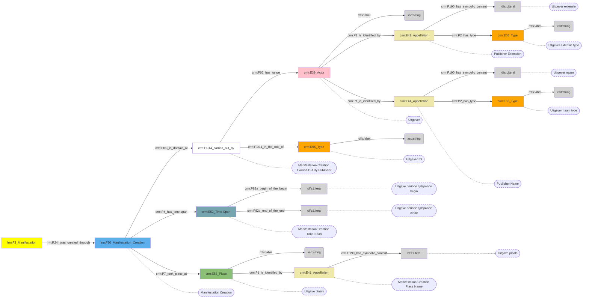

```mermaid
graph LR
960a47dc-94fe-11ee-9c98-960002548b4f["crm:E55_Type"]-->|"rdfs:label"|960a4b26-94fe-11ee-a096-960002548b4f(xsd:string)
b2832f1a-8e98-11ee-8f9d-96a6d245525a["crm:E39_Actor"]-->|"rdfs:label"|b2832fe2-8e98-11ee-8f9d-96a6d245525a(xsd:string)
b2833032-8e98-11ee-8f9d-96a6d245525a["crm:E41_Appellation"]-->|"crm:P190_has_symbolic_content"|b2833078-8e98-11ee-8f9d-96a6d245525a(rdfs:Literal)
b28330c8-8e98-11ee-8f9d-96a6d245525a["crm:E55_Type"]-->|"rdfs:label"|b283310e-8e98-11ee-8f9d-96a6d245525a(xsd:string)
b2833154-8e98-11ee-8f9d-96a6d245525a["crm:E41_Appellation"]-->|"crm:P190_has_symbolic_content"|b283319a-8e98-11ee-8f9d-96a6d245525a(rdfs:Literal)
b2833276-8e98-11ee-8f9d-96a6d245525a["crm:E41_Appellation"]-->|"crm:P190_has_symbolic_content"|b28332bc-8e98-11ee-8f9d-96a6d245525a(rdfs:Literal)
b2833398-8e98-11ee-8f9d-96a6d245525a["crm:E52_Time-Span"]-->|"crm:P82a_begin_of_the_begin"|b283342e-8e98-11ee-8f9d-96a6d245525a(rdfs:Literal)
b2833398-8e98-11ee-8f9d-96a6d245525a["crm:E52_Time-Span"]-->|"crm:P82b_end_of_the_end"|b28334c4-8e98-11ee-8f9d-96a6d245525a(rdfs:Literal)
b2833474-8e98-11ee-8f9d-96a6d245525a["crm:E55_Type"]-->|"rdfs:label"|b283355a-8e98-11ee-8f9d-96a6d245525a(xsd:string)
b283350a-8e98-11ee-8f9d-96a6d245525a["crm:E53_Place"]-->|"rdfs:label"|b2832f88-8e98-11ee-8f9d-96a6d245525a(xsd:string)
17e0efec-8e93-11ee-8f9d-96a6d245525a["lrm:F3_Manifestation"]-->|"lrm:R24i_was_created_through"|b2832db2-8e98-11ee-8f9d-96a6d245525a["lrm:F30_Manifestation_Creation"]
b2832db2-8e98-11ee-8f9d-96a6d245525a["lrm:F30_Manifestation_Creation"]-->|"crm:P01i_is_domain_of"|b28333e8-8e98-11ee-8f9d-96a6d245525a["crm:PC14_carried_out_by"]
b2832db2-8e98-11ee-8f9d-96a6d245525a["lrm:F30_Manifestation_Creation"]-->|"crm:P4_has_time-span"|b2833398-8e98-11ee-8f9d-96a6d245525a["crm:E52_Time-Span"]
b2832db2-8e98-11ee-8f9d-96a6d245525a["lrm:F30_Manifestation_Creation"]-->|"crm:P7_took_place_at"|b283350a-8e98-11ee-8f9d-96a6d245525a["crm:E53_Place"]
b2832f1a-8e98-11ee-8f9d-96a6d245525a["crm:E39_Actor"]-->|"crm:P1_is_identified_by"|b2833032-8e98-11ee-8f9d-96a6d245525a["crm:E41_Appellation"]
b2832f1a-8e98-11ee-8f9d-96a6d245525a["crm:E39_Actor"]-->|"crm:P1_is_identified_by"|b2833276-8e98-11ee-8f9d-96a6d245525a["crm:E41_Appellation"]
b2833032-8e98-11ee-8f9d-96a6d245525a["crm:E41_Appellation"]-->|"crm:P2_has_type"|b28330c8-8e98-11ee-8f9d-96a6d245525a["crm:E55_Type"]
b2833276-8e98-11ee-8f9d-96a6d245525a["crm:E41_Appellation"]-->|"crm:P2_has_type"|960a47dc-94fe-11ee-9c98-960002548b4f["crm:E55_Type"]
b28333e8-8e98-11ee-8f9d-96a6d245525a["crm:PC14_carried_out_by"]-->|"crm:P02_has_range"|b2832f1a-8e98-11ee-8f9d-96a6d245525a["crm:E39_Actor"]
b28333e8-8e98-11ee-8f9d-96a6d245525a["crm:PC14_carried_out_by"]-->|"crm:P14.1_in_the_role_of"|b2833474-8e98-11ee-8f9d-96a6d245525a["crm:E55_Type"]
b283350a-8e98-11ee-8f9d-96a6d245525a["crm:E53_Place"]-->|"crm:P1_is_identified_by"|b2833154-8e98-11ee-8f9d-96a6d245525a["crm:E41_Appellation"]
b2832db2-8e98-11ee-8f9d-96a6d245525a["lrm:F30_Manifestation_Creation"]-.-b2832db2-8e98-11ee-8f9d-96a6d245525a_s(["Manifestation Creation"])
b28333e8-8e98-11ee-8f9d-96a6d245525a["crm:PC14_carried_out_by"]-.-b28333e8-8e98-11ee-8f9d-96a6d245525a_s(["Manifestation Creation Carried Out By Publisher"])
b2833398-8e98-11ee-8f9d-96a6d245525a["crm:E52_Time-Span"]-.-b2833398-8e98-11ee-8f9d-96a6d245525a_s(["Manifestation Creation Time-Span"])
b283350a-8e98-11ee-8f9d-96a6d245525a["crm:E53_Place"]-.-b283350a-8e98-11ee-8f9d-96a6d245525a_s(["Uitgave plaats"])
b2833032-8e98-11ee-8f9d-96a6d245525a["crm:E41_Appellation"]-.-b2833032-8e98-11ee-8f9d-96a6d245525a_s(["Publisher Extension"])
b2833276-8e98-11ee-8f9d-96a6d245525a["crm:E41_Appellation"]-.-b2833276-8e98-11ee-8f9d-96a6d245525a_s(["Publisher Name"])
b2833078-8e98-11ee-8f9d-96a6d245525a["rdfs:Literal"]-.-b2833078-8e98-11ee-8f9d-96a6d245525a_s(["Uitgever extensie"])
b28330c8-8e98-11ee-8f9d-96a6d245525a["crm:E55_Type"]-.-b28330c8-8e98-11ee-8f9d-96a6d245525a_s(["Uitgever extensie type"])
b283319a-8e98-11ee-8f9d-96a6d245525a["rdfs:Literal"]-.-b283319a-8e98-11ee-8f9d-96a6d245525a_s(["Uitgave plaats"])
b28332bc-8e98-11ee-8f9d-96a6d245525a["rdfs:Literal"]-.-b28332bc-8e98-11ee-8f9d-96a6d245525a_s(["Uitgever naam"])
960a47dc-94fe-11ee-9c98-960002548b4f["crm:E55_Type"]-.-960a47dc-94fe-11ee-9c98-960002548b4f_s(["Uitgever naam type"])
b283342e-8e98-11ee-8f9d-96a6d245525a["rdfs:Literal"]-.-b283342e-8e98-11ee-8f9d-96a6d245525a_s(["Uitgave periode tijdspanne begin"])
b28334c4-8e98-11ee-8f9d-96a6d245525a["rdfs:Literal"]-.-b28334c4-8e98-11ee-8f9d-96a6d245525a_s(["Uitgave periode tijdspanne einde"])
b2832f1a-8e98-11ee-8f9d-96a6d245525a["crm:E39_Actor"]-.-b2832f1a-8e98-11ee-8f9d-96a6d245525a_s(["Uitgever"])
b2833474-8e98-11ee-8f9d-96a6d245525a["crm:E55_Type"]-.-b2833474-8e98-11ee-8f9d-96a6d245525a_s(["Uitgever rol"])
b2833154-8e98-11ee-8f9d-96a6d245525a["crm:E41_Appellation"]-.-b2833154-8e98-11ee-8f9d-96a6d245525a_s(["Manifestation Creation Place Name"])
style b2832db2-8e98-11ee-8f9d-96a6d245525a_s stroke-dasharray: 5
style b28333e8-8e98-11ee-8f9d-96a6d245525a_s stroke-dasharray: 5
style b2833398-8e98-11ee-8f9d-96a6d245525a_s stroke-dasharray: 5
style b283350a-8e98-11ee-8f9d-96a6d245525a_s stroke-dasharray: 5
style b2833032-8e98-11ee-8f9d-96a6d245525a_s stroke-dasharray: 5
style b2833276-8e98-11ee-8f9d-96a6d245525a_s stroke-dasharray: 5
style b2833078-8e98-11ee-8f9d-96a6d245525a_s stroke-dasharray: 5
style b28330c8-8e98-11ee-8f9d-96a6d245525a_s stroke-dasharray: 5
style b283319a-8e98-11ee-8f9d-96a6d245525a_s stroke-dasharray: 5
style b28332bc-8e98-11ee-8f9d-96a6d245525a_s stroke-dasharray: 5
style 960a47dc-94fe-11ee-9c98-960002548b4f_s stroke-dasharray: 5
style b283342e-8e98-11ee-8f9d-96a6d245525a_s stroke-dasharray: 5
style b28334c4-8e98-11ee-8f9d-96a6d245525a_s stroke-dasharray: 5
style b2832f1a-8e98-11ee-8f9d-96a6d245525a_s stroke-dasharray: 5
style b2833474-8e98-11ee-8f9d-96a6d245525a_s stroke-dasharray: 5
style b2833154-8e98-11ee-8f9d-96a6d245525a_s stroke-dasharray: 5
style 17e0efec-8e93-11ee-8f9d-96a6d245525a fill:#ffff00
style 960a47dc-94fe-11ee-9c98-960002548b4f fill:#ffa500
style 960a4b26-94fe-11ee-a096-960002548b4f fill:#D3D3D3
style b2832db2-8e98-11ee-8f9d-96a6d245525a fill:#5DAEEC
style b2832f1a-8e98-11ee-8f9d-96a6d245525a fill:#ffc0cb
style b2832f88-8e98-11ee-8f9d-96a6d245525a fill:#D3D3D3
style b2832fe2-8e98-11ee-8f9d-96a6d245525a fill:#D3D3D3
style b2833032-8e98-11ee-8f9d-96a6d245525a fill:#EEE8AA
style b2833078-8e98-11ee-8f9d-96a6d245525a fill:#D3D3D3
style b28330c8-8e98-11ee-8f9d-96a6d245525a fill:#ffa500
style b283310e-8e98-11ee-8f9d-96a6d245525a fill:#D3D3D3
style b2833154-8e98-11ee-8f9d-96a6d245525a fill:#EEE8AA
style b283319a-8e98-11ee-8f9d-96a6d245525a fill:#D3D3D3
style b2833276-8e98-11ee-8f9d-96a6d245525a fill:#EEE8AA
style b28332bc-8e98-11ee-8f9d-96a6d245525a fill:#D3D3D3
style b2833398-8e98-11ee-8f9d-96a6d245525a fill:#76A5AF
style b28333e8-8e98-11ee-8f9d-96a6d245525a fill:#ffffff
style b283342e-8e98-11ee-8f9d-96a6d245525a fill:#D3D3D3
style b2833474-8e98-11ee-8f9d-96a6d245525a fill:#ffa500
style b28334c4-8e98-11ee-8f9d-96a6d245525a fill:#D3D3D3
style b283350a-8e98-11ee-8f9d-96a6d245525a fill:#8CBF76
style b283355a-8e98-11ee-8f9d-96a6d245525a fill:#D3D3D3
```
