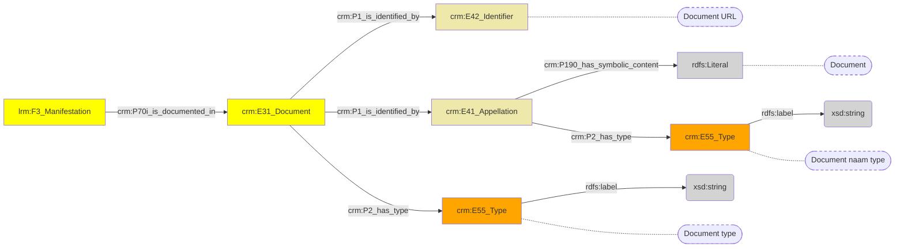

```mermaid
graph LR
17e0f708-8e93-11ee-8f9d-96a6d245525a["crm:E41_Appellation"]-->|"crm:P190_has_symbolic_content"|17e0f74e-8e93-11ee-8f9d-96a6d245525a(rdfs:Literal)
17e0f794-8e93-11ee-8f9d-96a6d245525a["crm:E55_Type"]-->|"rdfs:label"|17e0f7da-8e93-11ee-8f9d-96a6d245525a(xsd:string)
17e10c7a-8e93-11ee-8f9d-96a6d245525a["crm:E55_Type"]-->|"rdfs:label"|17e0f23a-8e93-11ee-8f9d-96a6d245525a(xsd:string)
17e0cf8a-8e93-11ee-8f9d-96a6d245525a["crm:E31_Document"]-->|"crm:P1_is_identified_by"|17e0f398-8e93-11ee-8f9d-96a6d245525a["crm:E42_Identifier"]
17e0cf8a-8e93-11ee-8f9d-96a6d245525a["crm:E31_Document"]-->|"crm:P1_is_identified_by"|17e0f708-8e93-11ee-8f9d-96a6d245525a["crm:E41_Appellation"]
17e0cf8a-8e93-11ee-8f9d-96a6d245525a["crm:E31_Document"]-->|"crm:P2_has_type"|17e10c7a-8e93-11ee-8f9d-96a6d245525a["crm:E55_Type"]
17e0efec-8e93-11ee-8f9d-96a6d245525a["lrm:F3_Manifestation"]-->|"crm:P70i_is_documented_in"|17e0cf8a-8e93-11ee-8f9d-96a6d245525a["crm:E31_Document"]
17e0f708-8e93-11ee-8f9d-96a6d245525a["crm:E41_Appellation"]-->|"crm:P2_has_type"|17e0f794-8e93-11ee-8f9d-96a6d245525a["crm:E55_Type"]
17e0f398-8e93-11ee-8f9d-96a6d245525a["crm:E42_Identifier"]-.-17e0f398-8e93-11ee-8f9d-96a6d245525a_s(["Document URL"])
17e10c7a-8e93-11ee-8f9d-96a6d245525a["crm:E55_Type"]-.-17e10c7a-8e93-11ee-8f9d-96a6d245525a_s(["Document type"])
17e0f74e-8e93-11ee-8f9d-96a6d245525a["rdfs:Literal"]-.-17e0f74e-8e93-11ee-8f9d-96a6d245525a_s(["Document"])
17e0f794-8e93-11ee-8f9d-96a6d245525a["crm:E55_Type"]-.-17e0f794-8e93-11ee-8f9d-96a6d245525a_s(["Document naam type"])
style 17e0f398-8e93-11ee-8f9d-96a6d245525a_s stroke-dasharray: 5
style 17e10c7a-8e93-11ee-8f9d-96a6d245525a_s stroke-dasharray: 5
style 17e0f74e-8e93-11ee-8f9d-96a6d245525a_s stroke-dasharray: 5
style 17e0f794-8e93-11ee-8f9d-96a6d245525a_s stroke-dasharray: 5
style 17e0cf8a-8e93-11ee-8f9d-96a6d245525a fill:#ffff00
style 17e0efec-8e93-11ee-8f9d-96a6d245525a fill:#ffff00
style 17e0f23a-8e93-11ee-8f9d-96a6d245525a fill:#D3D3D3
style 17e0f398-8e93-11ee-8f9d-96a6d245525a fill:#EEE8AA
style 17e0f708-8e93-11ee-8f9d-96a6d245525a fill:#EEE8AA
style 17e0f74e-8e93-11ee-8f9d-96a6d245525a fill:#D3D3D3
style 17e0f794-8e93-11ee-8f9d-96a6d245525a fill:#ffa500
style 17e0f7da-8e93-11ee-8f9d-96a6d245525a fill:#D3D3D3
style 17e10c7a-8e93-11ee-8f9d-96a6d245525a fill:#ffa500
```
