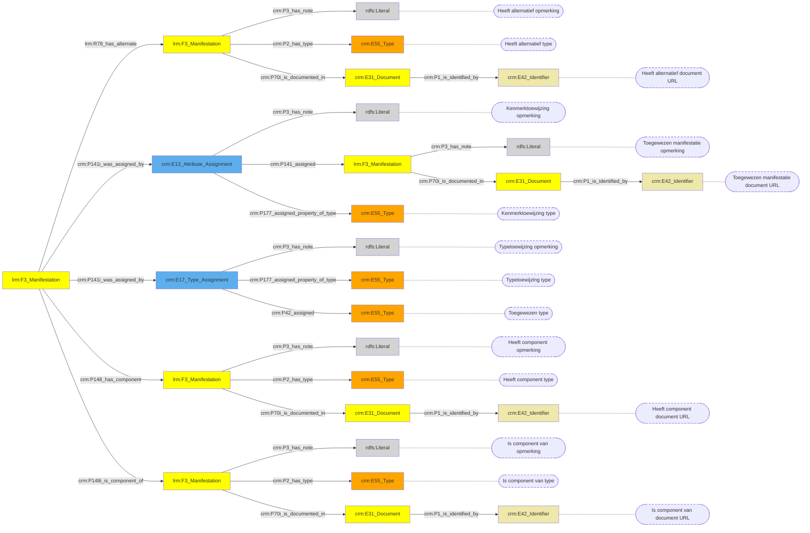

```mermaid
graph LR
style 07dd8e77-23f8-11ef-85f0-960002548b4f fill:#EEE8AA
style 0bb0c281-2d44-11ef-8085-960002548b4f fill:#ffff00
style 17e0efec-8e93-11ee-8f9d-96a6d245525a fill:#ffff00
style 26e47ef6-23f7-11ef-a802-960002548b4f fill:#D3D3D3
style 442fa8b0-1852-11ef-8081-960002548b4f fill:#5DAEEC
style 442fab11-1852-11ef-9e10-960002548b4f fill:#ffa500
style 442fabee-1852-11ef-b140-960002548b4f fill:#D3D3D3
style 442fac72-1852-11ef-827b-960002548b4f fill:#ffff00
style 460a5a0c-2d45-11ef-ad89-960002548b4f fill:#ffff00
style 460a5d99-2d45-11ef-aece-960002548b4f fill:#EEE8AA
style 578928b6-23f7-11ef-a74c-960002548b4f fill:#ffff00
style 5aca3730-8e95-11ee-8f9d-96a6d245525a fill:#ffff00
style 5b549843-1852-11ef-8f9b-960002548b4f fill:#5DAEEC
style 5b549a79-1852-11ef-a67b-960002548b4f fill:#ffa500
style 5b549b31-1852-11ef-9c37-960002548b4f fill:#ffa500
style 5b549caf-1852-11ef-81e2-960002548b4f fill:#D3D3D3
style 630087c4-23ea-11ef-bd1e-960002548b4f fill:#D3D3D3
style 654f9122-8e96-11ee-8f9d-96a6d245525a fill:#ffff00
style 6e33c4fa-2d45-11ef-8aa2-960002548b4f fill:#ffa500
style 6ea3fa25-23f7-11ef-97b7-960002548b4f fill:#EEE8AA
style 80479a48-2d45-11ef-b3ae-960002548b4f fill:#D3D3D3
style 83463627-934d-11ee-9e33-960002548b4f fill:#ffa500
style a13e386b-934d-11ee-a820-960002548b4f fill:#ffa500
style a63c7c12-23eb-11ef-8a46-960002548b4f fill:#D3D3D3
style bbb3a574-23f6-11ef-9d0c-960002548b4f fill:#ffff00
style e183d2ec-23f7-11ef-800b-960002548b4f fill:#ffff00
style eb354528-23f6-11ef-aa00-960002548b4f fill:#EEE8AA
0bb0c281-2d44-11ef-8085-960002548b4f["lrm:F3_Manifestation"]-->|"crm:P3_has_note"|80479a48-2d45-11ef-b3ae-960002548b4f(rdfs:Literal)
442fa8b0-1852-11ef-8081-960002548b4f["crm:E13_Attribute_Assignment"]-->|"crm:P3_has_note"|442fabee-1852-11ef-b140-960002548b4f(rdfs:Literal)
442fac72-1852-11ef-827b-960002548b4f["lrm:F3_Manifestation"]-->|"crm:P3_has_note"|26e47ef6-23f7-11ef-a802-960002548b4f(rdfs:Literal)
5aca3730-8e95-11ee-8f9d-96a6d245525a["lrm:F3_Manifestation"]-->|"crm:P3_has_note"|630087c4-23ea-11ef-bd1e-960002548b4f(rdfs:Literal)
5b549843-1852-11ef-8f9b-960002548b4f["crm:E17_Type_Assignment"]-->|"crm:P3_has_note"|5b549caf-1852-11ef-81e2-960002548b4f(rdfs:Literal)
654f9122-8e96-11ee-8f9d-96a6d245525a["lrm:F3_Manifestation"]-->|"crm:P3_has_note"|a63c7c12-23eb-11ef-8a46-960002548b4f(rdfs:Literal)
style 6e33c4fa-2d45-11ef-8aa2-960002548b4f_s stroke-dasharray: 5
style 80479a48-2d45-11ef-b3ae-960002548b4f_s stroke-dasharray: 5
style 442fab11-1852-11ef-9e10-960002548b4f_s stroke-dasharray: 5
style 442fabee-1852-11ef-b140-960002548b4f_s stroke-dasharray: 5
style 26e47ef6-23f7-11ef-a802-960002548b4f_s stroke-dasharray: 5
style 460a5d99-2d45-11ef-aece-960002548b4f_s stroke-dasharray: 5
style 6ea3fa25-23f7-11ef-97b7-960002548b4f_s stroke-dasharray: 5
style 83463627-934d-11ee-9e33-960002548b4f_s stroke-dasharray: 5
style 630087c4-23ea-11ef-bd1e-960002548b4f_s stroke-dasharray: 5
style 5b549a79-1852-11ef-a67b-960002548b4f_s stroke-dasharray: 5
style 5b549caf-1852-11ef-81e2-960002548b4f_s stroke-dasharray: 5
style 5b549b31-1852-11ef-9c37-960002548b4f_s stroke-dasharray: 5
style a13e386b-934d-11ee-a820-960002548b4f_s stroke-dasharray: 5
style a63c7c12-23eb-11ef-8a46-960002548b4f_s stroke-dasharray: 5
style eb354528-23f6-11ef-aa00-960002548b4f_s stroke-dasharray: 5
style 07dd8e77-23f8-11ef-85f0-960002548b4f_s stroke-dasharray: 5
6e33c4fa-2d45-11ef-8aa2-960002548b4f["crm:E55_Type"]-.-6e33c4fa-2d45-11ef-8aa2-960002548b4f_s(["Heeft alternatief type"])
80479a48-2d45-11ef-b3ae-960002548b4f["rdfs:Literal"]-.-80479a48-2d45-11ef-b3ae-960002548b4f_s(["Heeft alternatief opmerking"])
442fab11-1852-11ef-9e10-960002548b4f["crm:E55_Type"]-.-442fab11-1852-11ef-9e10-960002548b4f_s(["Kenmerktoewijzing type"])
442fabee-1852-11ef-b140-960002548b4f["rdfs:Literal"]-.-442fabee-1852-11ef-b140-960002548b4f_s(["Kenmerktoewijzing opmerking"])
26e47ef6-23f7-11ef-a802-960002548b4f["rdfs:Literal"]-.-26e47ef6-23f7-11ef-a802-960002548b4f_s(["Toegewezen manifestatie opmerking"])
460a5d99-2d45-11ef-aece-960002548b4f["crm:E42_Identifier"]-.-460a5d99-2d45-11ef-aece-960002548b4f_s(["Heeft alternatief document URL"])
6ea3fa25-23f7-11ef-97b7-960002548b4f["crm:E42_Identifier"]-.-6ea3fa25-23f7-11ef-97b7-960002548b4f_s(["Is component van document URL"])
83463627-934d-11ee-9e33-960002548b4f["crm:E55_Type"]-.-83463627-934d-11ee-9e33-960002548b4f_s(["Is component van type"])
630087c4-23ea-11ef-bd1e-960002548b4f["rdfs:Literal"]-.-630087c4-23ea-11ef-bd1e-960002548b4f_s(["Is component van opmerking"])
5b549a79-1852-11ef-a67b-960002548b4f["crm:E55_Type"]-.-5b549a79-1852-11ef-a67b-960002548b4f_s(["Typetoewijzing type"])
5b549caf-1852-11ef-81e2-960002548b4f["rdfs:Literal"]-.-5b549caf-1852-11ef-81e2-960002548b4f_s(["Typetoewijzing opmerking"])
5b549b31-1852-11ef-9c37-960002548b4f["crm:E55_Type"]-.-5b549b31-1852-11ef-9c37-960002548b4f_s(["Toegewezen type"])
a13e386b-934d-11ee-a820-960002548b4f["crm:E55_Type"]-.-a13e386b-934d-11ee-a820-960002548b4f_s(["Heeft component type"])
a63c7c12-23eb-11ef-8a46-960002548b4f["rdfs:Literal"]-.-a63c7c12-23eb-11ef-8a46-960002548b4f_s(["Heeft component opmerking"])
eb354528-23f6-11ef-aa00-960002548b4f["crm:E42_Identifier"]-.-eb354528-23f6-11ef-aa00-960002548b4f_s(["Toegewezen manifestatie document URL"])
07dd8e77-23f8-11ef-85f0-960002548b4f["crm:E42_Identifier"]-.-07dd8e77-23f8-11ef-85f0-960002548b4f_s(["Heeft component document URL"])
0bb0c281-2d44-11ef-8085-960002548b4f["lrm:F3_Manifestation"]-->|"crm:P2_has_type"|6e33c4fa-2d45-11ef-8aa2-960002548b4f["crm:E55_Type"]
0bb0c281-2d44-11ef-8085-960002548b4f["lrm:F3_Manifestation"]-->|"crm:P70i_is_documented_in"|460a5a0c-2d45-11ef-ad89-960002548b4f["crm:E31_Document"]
17e0efec-8e93-11ee-8f9d-96a6d245525a["lrm:F3_Manifestation"]-->|"lrm:R78_has_alternate"|0bb0c281-2d44-11ef-8085-960002548b4f["lrm:F3_Manifestation"]
17e0efec-8e93-11ee-8f9d-96a6d245525a["lrm:F3_Manifestation"]-->|"crm:P141i_was_assigned_by"|442fa8b0-1852-11ef-8081-960002548b4f["crm:E13_Attribute_Assignment"]
17e0efec-8e93-11ee-8f9d-96a6d245525a["lrm:F3_Manifestation"]-->|"crm:P141i_was_assigned_by"|5b549843-1852-11ef-8f9b-960002548b4f["crm:E17_Type_Assignment"]
17e0efec-8e93-11ee-8f9d-96a6d245525a["lrm:F3_Manifestation"]-->|"crm:P148_has_component"|654f9122-8e96-11ee-8f9d-96a6d245525a["lrm:F3_Manifestation"]
17e0efec-8e93-11ee-8f9d-96a6d245525a["lrm:F3_Manifestation"]-->|"crm:P148i_is_component_of"|5aca3730-8e95-11ee-8f9d-96a6d245525a["lrm:F3_Manifestation"]
442fa8b0-1852-11ef-8081-960002548b4f["crm:E13_Attribute_Assignment"]-->|"crm:P141_assigned"|442fac72-1852-11ef-827b-960002548b4f["lrm:F3_Manifestation"]
442fa8b0-1852-11ef-8081-960002548b4f["crm:E13_Attribute_Assignment"]-->|"crm:P177_assigned_property_of_type"|442fab11-1852-11ef-9e10-960002548b4f["crm:E55_Type"]
442fac72-1852-11ef-827b-960002548b4f["lrm:F3_Manifestation"]-->|"crm:P70i_is_documented_in"|bbb3a574-23f6-11ef-9d0c-960002548b4f["crm:E31_Document"]
460a5a0c-2d45-11ef-ad89-960002548b4f["crm:E31_Document"]-->|"crm:P1_is_identified_by"|460a5d99-2d45-11ef-aece-960002548b4f["crm:E42_Identifier"]
578928b6-23f7-11ef-a74c-960002548b4f["crm:E31_Document"]-->|"crm:P1_is_identified_by"|6ea3fa25-23f7-11ef-97b7-960002548b4f["crm:E42_Identifier"]
5aca3730-8e95-11ee-8f9d-96a6d245525a["lrm:F3_Manifestation"]-->|"crm:P2_has_type"|83463627-934d-11ee-9e33-960002548b4f["crm:E55_Type"]
5aca3730-8e95-11ee-8f9d-96a6d245525a["lrm:F3_Manifestation"]-->|"crm:P70i_is_documented_in"|578928b6-23f7-11ef-a74c-960002548b4f["crm:E31_Document"]
5b549843-1852-11ef-8f9b-960002548b4f["crm:E17_Type_Assignment"]-->|"crm:P177_assigned_property_of_type"|5b549a79-1852-11ef-a67b-960002548b4f["crm:E55_Type"]
5b549843-1852-11ef-8f9b-960002548b4f["crm:E17_Type_Assignment"]-->|"crm:P42_assigned"|5b549b31-1852-11ef-9c37-960002548b4f["crm:E55_Type"]
654f9122-8e96-11ee-8f9d-96a6d245525a["lrm:F3_Manifestation"]-->|"crm:P2_has_type"|a13e386b-934d-11ee-a820-960002548b4f["crm:E55_Type"]
654f9122-8e96-11ee-8f9d-96a6d245525a["lrm:F3_Manifestation"]-->|"crm:P70i_is_documented_in"|e183d2ec-23f7-11ef-800b-960002548b4f["crm:E31_Document"]
bbb3a574-23f6-11ef-9d0c-960002548b4f["crm:E31_Document"]-->|"crm:P1_is_identified_by"|eb354528-23f6-11ef-aa00-960002548b4f["crm:E42_Identifier"]
e183d2ec-23f7-11ef-800b-960002548b4f["crm:E31_Document"]-->|"crm:P1_is_identified_by"|07dd8e77-23f8-11ef-85f0-960002548b4f["crm:E42_Identifier"]
```
