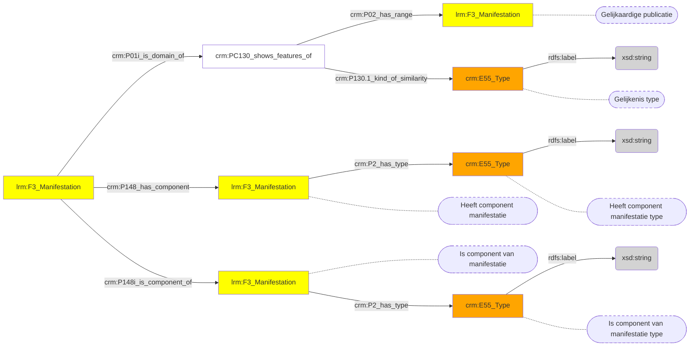

```mermaid
graph LR
17e0f3de-8e93-11ee-8f9d-96a6d245525a["crm:E55_Type"]-->|"rdfs:label"|17e0fb22-8e93-11ee-8f9d-96a6d245525a(xsd:string)
83463627-934d-11ee-9e33-960002548b4f["crm:E55_Type"]-->|"rdfs:label"|834639ce-934d-11ee-a516-960002548b4f(xsd:string)
a13e386b-934d-11ee-a820-960002548b4f["crm:E55_Type"]-->|"rdfs:label"|a13e3c31-934d-11ee-a98f-960002548b4f(xsd:string)
style 17e10d06-8e93-11ee-8f9d-96a6d245525a_s stroke-dasharray: 5
style 17e0f3de-8e93-11ee-8f9d-96a6d245525a_s stroke-dasharray: 5
style 654f9122-8e96-11ee-8f9d-96a6d245525a_s stroke-dasharray: 5
style 5aca3730-8e95-11ee-8f9d-96a6d245525a_s stroke-dasharray: 5
style 83463627-934d-11ee-9e33-960002548b4f_s stroke-dasharray: 5
style a13e386b-934d-11ee-a820-960002548b4f_s stroke-dasharray: 5
style 17e0cdb4-8e93-11ee-8f9d-96a6d245525a fill:#ffffff
style 17e0efec-8e93-11ee-8f9d-96a6d245525a fill:#ffff00
style 17e0f3de-8e93-11ee-8f9d-96a6d245525a fill:#ffa500
style 17e0fb22-8e93-11ee-8f9d-96a6d245525a fill:#D3D3D3
style 17e10d06-8e93-11ee-8f9d-96a6d245525a fill:#ffff00
style 5aca3730-8e95-11ee-8f9d-96a6d245525a fill:#ffff00
style 654f9122-8e96-11ee-8f9d-96a6d245525a fill:#ffff00
style 83463627-934d-11ee-9e33-960002548b4f fill:#ffa500
style 834639ce-934d-11ee-a516-960002548b4f fill:#D3D3D3
style a13e386b-934d-11ee-a820-960002548b4f fill:#ffa500
style a13e3c31-934d-11ee-a98f-960002548b4f fill:#D3D3D3
17e0cdb4-8e93-11ee-8f9d-96a6d245525a["crm:PC130_shows_features_of"]-->|"crm:P02_has_range"|17e10d06-8e93-11ee-8f9d-96a6d245525a["lrm:F3_Manifestation"]
17e0cdb4-8e93-11ee-8f9d-96a6d245525a["crm:PC130_shows_features_of"]-->|"crm:P130.1_kind_of_similarity"|17e0f3de-8e93-11ee-8f9d-96a6d245525a["crm:E55_Type"]
17e0efec-8e93-11ee-8f9d-96a6d245525a["lrm:F3_Manifestation"]-->|"crm:P01i_is_domain_of"|17e0cdb4-8e93-11ee-8f9d-96a6d245525a["crm:PC130_shows_features_of"]
17e0efec-8e93-11ee-8f9d-96a6d245525a["lrm:F3_Manifestation"]-->|"crm:P148_has_component"|654f9122-8e96-11ee-8f9d-96a6d245525a["lrm:F3_Manifestation"]
17e0efec-8e93-11ee-8f9d-96a6d245525a["lrm:F3_Manifestation"]-->|"crm:P148i_is_component_of"|5aca3730-8e95-11ee-8f9d-96a6d245525a["lrm:F3_Manifestation"]
5aca3730-8e95-11ee-8f9d-96a6d245525a["lrm:F3_Manifestation"]-->|"crm:P2_has_type"|83463627-934d-11ee-9e33-960002548b4f["crm:E55_Type"]
654f9122-8e96-11ee-8f9d-96a6d245525a["lrm:F3_Manifestation"]-->|"crm:P2_has_type"|a13e386b-934d-11ee-a820-960002548b4f["crm:E55_Type"]
17e10d06-8e93-11ee-8f9d-96a6d245525a["lrm:F3_Manifestation"]-.-17e10d06-8e93-11ee-8f9d-96a6d245525a_s(["Gelijkaardige publicatie"])
17e0f3de-8e93-11ee-8f9d-96a6d245525a["crm:E55_Type"]-.-17e0f3de-8e93-11ee-8f9d-96a6d245525a_s(["Gelijkenis type"])
654f9122-8e96-11ee-8f9d-96a6d245525a["lrm:F3_Manifestation"]-.-654f9122-8e96-11ee-8f9d-96a6d245525a_s(["Heeft component manifestatie"])
5aca3730-8e95-11ee-8f9d-96a6d245525a["lrm:F3_Manifestation"]-.-5aca3730-8e95-11ee-8f9d-96a6d245525a_s(["Is component van manifestatie"])
83463627-934d-11ee-9e33-960002548b4f["crm:E55_Type"]-.-83463627-934d-11ee-9e33-960002548b4f_s(["Is component van manifestatie type"])
a13e386b-934d-11ee-a820-960002548b4f["crm:E55_Type"]-.-a13e386b-934d-11ee-a820-960002548b4f_s(["Heeft component manifestatie type"])
```
