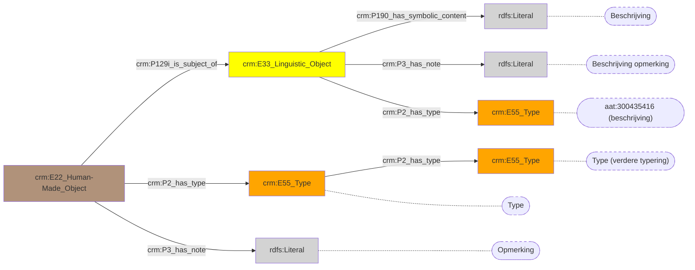

```mermaid
graph LR
style 099f196c-df80-11ed-9232-00163e71351b fill:#B0927A
style 35eb661e-ee5e-11ed-a1e6-00163e71351b fill:#ffff00
style 35eb6d76-ee5e-11ed-a1e6-00163e71351b fill:#ffa500
style 35eb71cc-ee5e-11ed-a1e6-00163e71351b fill:#D3D3D3
style 4a65efec-cb0c-11ee-accf-960002548b4f fill:#D3D3D3
style 5f7d3f52-62b7-11ee-bc5c-00163e71351b fill:#ffa500
style 5f7d44a2-62b7-11ee-bc5c-00163e71351b fill:#ffa500
style 9a15d478-233f-11ef-aa25-960002548b4f fill:#D3D3D3
099f196c-df80-11ed-9232-00163e71351b["crm:E22_Human-Made_Object"]-->|"crm:P3_has_note"|4a65efec-cb0c-11ee-accf-960002548b4f(rdfs:Literal)
35eb661e-ee5e-11ed-a1e6-00163e71351b["crm:E33_Linguistic_Object"]-->|"crm:P190_has_symbolic_content"|35eb71cc-ee5e-11ed-a1e6-00163e71351b(rdfs:Literal)
35eb661e-ee5e-11ed-a1e6-00163e71351b["crm:E33_Linguistic_Object"]-->|"crm:P3_has_note"|9a15d478-233f-11ef-aa25-960002548b4f(rdfs:Literal)
099f196c-df80-11ed-9232-00163e71351b["crm:E22_Human-Made_Object"]-->|"crm:P129i_is_subject_of"|35eb661e-ee5e-11ed-a1e6-00163e71351b["crm:E33_Linguistic_Object"]
099f196c-df80-11ed-9232-00163e71351b["crm:E22_Human-Made_Object"]-->|"crm:P2_has_type"|5f7d3f52-62b7-11ee-bc5c-00163e71351b["crm:E55_Type"]
35eb661e-ee5e-11ed-a1e6-00163e71351b["crm:E33_Linguistic_Object"]-->|"crm:P2_has_type"|35eb6d76-ee5e-11ed-a1e6-00163e71351b["crm:E55_Type"]
5f7d3f52-62b7-11ee-bc5c-00163e71351b["crm:E55_Type"]-->|"crm:P2_has_type"|5f7d44a2-62b7-11ee-bc5c-00163e71351b["crm:E55_Type"]
5f7d3f52-62b7-11ee-bc5c-00163e71351b["crm:E55_Type"]-.-5f7d3f52-62b7-11ee-bc5c-00163e71351b_s(["Type"])
4a65efec-cb0c-11ee-accf-960002548b4f["rdfs:Literal"]-.-4a65efec-cb0c-11ee-accf-960002548b4f_s(["Opmerking"])
35eb71cc-ee5e-11ed-a1e6-00163e71351b["rdfs:Literal"]-.-35eb71cc-ee5e-11ed-a1e6-00163e71351b_s(["Beschrijving"])
35eb6d76-ee5e-11ed-a1e6-00163e71351b["crm:E55_Type"]-.-35eb6d76-ee5e-11ed-a1e6-00163e71351b_s(["aat:300435416 (beschrijving)"])
9a15d478-233f-11ef-aa25-960002548b4f["rdfs:Literal"]-.-9a15d478-233f-11ef-aa25-960002548b4f_s(["Beschrijving opmerking"])
5f7d44a2-62b7-11ee-bc5c-00163e71351b["crm:E55_Type"]-.-5f7d44a2-62b7-11ee-bc5c-00163e71351b_s(["Type (verdere typering)"])
style 5f7d3f52-62b7-11ee-bc5c-00163e71351b_s stroke-dasharray: 5
style 4a65efec-cb0c-11ee-accf-960002548b4f_s stroke-dasharray: 5
style 35eb71cc-ee5e-11ed-a1e6-00163e71351b_s stroke-dasharray: 5
style 35eb6d76-ee5e-11ed-a1e6-00163e71351b_s stroke-dasharray: 5
style 9a15d478-233f-11ef-aa25-960002548b4f_s stroke-dasharray: 5
style 5f7d44a2-62b7-11ee-bc5c-00163e71351b_s stroke-dasharray: 5
```
