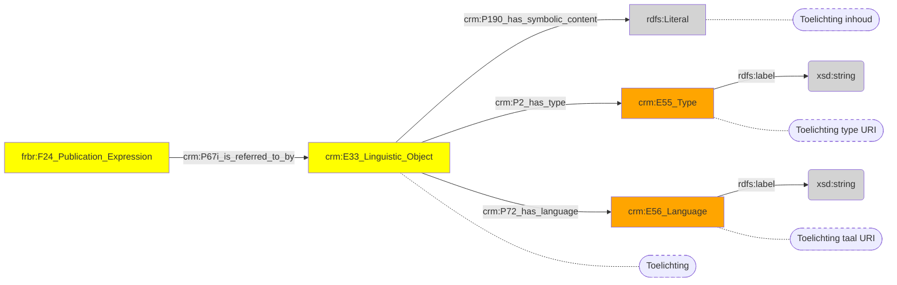

```mermaid
graph LR
f434ac6e-04f9-11ee-9497-96a6d2455259["crm:E33_Linguistic_Object"]-->|"crm:P190_has_symbolic_content"|f434cfdc-04f9-11ee-9497-96a6d2455259(rdfs:Literal)
f434cf50-04f9-11ee-9497-96a6d2455259["crm:E55_Type"]-->|"rdfs:label"|f434d072-04f9-11ee-9497-96a6d2455259(xsd:string)
f434cf96-04f9-11ee-9497-96a6d2455259["crm:E56_Language"]-->|"rdfs:label"|f434d022-04f9-11ee-9497-96a6d2455259(xsd:string)
f434ac6e-04f9-11ee-9497-96a6d2455259["crm:E33_Linguistic_Object"]-->|"crm:P2_has_type"|f434cf50-04f9-11ee-9497-96a6d2455259["crm:E55_Type"]
f434ac6e-04f9-11ee-9497-96a6d2455259["crm:E33_Linguistic_Object"]-->|"crm:P72_has_language"|f434cf96-04f9-11ee-9497-96a6d2455259["crm:E56_Language"]
f434b650-04f9-11ee-9497-96a6d2455259["frbr:F24_Publication_Expression"]-->|"crm:P67i_is_referred_to_by"|f434ac6e-04f9-11ee-9497-96a6d2455259["crm:E33_Linguistic_Object"]
f434cfdc-04f9-11ee-9497-96a6d2455259["rdfs:Literal"]-.-f434cfdc-04f9-11ee-9497-96a6d2455259_s(["Toelichting inhoud"])
f434cf50-04f9-11ee-9497-96a6d2455259["crm:E55_Type"]-.-f434cf50-04f9-11ee-9497-96a6d2455259_s(["Toelichting type URI"])
f434cf96-04f9-11ee-9497-96a6d2455259["crm:E56_Language"]-.-f434cf96-04f9-11ee-9497-96a6d2455259_s(["Toelichting taal URI"])
f434ac6e-04f9-11ee-9497-96a6d2455259["crm:E33_Linguistic_Object"]-.-f434ac6e-04f9-11ee-9497-96a6d2455259_s(["Toelichting"])
style f434cfdc-04f9-11ee-9497-96a6d2455259_s stroke-dasharray: 5
style f434cf50-04f9-11ee-9497-96a6d2455259_s stroke-dasharray: 5
style f434cf96-04f9-11ee-9497-96a6d2455259_s stroke-dasharray: 5
style f434ac6e-04f9-11ee-9497-96a6d2455259_s stroke-dasharray: 5
style f434ac6e-04f9-11ee-9497-96a6d2455259 fill:#ffff00
style f434b650-04f9-11ee-9497-96a6d2455259 fill:#ffff00
style f434cf50-04f9-11ee-9497-96a6d2455259 fill:#ffa500
style f434cf96-04f9-11ee-9497-96a6d2455259 fill:#ffa500
style f434cfdc-04f9-11ee-9497-96a6d2455259 fill:#D3D3D3
style f434d022-04f9-11ee-9497-96a6d2455259 fill:#D3D3D3
style f434d072-04f9-11ee-9497-96a6d2455259 fill:#D3D3D3
```
