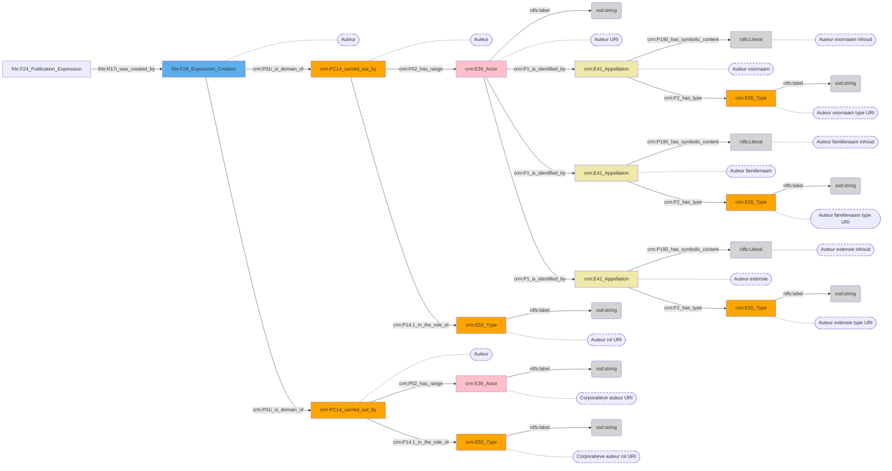

```mermaid
graph LR
style 221765d8-6d7b-11ee-b0c4-00163e71351b_s stroke-dasharray: 5
style 2217670e-6d7b-11ee-b0c4-00163e71351b_s stroke-dasharray: 5
style 74e6a102-6d7b-11ee-a9ac-00163e71351b_s stroke-dasharray: 5
style 74e6a242-6d7b-11ee-a9ac-00163e71351b_s stroke-dasharray: 5
style a4d25ed8-6d7b-11ee-b0c4-00163e71351b_s stroke-dasharray: 5
style a4d260ae-6d7b-11ee-b0c4-00163e71351b_s stroke-dasharray: 5
style e7c2c576-6d7a-11ee-a9ac-00163e71351b_s stroke-dasharray: 5
style 2c76475a-6d7c-11ee-b0c4-00163e71351b_s stroke-dasharray: 5
style 22176218-6d7b-11ee-b0c4-00163e71351b_s stroke-dasharray: 5
style 74e69d42-6d7b-11ee-a9ac-00163e71351b_s stroke-dasharray: 5
style a4d25956-6d7b-11ee-b0c4-00163e71351b_s stroke-dasharray: 5
style aa3c2558-6d7a-11ee-a9ac-00163e71351b_s stroke-dasharray: 5
style f434beac-04f9-11ee-9497-96a6d2455259_s stroke-dasharray: 5
style f4349fc6-04f9-11ee-9497-96a6d2455259_s stroke-dasharray: 5
style f434be16-04f9-11ee-9497-96a6d2455259_s stroke-dasharray: 5
style f434bd8a-04f9-11ee-9497-96a6d2455259_s stroke-dasharray: 5
22176218-6d7b-11ee-b0c4-00163e71351b["crm:E41_Appellation"]-->|"crm:P190_has_symbolic_content"|221765d8-6d7b-11ee-b0c4-00163e71351b(rdfs:Literal)
2217670e-6d7b-11ee-b0c4-00163e71351b["crm:E55_Type"]-->|"rdfs:label"|221767fe-6d7b-11ee-b0c4-00163e71351b(xsd:string)
2c76475a-6d7c-11ee-b0c4-00163e71351b["crm:E55_Type"]-->|"rdfs:label"|5b5d17ce-6d7c-11ee-974d-00163e71351b(xsd:string)
74e69d42-6d7b-11ee-a9ac-00163e71351b["crm:E41_Appellation"]-->|"crm:P190_has_symbolic_content"|74e6a102-6d7b-11ee-a9ac-00163e71351b(rdfs:Literal)
74e6a242-6d7b-11ee-a9ac-00163e71351b["crm:E55_Type"]-->|"rdfs:label"|74e6a346-6d7b-11ee-a9ac-00163e71351b(xsd:string)
a4d25956-6d7b-11ee-b0c4-00163e71351b["crm:E41_Appellation"]-->|"crm:P190_has_symbolic_content"|a4d25ed8-6d7b-11ee-b0c4-00163e71351b(rdfs:Literal)
a4d260ae-6d7b-11ee-b0c4-00163e71351b["crm:E55_Type"]-->|"rdfs:label"|a4d26234-6d7b-11ee-b0c4-00163e71351b(xsd:string)
e7c2c576-6d7a-11ee-a9ac-00163e71351b["crm:E39_Actor"]-->|"rdfs:label"|ecb78aa2-6d7b-11ee-974d-00163e71351b(xsd:string)
f434bd8a-04f9-11ee-9497-96a6d2455259["crm:E55_Type"]-->|"rdfs:label"|f434bc72-04f9-11ee-9497-96a6d2455259(xsd:string)
f434be16-04f9-11ee-9497-96a6d2455259["crm:E39_Actor"]-->|"rdfs:label"|f434bc22-04f9-11ee-9497-96a6d2455259(xsd:string)
221765d8-6d7b-11ee-b0c4-00163e71351b["rdfs:Literal"]-.-221765d8-6d7b-11ee-b0c4-00163e71351b_s(["Auteur voornaam inhoud"])
2217670e-6d7b-11ee-b0c4-00163e71351b["crm:E55_Type"]-.-2217670e-6d7b-11ee-b0c4-00163e71351b_s(["Auteur voornaam type URI"])
74e6a102-6d7b-11ee-a9ac-00163e71351b["rdfs:Literal"]-.-74e6a102-6d7b-11ee-a9ac-00163e71351b_s(["Auteur familienaam inhoud"])
74e6a242-6d7b-11ee-a9ac-00163e71351b["crm:E55_Type"]-.-74e6a242-6d7b-11ee-a9ac-00163e71351b_s(["Auteur familienaam type URI"])
a4d25ed8-6d7b-11ee-b0c4-00163e71351b["rdfs:Literal"]-.-a4d25ed8-6d7b-11ee-b0c4-00163e71351b_s(["Auteur extensie inhoud"])
a4d260ae-6d7b-11ee-b0c4-00163e71351b["crm:E55_Type"]-.-a4d260ae-6d7b-11ee-b0c4-00163e71351b_s(["Auteur extensie type URI"])
e7c2c576-6d7a-11ee-a9ac-00163e71351b["crm:E39_Actor"]-.-e7c2c576-6d7a-11ee-a9ac-00163e71351b_s(["Auteur URI"])
2c76475a-6d7c-11ee-b0c4-00163e71351b["crm:E55_Type"]-.-2c76475a-6d7c-11ee-b0c4-00163e71351b_s(["Auteur rol URI"])
22176218-6d7b-11ee-b0c4-00163e71351b["crm:E41_Appellation"]-.-22176218-6d7b-11ee-b0c4-00163e71351b_s(["Auteur voornaam"])
74e69d42-6d7b-11ee-a9ac-00163e71351b["crm:E41_Appellation"]-.-74e69d42-6d7b-11ee-a9ac-00163e71351b_s(["Auteur familienaam"])
a4d25956-6d7b-11ee-b0c4-00163e71351b["crm:E41_Appellation"]-.-a4d25956-6d7b-11ee-b0c4-00163e71351b_s(["Auteur extensie"])
aa3c2558-6d7a-11ee-a9ac-00163e71351b["crm:PC14_carried_out_by"]-.-aa3c2558-6d7a-11ee-a9ac-00163e71351b_s(["Auteur"])
f434beac-04f9-11ee-9497-96a6d2455259["crm:PC14_carried_out_by"]-.-f434beac-04f9-11ee-9497-96a6d2455259_s(["Auteur"])
f4349fc6-04f9-11ee-9497-96a6d2455259["frbr:F28_Expression_Creation"]-.-f4349fc6-04f9-11ee-9497-96a6d2455259_s(["Auteur"])
f434be16-04f9-11ee-9497-96a6d2455259["crm:E39_Actor"]-.-f434be16-04f9-11ee-9497-96a6d2455259_s(["Corporatieve auteur URI"])
f434bd8a-04f9-11ee-9497-96a6d2455259["crm:E55_Type"]-.-f434bd8a-04f9-11ee-9497-96a6d2455259_s(["Corporatieve auteur rol URI"])
22176218-6d7b-11ee-b0c4-00163e71351b["crm:E41_Appellation"]-->|"crm:P2_has_type"|2217670e-6d7b-11ee-b0c4-00163e71351b["crm:E55_Type"]
74e69d42-6d7b-11ee-a9ac-00163e71351b["crm:E41_Appellation"]-->|"crm:P2_has_type"|74e6a242-6d7b-11ee-a9ac-00163e71351b["crm:E55_Type"]
a4d25956-6d7b-11ee-b0c4-00163e71351b["crm:E41_Appellation"]-->|"crm:P2_has_type"|a4d260ae-6d7b-11ee-b0c4-00163e71351b["crm:E55_Type"]
aa3c2558-6d7a-11ee-a9ac-00163e71351b["crm:PC14_carried_out_by"]-->|"crm:P02_has_range"|e7c2c576-6d7a-11ee-a9ac-00163e71351b["crm:E39_Actor"]
aa3c2558-6d7a-11ee-a9ac-00163e71351b["crm:PC14_carried_out_by"]-->|"crm:P14.1_in_the_role_of"|2c76475a-6d7c-11ee-b0c4-00163e71351b["crm:E55_Type"]
e7c2c576-6d7a-11ee-a9ac-00163e71351b["crm:E39_Actor"]-->|"crm:P1_is_identified_by"|22176218-6d7b-11ee-b0c4-00163e71351b["crm:E41_Appellation"]
e7c2c576-6d7a-11ee-a9ac-00163e71351b["crm:E39_Actor"]-->|"crm:P1_is_identified_by"|74e69d42-6d7b-11ee-a9ac-00163e71351b["crm:E41_Appellation"]
e7c2c576-6d7a-11ee-a9ac-00163e71351b["crm:E39_Actor"]-->|"crm:P1_is_identified_by"|a4d25956-6d7b-11ee-b0c4-00163e71351b["crm:E41_Appellation"]
f4349fc6-04f9-11ee-9497-96a6d2455259["frbr:F28_Expression_Creation"]-->|"crm:P01i_is_domain_of"|aa3c2558-6d7a-11ee-a9ac-00163e71351b["crm:PC14_carried_out_by"]
f4349fc6-04f9-11ee-9497-96a6d2455259["frbr:F28_Expression_Creation"]-->|"crm:P01i_is_domain_of"|f434beac-04f9-11ee-9497-96a6d2455259["crm:PC14_carried_out_by"]
f434b650-04f9-11ee-9497-96a6d2455259["frbr:F24_Publication_Expression"]-->|"frbr:R17i_was_created_by"|f4349fc6-04f9-11ee-9497-96a6d2455259["frbr:F28_Expression_Creation"]
f434beac-04f9-11ee-9497-96a6d2455259["crm:PC14_carried_out_by"]-->|"crm:P02_has_range"|f434be16-04f9-11ee-9497-96a6d2455259["crm:E39_Actor"]
f434beac-04f9-11ee-9497-96a6d2455259["crm:PC14_carried_out_by"]-->|"crm:P14.1_in_the_role_of"|f434bd8a-04f9-11ee-9497-96a6d2455259["crm:E55_Type"]
style 22176218-6d7b-11ee-b0c4-00163e71351b fill:#EEE8AA
style 221765d8-6d7b-11ee-b0c4-00163e71351b fill:#D3D3D3
style 2217670e-6d7b-11ee-b0c4-00163e71351b fill:#ffa500
style 221767fe-6d7b-11ee-b0c4-00163e71351b fill:#D3D3D3
style 2c76475a-6d7c-11ee-b0c4-00163e71351b fill:#ffa500
style 5b5d17ce-6d7c-11ee-974d-00163e71351b fill:#D3D3D3
style 74e69d42-6d7b-11ee-a9ac-00163e71351b fill:#EEE8AA
style 74e6a102-6d7b-11ee-a9ac-00163e71351b fill:#D3D3D3
style 74e6a242-6d7b-11ee-a9ac-00163e71351b fill:#ffa500
style 74e6a346-6d7b-11ee-a9ac-00163e71351b fill:#D3D3D3
style a4d25956-6d7b-11ee-b0c4-00163e71351b fill:#EEE8AA
style a4d25ed8-6d7b-11ee-b0c4-00163e71351b fill:#D3D3D3
style a4d260ae-6d7b-11ee-b0c4-00163e71351b fill:#ffa500
style a4d26234-6d7b-11ee-b0c4-00163e71351b fill:#D3D3D3
style aa3c2558-6d7a-11ee-a9ac-00163e71351b fill:#ffa500
style e7c2c576-6d7a-11ee-a9ac-00163e71351b fill:#ffc0cb
style ecb78aa2-6d7b-11ee-974d-00163e71351b fill:#D3D3D3
style f4349fc6-04f9-11ee-9497-96a6d2455259 fill:#5DAEEC
style f434bc22-04f9-11ee-9497-96a6d2455259 fill:#D3D3D3
style f434bc72-04f9-11ee-9497-96a6d2455259 fill:#D3D3D3
style f434bd8a-04f9-11ee-9497-96a6d2455259 fill:#ffa500
style f434be16-04f9-11ee-9497-96a6d2455259 fill:#ffc0cb
style f434beac-04f9-11ee-9497-96a6d2455259 fill:#ffa500
```
