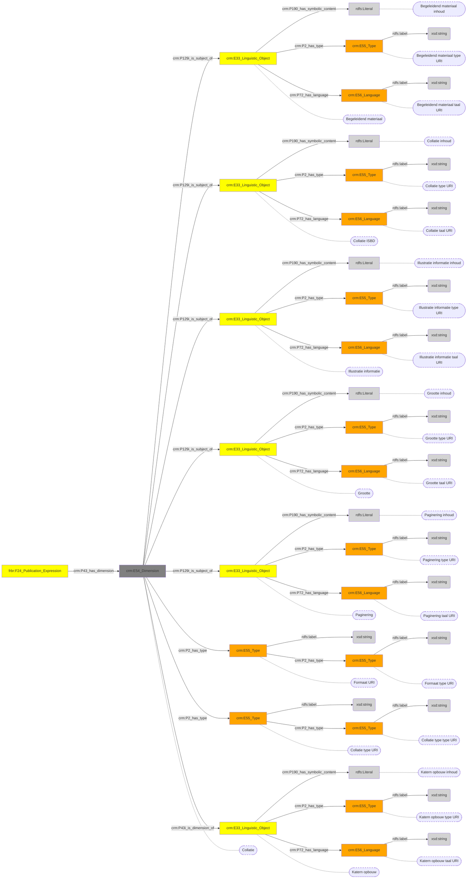

```mermaid
graph LR
481c8892-676f-11ee-a9ac-00163e71351b["crm:E55_Type"]-->|"rdfs:label"|481c8ff4-676f-11ee-a9ac-00163e71351b(xsd:string)
58cbcd30-668c-11ee-a9ac-00163e71351b["crm:E33_Linguistic_Object"]-->|"crm:P190_has_symbolic_content"|58cbd0f0-668c-11ee-a9ac-00163e71351b(rdfs:Literal)
58cbd32a-668c-11ee-a9ac-00163e71351b["crm:E55_Type"]-->|"rdfs:label"|58cbd230-668c-11ee-a9ac-00163e71351b(xsd:string)
58cbd50a-668c-11ee-a9ac-00163e71351b["crm:E56_Language"]-->|"rdfs:label"|58cbd41a-668c-11ee-a9ac-00163e71351b(xsd:string)
85f32706-6c16-11ee-bc5c-00163e71351b["crm:E33_Linguistic_Object"]-->|"crm:P190_has_symbolic_content"|85f32ada-6c16-11ee-bc5c-00163e71351b(rdfs:Literal)
85f32d14-6c16-11ee-bc5c-00163e71351b["crm:E55_Type"]-->|"rdfs:label"|85f32c10-6c16-11ee-bc5c-00163e71351b(xsd:string)
85f32eea-6c16-11ee-bc5c-00163e71351b["crm:E56_Language"]-->|"rdfs:label"|85f32e04-6c16-11ee-bc5c-00163e71351b(xsd:string)
9f5d011a-6687-11ee-974d-00163e71351b["crm:E55_Type"]-->|"rdfs:label"|9f5d0606-6687-11ee-974d-00163e71351b(xsd:string)
9f5d04c6-6687-11ee-974d-00163e71351b["crm:E55_Type"]-->|"rdfs:label"|9f5d0714-6687-11ee-974d-00163e71351b(xsd:string)
bd3a73b2-668b-11ee-974d-00163e71351b["crm:E33_Linguistic_Object"]-->|"crm:P190_has_symbolic_content"|bd3a7754-668b-11ee-974d-00163e71351b(rdfs:Literal)
bd3a7998-668b-11ee-974d-00163e71351b["crm:E55_Type"]-->|"rdfs:label"|bd3a7894-668b-11ee-974d-00163e71351b(xsd:string)
bd3a7b6e-668b-11ee-974d-00163e71351b["crm:E56_Language"]-->|"rdfs:label"|bd3a7a88-668b-11ee-974d-00163e71351b(xsd:string)
d46281a8-6689-11ee-bc5c-00163e71351b["crm:E33_Linguistic_Object"]-->|"crm:P190_has_symbolic_content"|d462855e-6689-11ee-bc5c-00163e71351b(rdfs:Literal)
d46289be-6689-11ee-bc5c-00163e71351b["crm:E55_Type"]-->|"rdfs:label"|d46286a8-6689-11ee-bc5c-00163e71351b(xsd:string)
d4628c20-6689-11ee-bc5c-00163e71351b["crm:E56_Language"]-->|"rdfs:label"|d4628b08-6689-11ee-bc5c-00163e71351b(xsd:string)
dfc30ff6-668c-11ee-a9ac-00163e71351b["crm:E33_Linguistic_Object"]-->|"crm:P190_has_symbolic_content"|dfc3173a-668c-11ee-a9ac-00163e71351b(rdfs:Literal)
dfc31bc2-668c-11ee-a9ac-00163e71351b["crm:E55_Type"]-->|"rdfs:label"|dfc319a6-668c-11ee-a9ac-00163e71351b(xsd:string)
dfc31fd2-668c-11ee-a9ac-00163e71351b["crm:E56_Language"]-->|"rdfs:label"|dfc31dd4-668c-11ee-a9ac-00163e71351b(xsd:string)
f1d6cd04-4bc5-11ee-a9ac-00163e71351b["crm:E33_Linguistic_Object"]-->|"crm:P190_has_symbolic_content"|f1d6dace-4bc5-11ee-a9ac-00163e71351b(rdfs:Literal)
f1d6cfb6-4bc5-11ee-a9ac-00163e71351b["crm:E55_Type"]-->|"rdfs:label"|f1d6d2cc-4bc5-11ee-a9ac-00163e71351b(xsd:string)
f1d6dd76-4bc5-11ee-a9ac-00163e71351b["crm:E55_Type"]-->|"rdfs:label"|f1d6de52-4bc5-11ee-a9ac-00163e71351b(xsd:string)
f1d6e0e6-4bc5-11ee-a9ac-00163e71351b["crm:E56_Language"]-->|"rdfs:label"|f1d6dc90-4bc5-11ee-a9ac-00163e71351b(xsd:string)
58cbcd30-668c-11ee-a9ac-00163e71351b["crm:E33_Linguistic_Object"]-->|"crm:P2_has_type"|58cbd32a-668c-11ee-a9ac-00163e71351b["crm:E55_Type"]
58cbcd30-668c-11ee-a9ac-00163e71351b["crm:E33_Linguistic_Object"]-->|"crm:P72_has_language"|58cbd50a-668c-11ee-a9ac-00163e71351b["crm:E56_Language"]
85f32706-6c16-11ee-bc5c-00163e71351b["crm:E33_Linguistic_Object"]-->|"crm:P2_has_type"|85f32d14-6c16-11ee-bc5c-00163e71351b["crm:E55_Type"]
85f32706-6c16-11ee-bc5c-00163e71351b["crm:E33_Linguistic_Object"]-->|"crm:P72_has_language"|85f32eea-6c16-11ee-bc5c-00163e71351b["crm:E56_Language"]
9f5d011a-6687-11ee-974d-00163e71351b["crm:E55_Type"]-->|"crm:P2_has_type"|9f5d04c6-6687-11ee-974d-00163e71351b["crm:E55_Type"]
bd3a73b2-668b-11ee-974d-00163e71351b["crm:E33_Linguistic_Object"]-->|"crm:P2_has_type"|bd3a7998-668b-11ee-974d-00163e71351b["crm:E55_Type"]
bd3a73b2-668b-11ee-974d-00163e71351b["crm:E33_Linguistic_Object"]-->|"crm:P72_has_language"|bd3a7b6e-668b-11ee-974d-00163e71351b["crm:E56_Language"]
d46281a8-6689-11ee-bc5c-00163e71351b["crm:E33_Linguistic_Object"]-->|"crm:P2_has_type"|d46289be-6689-11ee-bc5c-00163e71351b["crm:E55_Type"]
d46281a8-6689-11ee-bc5c-00163e71351b["crm:E33_Linguistic_Object"]-->|"crm:P72_has_language"|d4628c20-6689-11ee-bc5c-00163e71351b["crm:E56_Language"]
dfc30ff6-668c-11ee-a9ac-00163e71351b["crm:E33_Linguistic_Object"]-->|"crm:P2_has_type"|dfc31bc2-668c-11ee-a9ac-00163e71351b["crm:E55_Type"]
dfc30ff6-668c-11ee-a9ac-00163e71351b["crm:E33_Linguistic_Object"]-->|"crm:P72_has_language"|dfc31fd2-668c-11ee-a9ac-00163e71351b["crm:E56_Language"]
f1d6c386-4bc5-11ee-a9ac-00163e71351b["crm:E54_Dimension"]-->|"crm:P129i_is_subject_of"|58cbcd30-668c-11ee-a9ac-00163e71351b["crm:E33_Linguistic_Object"]
f1d6c386-4bc5-11ee-a9ac-00163e71351b["crm:E54_Dimension"]-->|"crm:P129i_is_subject_of"|85f32706-6c16-11ee-bc5c-00163e71351b["crm:E33_Linguistic_Object"]
f1d6c386-4bc5-11ee-a9ac-00163e71351b["crm:E54_Dimension"]-->|"crm:P129i_is_subject_of"|bd3a73b2-668b-11ee-974d-00163e71351b["crm:E33_Linguistic_Object"]
f1d6c386-4bc5-11ee-a9ac-00163e71351b["crm:E54_Dimension"]-->|"crm:P129i_is_subject_of"|d46281a8-6689-11ee-bc5c-00163e71351b["crm:E33_Linguistic_Object"]
f1d6c386-4bc5-11ee-a9ac-00163e71351b["crm:E54_Dimension"]-->|"crm:P129i_is_subject_of"|f1d6cd04-4bc5-11ee-a9ac-00163e71351b["crm:E33_Linguistic_Object"]
f1d6c386-4bc5-11ee-a9ac-00163e71351b["crm:E54_Dimension"]-->|"crm:P2_has_type"|9f5d011a-6687-11ee-974d-00163e71351b["crm:E55_Type"]
f1d6c386-4bc5-11ee-a9ac-00163e71351b["crm:E54_Dimension"]-->|"crm:P2_has_type"|f1d6cfb6-4bc5-11ee-a9ac-00163e71351b["crm:E55_Type"]
f1d6c386-4bc5-11ee-a9ac-00163e71351b["crm:E54_Dimension"]-->|"crm:P43i_is_dimension_of"|dfc30ff6-668c-11ee-a9ac-00163e71351b["crm:E33_Linguistic_Object"]
f1d6cd04-4bc5-11ee-a9ac-00163e71351b["crm:E33_Linguistic_Object"]-->|"crm:P2_has_type"|f1d6dd76-4bc5-11ee-a9ac-00163e71351b["crm:E55_Type"]
f1d6cd04-4bc5-11ee-a9ac-00163e71351b["crm:E33_Linguistic_Object"]-->|"crm:P72_has_language"|f1d6e0e6-4bc5-11ee-a9ac-00163e71351b["crm:E56_Language"]
f1d6cfb6-4bc5-11ee-a9ac-00163e71351b["crm:E55_Type"]-->|"crm:P2_has_type"|481c8892-676f-11ee-a9ac-00163e71351b["crm:E55_Type"]
f434b650-04f9-11ee-9497-96a6d2455259["frbr:F24_Publication_Expression"]-->|"crm:P43_has_dimension"|f1d6c386-4bc5-11ee-a9ac-00163e71351b["crm:E54_Dimension"]
58cbd0f0-668c-11ee-a9ac-00163e71351b["rdfs:Literal"]-.-58cbd0f0-668c-11ee-a9ac-00163e71351b_s(["Begeleidend materiaal inhoud"])
58cbd32a-668c-11ee-a9ac-00163e71351b["crm:E55_Type"]-.-58cbd32a-668c-11ee-a9ac-00163e71351b_s(["Begeleidend materiaal type URI"])
58cbd50a-668c-11ee-a9ac-00163e71351b["crm:E56_Language"]-.-58cbd50a-668c-11ee-a9ac-00163e71351b_s(["Begeleidend materiaal taal URI"])
85f32ada-6c16-11ee-bc5c-00163e71351b["rdfs:Literal"]-.-85f32ada-6c16-11ee-bc5c-00163e71351b_s(["Collatie inhoud"])
85f32d14-6c16-11ee-bc5c-00163e71351b["crm:E55_Type"]-.-85f32d14-6c16-11ee-bc5c-00163e71351b_s(["Collatie type URI"])
85f32eea-6c16-11ee-bc5c-00163e71351b["crm:E56_Language"]-.-85f32eea-6c16-11ee-bc5c-00163e71351b_s(["Collatie taal URI"])
9f5d04c6-6687-11ee-974d-00163e71351b["crm:E55_Type"]-.-9f5d04c6-6687-11ee-974d-00163e71351b_s(["Formaat type URI"])
bd3a7754-668b-11ee-974d-00163e71351b["rdfs:Literal"]-.-bd3a7754-668b-11ee-974d-00163e71351b_s(["Illustratie informatie inhoud"])
bd3a7998-668b-11ee-974d-00163e71351b["crm:E55_Type"]-.-bd3a7998-668b-11ee-974d-00163e71351b_s(["Illustratie informatie type URI"])
bd3a7b6e-668b-11ee-974d-00163e71351b["crm:E56_Language"]-.-bd3a7b6e-668b-11ee-974d-00163e71351b_s(["Illustratie informatie taal URI"])
d462855e-6689-11ee-bc5c-00163e71351b["rdfs:Literal"]-.-d462855e-6689-11ee-bc5c-00163e71351b_s(["Grootte inhoud"])
d46289be-6689-11ee-bc5c-00163e71351b["crm:E55_Type"]-.-d46289be-6689-11ee-bc5c-00163e71351b_s(["Grootte type URI"])
d4628c20-6689-11ee-bc5c-00163e71351b["crm:E56_Language"]-.-d4628c20-6689-11ee-bc5c-00163e71351b_s(["Grootte taal URI"])
dfc3173a-668c-11ee-a9ac-00163e71351b["rdfs:Literal"]-.-dfc3173a-668c-11ee-a9ac-00163e71351b_s(["Katern opbouw inhoud"])
dfc31bc2-668c-11ee-a9ac-00163e71351b["crm:E55_Type"]-.-dfc31bc2-668c-11ee-a9ac-00163e71351b_s(["Katern opbouw type URI"])
dfc31fd2-668c-11ee-a9ac-00163e71351b["crm:E56_Language"]-.-dfc31fd2-668c-11ee-a9ac-00163e71351b_s(["Katern opbouw taal URI"])
58cbcd30-668c-11ee-a9ac-00163e71351b["crm:E33_Linguistic_Object"]-.-58cbcd30-668c-11ee-a9ac-00163e71351b_s(["Begeleidend materiaal"])
85f32706-6c16-11ee-bc5c-00163e71351b["crm:E33_Linguistic_Object"]-.-85f32706-6c16-11ee-bc5c-00163e71351b_s(["Collatie ISBD"])
bd3a73b2-668b-11ee-974d-00163e71351b["crm:E33_Linguistic_Object"]-.-bd3a73b2-668b-11ee-974d-00163e71351b_s(["Illustratie informatie"])
d46281a8-6689-11ee-bc5c-00163e71351b["crm:E33_Linguistic_Object"]-.-d46281a8-6689-11ee-bc5c-00163e71351b_s(["Grootte"])
f1d6cd04-4bc5-11ee-a9ac-00163e71351b["crm:E33_Linguistic_Object"]-.-f1d6cd04-4bc5-11ee-a9ac-00163e71351b_s(["Paginering"])
9f5d011a-6687-11ee-974d-00163e71351b["crm:E55_Type"]-.-9f5d011a-6687-11ee-974d-00163e71351b_s(["Formaat URI"])
f1d6cfb6-4bc5-11ee-a9ac-00163e71351b["crm:E55_Type"]-.-f1d6cfb6-4bc5-11ee-a9ac-00163e71351b_s(["Collatie type URI"])
dfc30ff6-668c-11ee-a9ac-00163e71351b["crm:E33_Linguistic_Object"]-.-dfc30ff6-668c-11ee-a9ac-00163e71351b_s(["Katern opbouw"])
f1d6dace-4bc5-11ee-a9ac-00163e71351b["rdfs:Literal"]-.-f1d6dace-4bc5-11ee-a9ac-00163e71351b_s(["Paginering inhoud"])
f1d6dd76-4bc5-11ee-a9ac-00163e71351b["crm:E55_Type"]-.-f1d6dd76-4bc5-11ee-a9ac-00163e71351b_s(["Paginering type URI"])
f1d6e0e6-4bc5-11ee-a9ac-00163e71351b["crm:E56_Language"]-.-f1d6e0e6-4bc5-11ee-a9ac-00163e71351b_s(["Paginering taal URI"])
481c8892-676f-11ee-a9ac-00163e71351b["crm:E55_Type"]-.-481c8892-676f-11ee-a9ac-00163e71351b_s(["Collatie type type URI"])
f1d6c386-4bc5-11ee-a9ac-00163e71351b["crm:E54_Dimension"]-.-f1d6c386-4bc5-11ee-a9ac-00163e71351b_s(["Collatie"])
style 58cbd0f0-668c-11ee-a9ac-00163e71351b_s stroke-dasharray: 5
style 58cbd32a-668c-11ee-a9ac-00163e71351b_s stroke-dasharray: 5
style 58cbd50a-668c-11ee-a9ac-00163e71351b_s stroke-dasharray: 5
style 85f32ada-6c16-11ee-bc5c-00163e71351b_s stroke-dasharray: 5
style 85f32d14-6c16-11ee-bc5c-00163e71351b_s stroke-dasharray: 5
style 85f32eea-6c16-11ee-bc5c-00163e71351b_s stroke-dasharray: 5
style 9f5d04c6-6687-11ee-974d-00163e71351b_s stroke-dasharray: 5
style bd3a7754-668b-11ee-974d-00163e71351b_s stroke-dasharray: 5
style bd3a7998-668b-11ee-974d-00163e71351b_s stroke-dasharray: 5
style bd3a7b6e-668b-11ee-974d-00163e71351b_s stroke-dasharray: 5
style d462855e-6689-11ee-bc5c-00163e71351b_s stroke-dasharray: 5
style d46289be-6689-11ee-bc5c-00163e71351b_s stroke-dasharray: 5
style d4628c20-6689-11ee-bc5c-00163e71351b_s stroke-dasharray: 5
style dfc3173a-668c-11ee-a9ac-00163e71351b_s stroke-dasharray: 5
style dfc31bc2-668c-11ee-a9ac-00163e71351b_s stroke-dasharray: 5
style dfc31fd2-668c-11ee-a9ac-00163e71351b_s stroke-dasharray: 5
style 58cbcd30-668c-11ee-a9ac-00163e71351b_s stroke-dasharray: 5
style 85f32706-6c16-11ee-bc5c-00163e71351b_s stroke-dasharray: 5
style bd3a73b2-668b-11ee-974d-00163e71351b_s stroke-dasharray: 5
style d46281a8-6689-11ee-bc5c-00163e71351b_s stroke-dasharray: 5
style f1d6cd04-4bc5-11ee-a9ac-00163e71351b_s stroke-dasharray: 5
style 9f5d011a-6687-11ee-974d-00163e71351b_s stroke-dasharray: 5
style f1d6cfb6-4bc5-11ee-a9ac-00163e71351b_s stroke-dasharray: 5
style dfc30ff6-668c-11ee-a9ac-00163e71351b_s stroke-dasharray: 5
style f1d6dace-4bc5-11ee-a9ac-00163e71351b_s stroke-dasharray: 5
style f1d6dd76-4bc5-11ee-a9ac-00163e71351b_s stroke-dasharray: 5
style f1d6e0e6-4bc5-11ee-a9ac-00163e71351b_s stroke-dasharray: 5
style 481c8892-676f-11ee-a9ac-00163e71351b_s stroke-dasharray: 5
style f1d6c386-4bc5-11ee-a9ac-00163e71351b_s stroke-dasharray: 5
style 481c8892-676f-11ee-a9ac-00163e71351b fill:#ffa500
style 481c8ff4-676f-11ee-a9ac-00163e71351b fill:#D3D3D3
style 58cbcd30-668c-11ee-a9ac-00163e71351b fill:#ffff00
style 58cbd0f0-668c-11ee-a9ac-00163e71351b fill:#D3D3D3
style 58cbd230-668c-11ee-a9ac-00163e71351b fill:#D3D3D3
style 58cbd32a-668c-11ee-a9ac-00163e71351b fill:#ffa500
style 58cbd41a-668c-11ee-a9ac-00163e71351b fill:#D3D3D3
style 58cbd50a-668c-11ee-a9ac-00163e71351b fill:#ffa500
style 85f32706-6c16-11ee-bc5c-00163e71351b fill:#ffff00
style 85f32ada-6c16-11ee-bc5c-00163e71351b fill:#D3D3D3
style 85f32c10-6c16-11ee-bc5c-00163e71351b fill:#D3D3D3
style 85f32d14-6c16-11ee-bc5c-00163e71351b fill:#ffa500
style 85f32e04-6c16-11ee-bc5c-00163e71351b fill:#D3D3D3
style 85f32eea-6c16-11ee-bc5c-00163e71351b fill:#ffa500
style 9f5d011a-6687-11ee-974d-00163e71351b fill:#ffa500
style 9f5d04c6-6687-11ee-974d-00163e71351b fill:#ffa500
style 9f5d0606-6687-11ee-974d-00163e71351b fill:#D3D3D3
style 9f5d0714-6687-11ee-974d-00163e71351b fill:#D3D3D3
style bd3a73b2-668b-11ee-974d-00163e71351b fill:#ffff00
style bd3a7754-668b-11ee-974d-00163e71351b fill:#D3D3D3
style bd3a7894-668b-11ee-974d-00163e71351b fill:#D3D3D3
style bd3a7998-668b-11ee-974d-00163e71351b fill:#ffa500
style bd3a7a88-668b-11ee-974d-00163e71351b fill:#D3D3D3
style bd3a7b6e-668b-11ee-974d-00163e71351b fill:#ffa500
style d46281a8-6689-11ee-bc5c-00163e71351b fill:#ffff00
style d462855e-6689-11ee-bc5c-00163e71351b fill:#D3D3D3
style d46286a8-6689-11ee-bc5c-00163e71351b fill:#D3D3D3
style d46289be-6689-11ee-bc5c-00163e71351b fill:#ffa500
style d4628b08-6689-11ee-bc5c-00163e71351b fill:#D3D3D3
style d4628c20-6689-11ee-bc5c-00163e71351b fill:#ffa500
style dfc30ff6-668c-11ee-a9ac-00163e71351b fill:#ffff00
style dfc3173a-668c-11ee-a9ac-00163e71351b fill:#D3D3D3
style dfc319a6-668c-11ee-a9ac-00163e71351b fill:#D3D3D3
style dfc31bc2-668c-11ee-a9ac-00163e71351b fill:#ffa500
style dfc31dd4-668c-11ee-a9ac-00163e71351b fill:#D3D3D3
style dfc31fd2-668c-11ee-a9ac-00163e71351b fill:#ffa500
style f1d6c386-4bc5-11ee-a9ac-00163e71351b fill:#808080
style f1d6cd04-4bc5-11ee-a9ac-00163e71351b fill:#ffff00
style f1d6cfb6-4bc5-11ee-a9ac-00163e71351b fill:#ffa500
style f1d6d2cc-4bc5-11ee-a9ac-00163e71351b fill:#D3D3D3
style f1d6dace-4bc5-11ee-a9ac-00163e71351b fill:#D3D3D3
style f1d6dc90-4bc5-11ee-a9ac-00163e71351b fill:#D3D3D3
style f1d6dd76-4bc5-11ee-a9ac-00163e71351b fill:#ffa500
style f1d6de52-4bc5-11ee-a9ac-00163e71351b fill:#D3D3D3
style f1d6e0e6-4bc5-11ee-a9ac-00163e71351b fill:#ffa500
style f434b650-04f9-11ee-9497-96a6d2455259 fill:#ffff00
```
