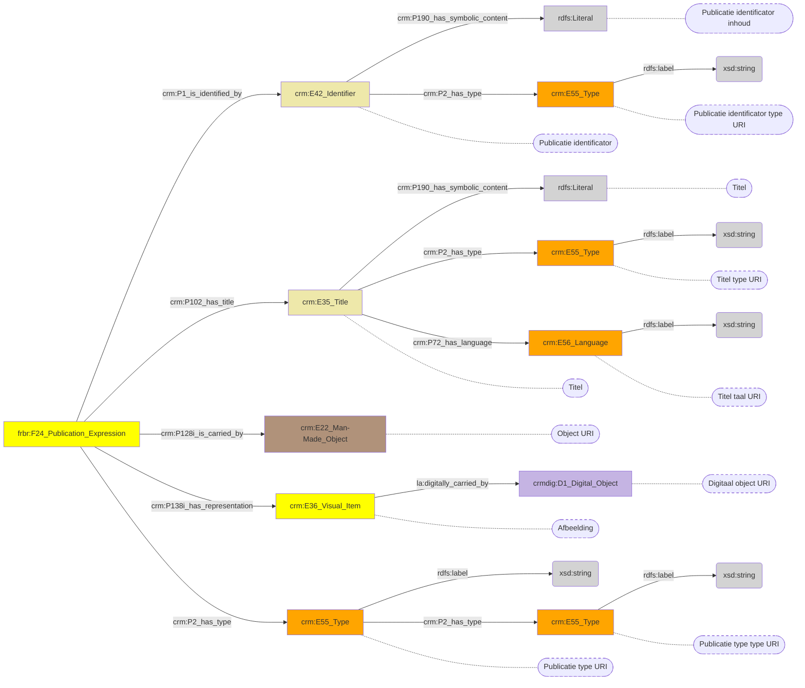

```mermaid
graph LR
f434906c-04f9-11ee-9497-96a6d2455259["crm:E35_Title"]-->|"crm:P190_has_symbolic_content"|f434b222-04f9-11ee-9497-96a6d2455259(rdfs:Literal)
f43493fa-04f9-11ee-9497-96a6d2455259["crm:E55_Type"]-->|"rdfs:label"|f434b3d0-04f9-11ee-9497-96a6d2455259(xsd:string)
f43495b2-04f9-11ee-9497-96a6d2455259["crm:E42_Identifier"]-->|"crm:P190_has_symbolic_content"|f434b466-04f9-11ee-9497-96a6d2455259(rdfs:Literal)
f434b100-04f9-11ee-9497-96a6d2455259["crm:E56_Language"]-->|"rdfs:label"|f434b268-04f9-11ee-9497-96a6d2455259(xsd:string)
f434b1dc-04f9-11ee-9497-96a6d2455259["crm:E55_Type"]-->|"rdfs:label"|f434b146-04f9-11ee-9497-96a6d2455259(xsd:string)
f434b344-04f9-11ee-9497-96a6d2455259["crm:E55_Type"]-->|"rdfs:label"|f434b38a-04f9-11ee-9497-96a6d2455259(xsd:string)
f434b4ac-04f9-11ee-9497-96a6d2455259["crm:E55_Type"]-->|"rdfs:label"|f434b4f2-04f9-11ee-9497-96a6d2455259(xsd:string)
f434906c-04f9-11ee-9497-96a6d2455259["crm:E35_Title"]-->|"crm:P2_has_type"|f434b1dc-04f9-11ee-9497-96a6d2455259["crm:E55_Type"]
f434906c-04f9-11ee-9497-96a6d2455259["crm:E35_Title"]-->|"crm:P72_has_language"|f434b100-04f9-11ee-9497-96a6d2455259["crm:E56_Language"]
f43493fa-04f9-11ee-9497-96a6d2455259["crm:E55_Type"]-->|"crm:P2_has_type"|f434b344-04f9-11ee-9497-96a6d2455259["crm:E55_Type"]
f43495b2-04f9-11ee-9497-96a6d2455259["crm:E42_Identifier"]-->|"crm:P2_has_type"|f434b4ac-04f9-11ee-9497-96a6d2455259["crm:E55_Type"]
f4349ac6-04f9-11ee-9497-96a6d2455259["crm:E36_Visual_Item"]-->|"la:digitally_carried_by"|f434b6dc-04f9-11ee-9497-96a6d2455259["crmdig:D1_Digital_Object"]
f434b650-04f9-11ee-9497-96a6d2455259["frbr:F24_Publication_Expression"]-->|"crm:P1_is_identified_by"|f43495b2-04f9-11ee-9497-96a6d2455259["crm:E42_Identifier"]
f434b650-04f9-11ee-9497-96a6d2455259["frbr:F24_Publication_Expression"]-->|"crm:P102_has_title"|f434906c-04f9-11ee-9497-96a6d2455259["crm:E35_Title"]
f434b650-04f9-11ee-9497-96a6d2455259["frbr:F24_Publication_Expression"]-->|"crm:P128i_is_carried_by"|f4349242-04f9-11ee-9497-96a6d2455259["crm:E22_Man-Made_Object"]
f434b650-04f9-11ee-9497-96a6d2455259["frbr:F24_Publication_Expression"]-->|"crm:P138i_has_representation"|f4349ac6-04f9-11ee-9497-96a6d2455259["crm:E36_Visual_Item"]
f434b650-04f9-11ee-9497-96a6d2455259["frbr:F24_Publication_Expression"]-->|"crm:P2_has_type"|f43493fa-04f9-11ee-9497-96a6d2455259["crm:E55_Type"]
f434b222-04f9-11ee-9497-96a6d2455259["rdfs:Literal"]-.-f434b222-04f9-11ee-9497-96a6d2455259_s(["Titel"])
f434b1dc-04f9-11ee-9497-96a6d2455259["crm:E55_Type"]-.-f434b1dc-04f9-11ee-9497-96a6d2455259_s(["Titel type URI"])
f434b100-04f9-11ee-9497-96a6d2455259["crm:E56_Language"]-.-f434b100-04f9-11ee-9497-96a6d2455259_s(["Titel taal URI"])
f434b344-04f9-11ee-9497-96a6d2455259["crm:E55_Type"]-.-f434b344-04f9-11ee-9497-96a6d2455259_s(["Publicatie type type URI"])
f434b466-04f9-11ee-9497-96a6d2455259["rdfs:Literal"]-.-f434b466-04f9-11ee-9497-96a6d2455259_s(["Publicatie identificator inhoud"])
f434b4ac-04f9-11ee-9497-96a6d2455259["crm:E55_Type"]-.-f434b4ac-04f9-11ee-9497-96a6d2455259_s(["Publicatie identificator type URI"])
f434b6dc-04f9-11ee-9497-96a6d2455259["crmdig:D1_Digital_Object"]-.-f434b6dc-04f9-11ee-9497-96a6d2455259_s(["Digitaal object URI"])
f43495b2-04f9-11ee-9497-96a6d2455259["crm:E42_Identifier"]-.-f43495b2-04f9-11ee-9497-96a6d2455259_s(["Publicatie identificator"])
f434906c-04f9-11ee-9497-96a6d2455259["crm:E35_Title"]-.-f434906c-04f9-11ee-9497-96a6d2455259_s(["Titel"])
f4349242-04f9-11ee-9497-96a6d2455259["crm:E22_Man-Made_Object"]-.-f4349242-04f9-11ee-9497-96a6d2455259_s(["Object URI"])
f4349ac6-04f9-11ee-9497-96a6d2455259["crm:E36_Visual_Item"]-.-f4349ac6-04f9-11ee-9497-96a6d2455259_s(["Afbeelding"])
f43493fa-04f9-11ee-9497-96a6d2455259["crm:E55_Type"]-.-f43493fa-04f9-11ee-9497-96a6d2455259_s(["Publicatie type URI"])
style f434b222-04f9-11ee-9497-96a6d2455259_s stroke-dasharray: 5
style f434b1dc-04f9-11ee-9497-96a6d2455259_s stroke-dasharray: 5
style f434b100-04f9-11ee-9497-96a6d2455259_s stroke-dasharray: 5
style f434b344-04f9-11ee-9497-96a6d2455259_s stroke-dasharray: 5
style f434b466-04f9-11ee-9497-96a6d2455259_s stroke-dasharray: 5
style f434b4ac-04f9-11ee-9497-96a6d2455259_s stroke-dasharray: 5
style f434b6dc-04f9-11ee-9497-96a6d2455259_s stroke-dasharray: 5
style f43495b2-04f9-11ee-9497-96a6d2455259_s stroke-dasharray: 5
style f434906c-04f9-11ee-9497-96a6d2455259_s stroke-dasharray: 5
style f4349242-04f9-11ee-9497-96a6d2455259_s stroke-dasharray: 5
style f4349ac6-04f9-11ee-9497-96a6d2455259_s stroke-dasharray: 5
style f43493fa-04f9-11ee-9497-96a6d2455259_s stroke-dasharray: 5
style f434906c-04f9-11ee-9497-96a6d2455259 fill:#EEE8AA
style f4349242-04f9-11ee-9497-96a6d2455259 fill:#B0927A
style f43493fa-04f9-11ee-9497-96a6d2455259 fill:#ffa500
style f43495b2-04f9-11ee-9497-96a6d2455259 fill:#EEE8AA
style f4349ac6-04f9-11ee-9497-96a6d2455259 fill:#ffff00
style f434b100-04f9-11ee-9497-96a6d2455259 fill:#ffa500
style f434b146-04f9-11ee-9497-96a6d2455259 fill:#D3D3D3
style f434b1dc-04f9-11ee-9497-96a6d2455259 fill:#ffa500
style f434b222-04f9-11ee-9497-96a6d2455259 fill:#D3D3D3
style f434b268-04f9-11ee-9497-96a6d2455259 fill:#D3D3D3
style f434b344-04f9-11ee-9497-96a6d2455259 fill:#ffa500
style f434b38a-04f9-11ee-9497-96a6d2455259 fill:#D3D3D3
style f434b3d0-04f9-11ee-9497-96a6d2455259 fill:#D3D3D3
style f434b466-04f9-11ee-9497-96a6d2455259 fill:#D3D3D3
style f434b4ac-04f9-11ee-9497-96a6d2455259 fill:#ffa500
style f434b4f2-04f9-11ee-9497-96a6d2455259 fill:#D3D3D3
style f434b650-04f9-11ee-9497-96a6d2455259 fill:#ffff00
style f434b6dc-04f9-11ee-9497-96a6d2455259 fill:#C5B4E3
```
