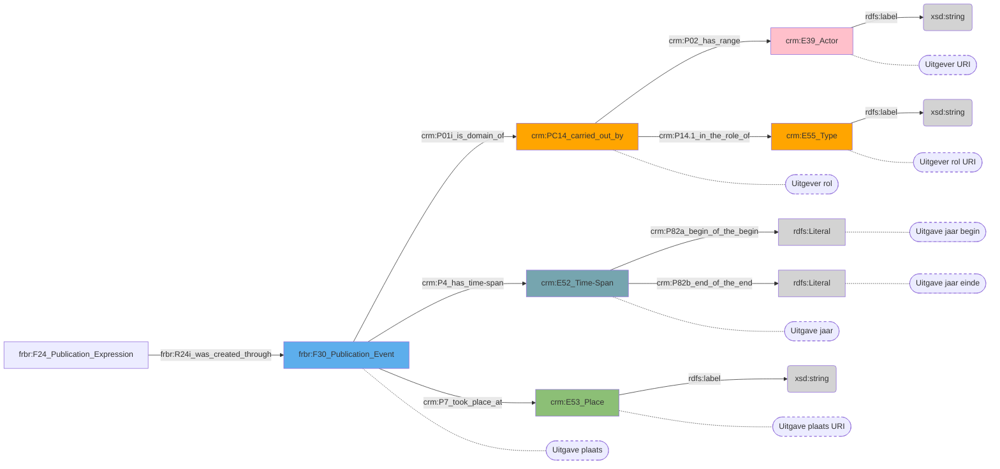

```mermaid
graph LR
f434affc-04f9-11ee-9497-96a6d2455259["crm:E52_Time-Span"]-->|"crm:P82a_begin_of_the_begin"|f434b2ae-04f9-11ee-9497-96a6d2455259(rdfs:Literal)
f434affc-04f9-11ee-9497-96a6d2455259["crm:E52_Time-Span"]-->|"crm:P82b_end_of_the_end"|f434b538-04f9-11ee-9497-96a6d2455259(rdfs:Literal)
f434b2f4-04f9-11ee-9497-96a6d2455259["crm:E55_Type"]-->|"rdfs:label"|f434c55a-04f9-11ee-9497-96a6d2455259(xsd:string)
f434b57e-04f9-11ee-9497-96a6d2455259["crm:E53_Place"]-->|"rdfs:label"|f434b68c-04f9-11ee-9497-96a6d2455259(xsd:string)
f434b5c4-04f9-11ee-9497-96a6d2455259["crm:E39_Actor"]-->|"rdfs:label"|f434ba38-04f9-11ee-9497-96a6d2455259(xsd:string)
style f434b060-04f9-11ee-9497-96a6d2455259_s stroke-dasharray: 5
style f434affc-04f9-11ee-9497-96a6d2455259_s stroke-dasharray: 5
style f434b57e-04f9-11ee-9497-96a6d2455259_s stroke-dasharray: 5
style f434b2ae-04f9-11ee-9497-96a6d2455259_s stroke-dasharray: 5
style f434b538-04f9-11ee-9497-96a6d2455259_s stroke-dasharray: 5
style f434b5c4-04f9-11ee-9497-96a6d2455259_s stroke-dasharray: 5
style f434b2f4-04f9-11ee-9497-96a6d2455259_s stroke-dasharray: 5
style f434a6e2-04f9-11ee-9497-96a6d2455259_s stroke-dasharray: 5
f434a6e2-04f9-11ee-9497-96a6d2455259["frbr:F30_Publication_Event"]-->|"crm:P01i_is_domain_of"|f434b060-04f9-11ee-9497-96a6d2455259["crm:PC14_carried_out_by"]
f434a6e2-04f9-11ee-9497-96a6d2455259["frbr:F30_Publication_Event"]-->|"crm:P4_has_time-span"|f434affc-04f9-11ee-9497-96a6d2455259["crm:E52_Time-Span"]
f434a6e2-04f9-11ee-9497-96a6d2455259["frbr:F30_Publication_Event"]-->|"crm:P7_took_place_at"|f434b57e-04f9-11ee-9497-96a6d2455259["crm:E53_Place"]
f434b060-04f9-11ee-9497-96a6d2455259["crm:PC14_carried_out_by"]-->|"crm:P02_has_range"|f434b5c4-04f9-11ee-9497-96a6d2455259["crm:E39_Actor"]
f434b060-04f9-11ee-9497-96a6d2455259["crm:PC14_carried_out_by"]-->|"crm:P14.1_in_the_role_of"|f434b2f4-04f9-11ee-9497-96a6d2455259["crm:E55_Type"]
f434b650-04f9-11ee-9497-96a6d2455259["frbr:F24_Publication_Expression"]-->|"frbr:R24i_was_created_through"|f434a6e2-04f9-11ee-9497-96a6d2455259["frbr:F30_Publication_Event"]
f434b060-04f9-11ee-9497-96a6d2455259["crm:PC14_carried_out_by"]-.-f434b060-04f9-11ee-9497-96a6d2455259_s(["Uitgever rol"])
f434affc-04f9-11ee-9497-96a6d2455259["crm:E52_Time-Span"]-.-f434affc-04f9-11ee-9497-96a6d2455259_s(["Uitgave jaar"])
f434b57e-04f9-11ee-9497-96a6d2455259["crm:E53_Place"]-.-f434b57e-04f9-11ee-9497-96a6d2455259_s(["Uitgave plaats URI"])
f434b2ae-04f9-11ee-9497-96a6d2455259["rdfs:Literal"]-.-f434b2ae-04f9-11ee-9497-96a6d2455259_s(["Uitgave jaar begin"])
f434b538-04f9-11ee-9497-96a6d2455259["rdfs:Literal"]-.-f434b538-04f9-11ee-9497-96a6d2455259_s(["Uitgave jaar einde"])
f434b5c4-04f9-11ee-9497-96a6d2455259["crm:E39_Actor"]-.-f434b5c4-04f9-11ee-9497-96a6d2455259_s(["Uitgever URI"])
f434b2f4-04f9-11ee-9497-96a6d2455259["crm:E55_Type"]-.-f434b2f4-04f9-11ee-9497-96a6d2455259_s(["Uitgever rol URI"])
f434a6e2-04f9-11ee-9497-96a6d2455259["frbr:F30_Publication_Event"]-.-f434a6e2-04f9-11ee-9497-96a6d2455259_s(["Uitgave plaats"])
style f434a6e2-04f9-11ee-9497-96a6d2455259 fill:#5DAEEC
style f434affc-04f9-11ee-9497-96a6d2455259 fill:#76A5AF
style f434b060-04f9-11ee-9497-96a6d2455259 fill:#ffa500
style f434b2ae-04f9-11ee-9497-96a6d2455259 fill:#D3D3D3
style f434b2f4-04f9-11ee-9497-96a6d2455259 fill:#ffa500
style f434b538-04f9-11ee-9497-96a6d2455259 fill:#D3D3D3
style f434b57e-04f9-11ee-9497-96a6d2455259 fill:#8CBF76
style f434b5c4-04f9-11ee-9497-96a6d2455259 fill:#ffc0cb
style f434b68c-04f9-11ee-9497-96a6d2455259 fill:#D3D3D3
style f434ba38-04f9-11ee-9497-96a6d2455259 fill:#D3D3D3
style f434c55a-04f9-11ee-9497-96a6d2455259 fill:#D3D3D3
```
