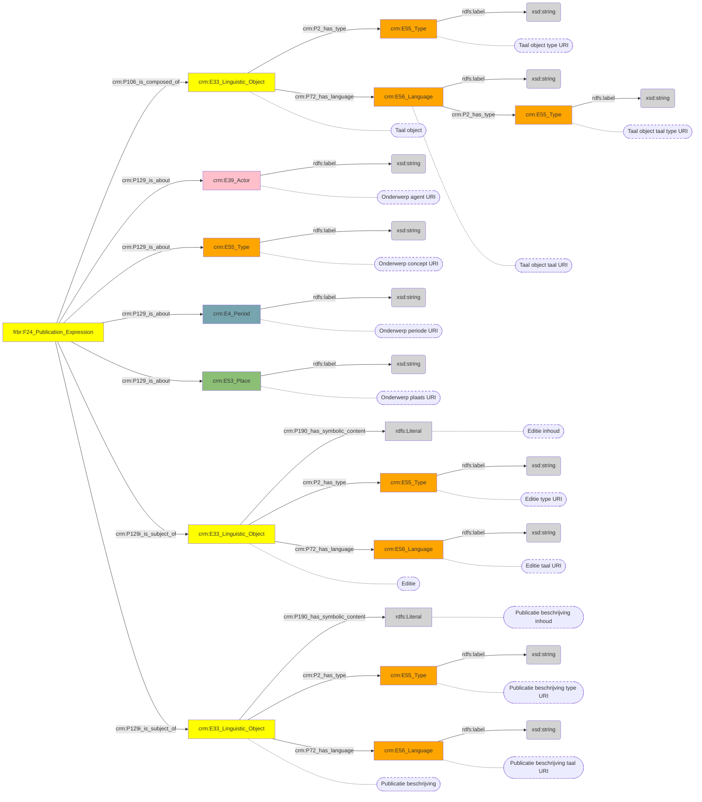

```mermaid
graph LR
096a8642-6285-11ee-bc5c-00163e71351b["crm:E55_Type"]-->|"rdfs:label"|37ff51d6-6285-11ee-b0c4-00163e71351b(xsd:string)
50974f40-6286-11ee-a9ac-00163e71351b["crm:E55_Type"]-->|"rdfs:label"|7f23156a-6286-11ee-974d-00163e71351b(xsd:string)
b0d9cd7a-628f-11ee-bc5c-00163e71351b["crm:E33_Linguistic_Object"]-->|"crm:P190_has_symbolic_content"|b0d9d360-628f-11ee-bc5c-00163e71351b(rdfs:Literal)
b0d9d11c-628f-11ee-bc5c-00163e71351b["crm:E55_Type"]-->|"rdfs:label"|b0d9d540-628f-11ee-bc5c-00163e71351b(xsd:string)
b0d9d25c-628f-11ee-bc5c-00163e71351b["crm:E56_Language"]-->|"rdfs:label"|b0d9d450-628f-11ee-bc5c-00163e71351b(xsd:string)
c90b86ee-5160-11ee-a9ac-00163e71351b["crm:E56_Language"]-->|"rdfs:label"|fd568fb6-5160-11ee-a9ac-00163e71351b(xsd:string)
f4349c74-04f9-11ee-9497-96a6d2455259["crm:E39_Actor"]-->|"rdfs:label"|f434b7b8-04f9-11ee-9497-96a6d2455259(xsd:string)
f434a390-04f9-11ee-9497-96a6d2455259["crm:E55_Type"]-->|"rdfs:label"|f434c0e6-04f9-11ee-9497-96a6d2455259(xsd:string)
f434a8ea-04f9-11ee-9497-96a6d2455259["crm:E4_Period"]-->|"rdfs:label"|f434c672-04f9-11ee-9497-96a6d2455259(xsd:string)
f434aa8e-04f9-11ee-9497-96a6d2455259["crm:E53_Place"]-->|"rdfs:label"|f434cd16-04f9-11ee-9497-96a6d2455259(xsd:string)
f434ae4e-04f9-11ee-9497-96a6d2455259["crm:E33_Linguistic_Object"]-->|"crm:P190_has_symbolic_content"|f434d0b8-04f9-11ee-9497-96a6d2455259(rdfs:Literal)
f434d144-04f9-11ee-9497-96a6d2455259["crm:E55_Type"]-->|"rdfs:label"|f434d0fe-04f9-11ee-9497-96a6d2455259(xsd:string)
f434d1d0-04f9-11ee-9497-96a6d2455259["crm:E56_Language"]-->|"rdfs:label"|f434d18a-04f9-11ee-9497-96a6d2455259(xsd:string)
814b53fc-5160-11ee-bc5c-00163e71351b["crm:E33_Linguistic_Object"]-->|"crm:P2_has_type"|50974f40-6286-11ee-a9ac-00163e71351b["crm:E55_Type"]
814b53fc-5160-11ee-bc5c-00163e71351b["crm:E33_Linguistic_Object"]-->|"crm:P72_has_language"|c90b86ee-5160-11ee-a9ac-00163e71351b["crm:E56_Language"]
b0d9cd7a-628f-11ee-bc5c-00163e71351b["crm:E33_Linguistic_Object"]-->|"crm:P2_has_type"|b0d9d11c-628f-11ee-bc5c-00163e71351b["crm:E55_Type"]
b0d9cd7a-628f-11ee-bc5c-00163e71351b["crm:E33_Linguistic_Object"]-->|"crm:P72_has_language"|b0d9d25c-628f-11ee-bc5c-00163e71351b["crm:E56_Language"]
c90b86ee-5160-11ee-a9ac-00163e71351b["crm:E56_Language"]-->|"crm:P2_has_type"|096a8642-6285-11ee-bc5c-00163e71351b["crm:E55_Type"]
f434ae4e-04f9-11ee-9497-96a6d2455259["crm:E33_Linguistic_Object"]-->|"crm:P2_has_type"|f434d144-04f9-11ee-9497-96a6d2455259["crm:E55_Type"]
f434ae4e-04f9-11ee-9497-96a6d2455259["crm:E33_Linguistic_Object"]-->|"crm:P72_has_language"|f434d1d0-04f9-11ee-9497-96a6d2455259["crm:E56_Language"]
f434b650-04f9-11ee-9497-96a6d2455259["frbr:F24_Publication_Expression"]-->|"crm:P106_is_composed_of"|814b53fc-5160-11ee-bc5c-00163e71351b["crm:E33_Linguistic_Object"]
f434b650-04f9-11ee-9497-96a6d2455259["frbr:F24_Publication_Expression"]-->|"crm:P129_is_about"|f4349c74-04f9-11ee-9497-96a6d2455259["crm:E39_Actor"]
f434b650-04f9-11ee-9497-96a6d2455259["frbr:F24_Publication_Expression"]-->|"crm:P129_is_about"|f434a390-04f9-11ee-9497-96a6d2455259["crm:E55_Type"]
f434b650-04f9-11ee-9497-96a6d2455259["frbr:F24_Publication_Expression"]-->|"crm:P129_is_about"|f434a8ea-04f9-11ee-9497-96a6d2455259["crm:E4_Period"]
f434b650-04f9-11ee-9497-96a6d2455259["frbr:F24_Publication_Expression"]-->|"crm:P129_is_about"|f434aa8e-04f9-11ee-9497-96a6d2455259["crm:E53_Place"]
f434b650-04f9-11ee-9497-96a6d2455259["frbr:F24_Publication_Expression"]-->|"crm:P129i_is_subject_of"|b0d9cd7a-628f-11ee-bc5c-00163e71351b["crm:E33_Linguistic_Object"]
f434b650-04f9-11ee-9497-96a6d2455259["frbr:F24_Publication_Expression"]-->|"crm:P129i_is_subject_of"|f434ae4e-04f9-11ee-9497-96a6d2455259["crm:E33_Linguistic_Object"]
50974f40-6286-11ee-a9ac-00163e71351b["crm:E55_Type"]-.-50974f40-6286-11ee-a9ac-00163e71351b_s(["Taal object type URI"])
c90b86ee-5160-11ee-a9ac-00163e71351b["crm:E56_Language"]-.-c90b86ee-5160-11ee-a9ac-00163e71351b_s(["Taal object taal URI"])
b0d9d360-628f-11ee-bc5c-00163e71351b["rdfs:Literal"]-.-b0d9d360-628f-11ee-bc5c-00163e71351b_s(["Editie inhoud"])
b0d9d11c-628f-11ee-bc5c-00163e71351b["crm:E55_Type"]-.-b0d9d11c-628f-11ee-bc5c-00163e71351b_s(["Editie type URI"])
b0d9d25c-628f-11ee-bc5c-00163e71351b["crm:E56_Language"]-.-b0d9d25c-628f-11ee-bc5c-00163e71351b_s(["Editie taal URI"])
096a8642-6285-11ee-bc5c-00163e71351b["crm:E55_Type"]-.-096a8642-6285-11ee-bc5c-00163e71351b_s(["Taal object taal type URI"])
f434d0b8-04f9-11ee-9497-96a6d2455259["rdfs:Literal"]-.-f434d0b8-04f9-11ee-9497-96a6d2455259_s(["Publicatie beschrijving inhoud"])
f434d144-04f9-11ee-9497-96a6d2455259["crm:E55_Type"]-.-f434d144-04f9-11ee-9497-96a6d2455259_s(["Publicatie beschrijving type URI"])
f434d1d0-04f9-11ee-9497-96a6d2455259["crm:E56_Language"]-.-f434d1d0-04f9-11ee-9497-96a6d2455259_s(["Publicatie beschrijving taal URI"])
814b53fc-5160-11ee-bc5c-00163e71351b["crm:E33_Linguistic_Object"]-.-814b53fc-5160-11ee-bc5c-00163e71351b_s(["Taal object"])
f4349c74-04f9-11ee-9497-96a6d2455259["crm:E39_Actor"]-.-f4349c74-04f9-11ee-9497-96a6d2455259_s(["Onderwerp agent URI"])
f434a390-04f9-11ee-9497-96a6d2455259["crm:E55_Type"]-.-f434a390-04f9-11ee-9497-96a6d2455259_s(["Onderwerp concept URI"])
f434a8ea-04f9-11ee-9497-96a6d2455259["crm:E4_Period"]-.-f434a8ea-04f9-11ee-9497-96a6d2455259_s(["Onderwerp periode URI"])
f434aa8e-04f9-11ee-9497-96a6d2455259["crm:E53_Place"]-.-f434aa8e-04f9-11ee-9497-96a6d2455259_s(["Onderwerp plaats URI"])
b0d9cd7a-628f-11ee-bc5c-00163e71351b["crm:E33_Linguistic_Object"]-.-b0d9cd7a-628f-11ee-bc5c-00163e71351b_s(["Editie"])
f434ae4e-04f9-11ee-9497-96a6d2455259["crm:E33_Linguistic_Object"]-.-f434ae4e-04f9-11ee-9497-96a6d2455259_s(["Publicatie beschrijving"])
style 50974f40-6286-11ee-a9ac-00163e71351b_s stroke-dasharray: 5
style c90b86ee-5160-11ee-a9ac-00163e71351b_s stroke-dasharray: 5
style b0d9d360-628f-11ee-bc5c-00163e71351b_s stroke-dasharray: 5
style b0d9d11c-628f-11ee-bc5c-00163e71351b_s stroke-dasharray: 5
style b0d9d25c-628f-11ee-bc5c-00163e71351b_s stroke-dasharray: 5
style 096a8642-6285-11ee-bc5c-00163e71351b_s stroke-dasharray: 5
style f434d0b8-04f9-11ee-9497-96a6d2455259_s stroke-dasharray: 5
style f434d144-04f9-11ee-9497-96a6d2455259_s stroke-dasharray: 5
style f434d1d0-04f9-11ee-9497-96a6d2455259_s stroke-dasharray: 5
style 814b53fc-5160-11ee-bc5c-00163e71351b_s stroke-dasharray: 5
style f4349c74-04f9-11ee-9497-96a6d2455259_s stroke-dasharray: 5
style f434a390-04f9-11ee-9497-96a6d2455259_s stroke-dasharray: 5
style f434a8ea-04f9-11ee-9497-96a6d2455259_s stroke-dasharray: 5
style f434aa8e-04f9-11ee-9497-96a6d2455259_s stroke-dasharray: 5
style b0d9cd7a-628f-11ee-bc5c-00163e71351b_s stroke-dasharray: 5
style f434ae4e-04f9-11ee-9497-96a6d2455259_s stroke-dasharray: 5
style 096a8642-6285-11ee-bc5c-00163e71351b fill:#ffa500
style 37ff51d6-6285-11ee-b0c4-00163e71351b fill:#D3D3D3
style 50974f40-6286-11ee-a9ac-00163e71351b fill:#ffa500
style 7f23156a-6286-11ee-974d-00163e71351b fill:#D3D3D3
style 814b53fc-5160-11ee-bc5c-00163e71351b fill:#ffff00
style b0d9cd7a-628f-11ee-bc5c-00163e71351b fill:#ffff00
style b0d9d11c-628f-11ee-bc5c-00163e71351b fill:#ffa500
style b0d9d25c-628f-11ee-bc5c-00163e71351b fill:#ffa500
style b0d9d360-628f-11ee-bc5c-00163e71351b fill:#D3D3D3
style b0d9d450-628f-11ee-bc5c-00163e71351b fill:#D3D3D3
style b0d9d540-628f-11ee-bc5c-00163e71351b fill:#D3D3D3
style c90b86ee-5160-11ee-a9ac-00163e71351b fill:#ffa500
style f4349c74-04f9-11ee-9497-96a6d2455259 fill:#ffc0cb
style f434a390-04f9-11ee-9497-96a6d2455259 fill:#ffa500
style f434a8ea-04f9-11ee-9497-96a6d2455259 fill:#76A5AF
style f434aa8e-04f9-11ee-9497-96a6d2455259 fill:#8CBF76
style f434ae4e-04f9-11ee-9497-96a6d2455259 fill:#ffff00
style f434b650-04f9-11ee-9497-96a6d2455259 fill:#ffff00
style f434b7b8-04f9-11ee-9497-96a6d2455259 fill:#D3D3D3
style f434c0e6-04f9-11ee-9497-96a6d2455259 fill:#D3D3D3
style f434c672-04f9-11ee-9497-96a6d2455259 fill:#D3D3D3
style f434cd16-04f9-11ee-9497-96a6d2455259 fill:#D3D3D3
style f434d0b8-04f9-11ee-9497-96a6d2455259 fill:#D3D3D3
style f434d0fe-04f9-11ee-9497-96a6d2455259 fill:#D3D3D3
style f434d144-04f9-11ee-9497-96a6d2455259 fill:#ffa500
style f434d18a-04f9-11ee-9497-96a6d2455259 fill:#D3D3D3
style f434d1d0-04f9-11ee-9497-96a6d2455259 fill:#ffa500
style fd568fb6-5160-11ee-a9ac-00163e71351b fill:#D3D3D3
```
