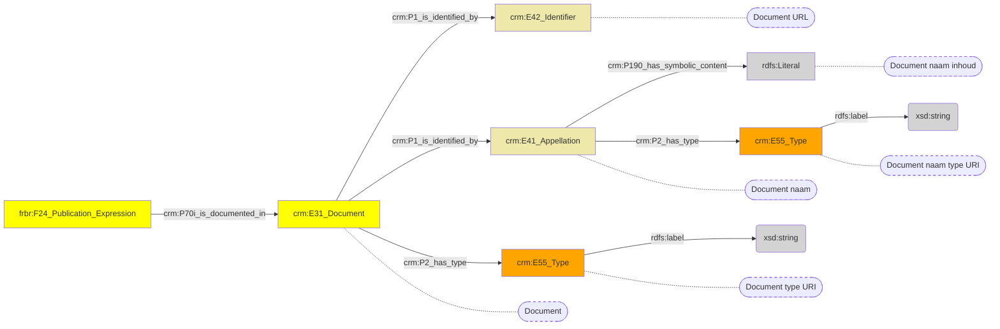

```mermaid
graph LR
3ad08bac-6288-11ee-bc5c-00163e71351b["crm:E41_Appellation"]-->|"crm:P190_has_symbolic_content"|3ad091f6-6288-11ee-bc5c-00163e71351b(rdfs:Literal)
3ad09412-6288-11ee-bc5c-00163e71351b["crm:E55_Type"]-->|"rdfs:label"|3ad095c0-6288-11ee-bc5c-00163e71351b(xsd:string)
ebd702e0-6289-11ee-974d-00163e71351b["crm:E55_Type"]-->|"rdfs:label"|0c4eb162-628a-11ee-974d-00163e71351b(xsd:string)
3ad08bac-6288-11ee-bc5c-00163e71351b["crm:E41_Appellation"]-->|"crm:P2_has_type"|3ad09412-6288-11ee-bc5c-00163e71351b["crm:E55_Type"]
e32cad72-6287-11ee-b0c4-00163e71351b["crm:E31_Document"]-->|"crm:P1_is_identified_by"|0c76d5c2-6288-11ee-bc5c-00163e71351b["crm:E42_Identifier"]
e32cad72-6287-11ee-b0c4-00163e71351b["crm:E31_Document"]-->|"crm:P1_is_identified_by"|3ad08bac-6288-11ee-bc5c-00163e71351b["crm:E41_Appellation"]
e32cad72-6287-11ee-b0c4-00163e71351b["crm:E31_Document"]-->|"crm:P2_has_type"|ebd702e0-6289-11ee-974d-00163e71351b["crm:E55_Type"]
f434b650-04f9-11ee-9497-96a6d2455259["frbr:F24_Publication_Expression"]-->|"crm:P70i_is_documented_in"|e32cad72-6287-11ee-b0c4-00163e71351b["crm:E31_Document"]
3ad091f6-6288-11ee-bc5c-00163e71351b["rdfs:Literal"]-.-3ad091f6-6288-11ee-bc5c-00163e71351b_s(["Document naam inhoud"])
3ad09412-6288-11ee-bc5c-00163e71351b["crm:E55_Type"]-.-3ad09412-6288-11ee-bc5c-00163e71351b_s(["Document naam type URI"])
0c76d5c2-6288-11ee-bc5c-00163e71351b["crm:E42_Identifier"]-.-0c76d5c2-6288-11ee-bc5c-00163e71351b_s(["Document URL"])
3ad08bac-6288-11ee-bc5c-00163e71351b["crm:E41_Appellation"]-.-3ad08bac-6288-11ee-bc5c-00163e71351b_s(["Document naam"])
ebd702e0-6289-11ee-974d-00163e71351b["crm:E55_Type"]-.-ebd702e0-6289-11ee-974d-00163e71351b_s(["Document type URI"])
e32cad72-6287-11ee-b0c4-00163e71351b["crm:E31_Document"]-.-e32cad72-6287-11ee-b0c4-00163e71351b_s(["Document"])
style 3ad091f6-6288-11ee-bc5c-00163e71351b_s stroke-dasharray: 5
style 3ad09412-6288-11ee-bc5c-00163e71351b_s stroke-dasharray: 5
style 0c76d5c2-6288-11ee-bc5c-00163e71351b_s stroke-dasharray: 5
style 3ad08bac-6288-11ee-bc5c-00163e71351b_s stroke-dasharray: 5
style ebd702e0-6289-11ee-974d-00163e71351b_s stroke-dasharray: 5
style e32cad72-6287-11ee-b0c4-00163e71351b_s stroke-dasharray: 5
style 0c4eb162-628a-11ee-974d-00163e71351b fill:#D3D3D3
style 0c76d5c2-6288-11ee-bc5c-00163e71351b fill:#EEE8AA
style 3ad08bac-6288-11ee-bc5c-00163e71351b fill:#EEE8AA
style 3ad091f6-6288-11ee-bc5c-00163e71351b fill:#D3D3D3
style 3ad09412-6288-11ee-bc5c-00163e71351b fill:#ffa500
style 3ad095c0-6288-11ee-bc5c-00163e71351b fill:#D3D3D3
style e32cad72-6287-11ee-b0c4-00163e71351b fill:#ffff00
style ebd702e0-6289-11ee-974d-00163e71351b fill:#ffa500
style f434b650-04f9-11ee-9497-96a6d2455259 fill:#ffff00
```
