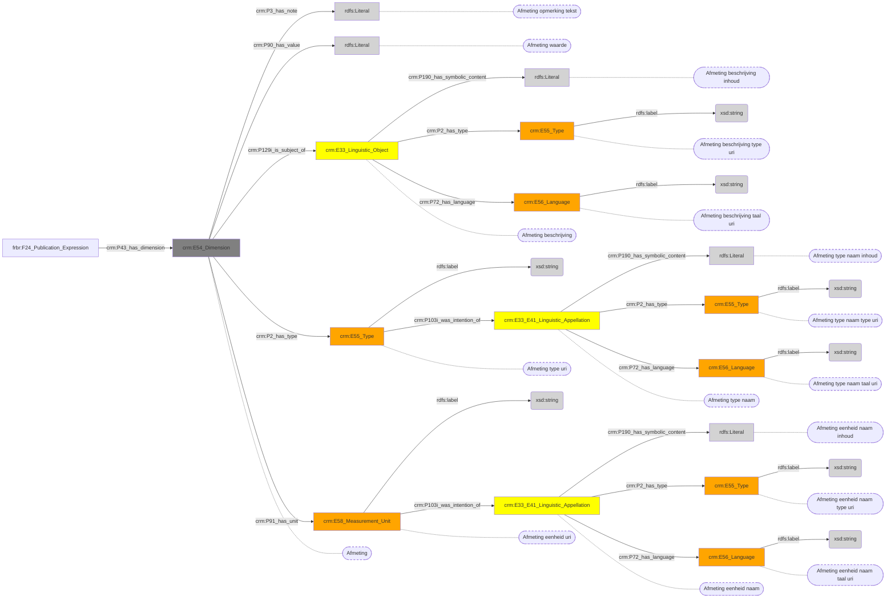

```mermaid
graph LR
f1d6c386-4bc5-11ee-a9ac-00163e71351b["crm:E54_Dimension"]-->|"crm:P3_has_note"|f1d6d498-4bc5-11ee-a9ac-00163e71351b(rdfs:Literal)
f1d6c386-4bc5-11ee-a9ac-00163e71351b["crm:E54_Dimension"]-->|"crm:P90_has_value"|f1d6d1dc-4bc5-11ee-a9ac-00163e71351b(rdfs:Literal)
f1d6c75a-4bc5-11ee-a9ac-00163e71351b["crm:E33_E41_Linguistic_Appellation"]-->|"crm:P190_has_symbolic_content"|f1d6d740-4bc5-11ee-a9ac-00163e71351b(rdfs:Literal)
f1d6ca48-4bc5-11ee-a9ac-00163e71351b["crm:E33_E41_Linguistic_Appellation"]-->|"crm:P190_has_symbolic_content"|f1d6df2e-4bc5-11ee-a9ac-00163e71351b(rdfs:Literal)
f1d6cd04-4bc5-11ee-a9ac-00163e71351b["crm:E33_Linguistic_Object"]-->|"crm:P190_has_symbolic_content"|f1d6dace-4bc5-11ee-a9ac-00163e71351b(rdfs:Literal)
f1d6cfb6-4bc5-11ee-a9ac-00163e71351b["crm:E55_Type"]-->|"rdfs:label"|f1d6d2cc-4bc5-11ee-a9ac-00163e71351b(xsd:string)
f1d6d0ec-4bc5-11ee-a9ac-00163e71351b["crm:E58_Measurement_Unit"]-->|"rdfs:label"|f1d6d3b2-4bc5-11ee-a9ac-00163e71351b(xsd:string)
f1d6d574-4bc5-11ee-a9ac-00163e71351b["crm:E55_Type"]-->|"rdfs:label"|f1d6d65a-4bc5-11ee-a9ac-00163e71351b(xsd:string)
f1d6d826-4bc5-11ee-a9ac-00163e71351b["crm:E56_Language"]-->|"rdfs:label"|f1d6d902-4bc5-11ee-a9ac-00163e71351b(xsd:string)
f1d6dbaa-4bc5-11ee-a9ac-00163e71351b["crm:E55_Type"]-->|"rdfs:label"|f1d6d9e8-4bc5-11ee-a9ac-00163e71351b(xsd:string)
f1d6dd76-4bc5-11ee-a9ac-00163e71351b["crm:E55_Type"]-->|"rdfs:label"|f1d6de52-4bc5-11ee-a9ac-00163e71351b(xsd:string)
f1d6e014-4bc5-11ee-a9ac-00163e71351b["crm:E56_Language"]-->|"rdfs:label"|f1d6e1cc-4bc5-11ee-a9ac-00163e71351b(xsd:string)
f1d6e0e6-4bc5-11ee-a9ac-00163e71351b["crm:E56_Language"]-->|"rdfs:label"|f1d6dc90-4bc5-11ee-a9ac-00163e71351b(xsd:string)
f1d6c386-4bc5-11ee-a9ac-00163e71351b["crm:E54_Dimension"]-->|"crm:P129i_is_subject_of"|f1d6cd04-4bc5-11ee-a9ac-00163e71351b["crm:E33_Linguistic_Object"]
f1d6c386-4bc5-11ee-a9ac-00163e71351b["crm:E54_Dimension"]-->|"crm:P2_has_type"|f1d6cfb6-4bc5-11ee-a9ac-00163e71351b["crm:E55_Type"]
f1d6c386-4bc5-11ee-a9ac-00163e71351b["crm:E54_Dimension"]-->|"crm:P91_has_unit"|f1d6d0ec-4bc5-11ee-a9ac-00163e71351b["crm:E58_Measurement_Unit"]
f1d6c75a-4bc5-11ee-a9ac-00163e71351b["crm:E33_E41_Linguistic_Appellation"]-->|"crm:P2_has_type"|f1d6d574-4bc5-11ee-a9ac-00163e71351b["crm:E55_Type"]
f1d6c75a-4bc5-11ee-a9ac-00163e71351b["crm:E33_E41_Linguistic_Appellation"]-->|"crm:P72_has_language"|f1d6d826-4bc5-11ee-a9ac-00163e71351b["crm:E56_Language"]
f1d6ca48-4bc5-11ee-a9ac-00163e71351b["crm:E33_E41_Linguistic_Appellation"]-->|"crm:P2_has_type"|f1d6dbaa-4bc5-11ee-a9ac-00163e71351b["crm:E55_Type"]
f1d6ca48-4bc5-11ee-a9ac-00163e71351b["crm:E33_E41_Linguistic_Appellation"]-->|"crm:P72_has_language"|f1d6e014-4bc5-11ee-a9ac-00163e71351b["crm:E56_Language"]
f1d6cd04-4bc5-11ee-a9ac-00163e71351b["crm:E33_Linguistic_Object"]-->|"crm:P2_has_type"|f1d6dd76-4bc5-11ee-a9ac-00163e71351b["crm:E55_Type"]
f1d6cd04-4bc5-11ee-a9ac-00163e71351b["crm:E33_Linguistic_Object"]-->|"crm:P72_has_language"|f1d6e0e6-4bc5-11ee-a9ac-00163e71351b["crm:E56_Language"]
f1d6cfb6-4bc5-11ee-a9ac-00163e71351b["crm:E55_Type"]-->|"crm:P103i_was_intention_of"|f1d6ca48-4bc5-11ee-a9ac-00163e71351b["crm:E33_E41_Linguistic_Appellation"]
f1d6d0ec-4bc5-11ee-a9ac-00163e71351b["crm:E58_Measurement_Unit"]-->|"crm:P103i_was_intention_of"|f1d6c75a-4bc5-11ee-a9ac-00163e71351b["crm:E33_E41_Linguistic_Appellation"]
f434b650-04f9-11ee-9497-96a6d2455259["frbr:F24_Publication_Expression"]-->|"crm:P43_has_dimension"|f1d6c386-4bc5-11ee-a9ac-00163e71351b["crm:E54_Dimension"]
style f1d6cd04-4bc5-11ee-a9ac-00163e71351b_s stroke-dasharray: 5
style f1d6cfb6-4bc5-11ee-a9ac-00163e71351b_s stroke-dasharray: 5
style f1d6d498-4bc5-11ee-a9ac-00163e71351b_s stroke-dasharray: 5
style f1d6d1dc-4bc5-11ee-a9ac-00163e71351b_s stroke-dasharray: 5
style f1d6d0ec-4bc5-11ee-a9ac-00163e71351b_s stroke-dasharray: 5
style f1d6d740-4bc5-11ee-a9ac-00163e71351b_s stroke-dasharray: 5
style f1d6d574-4bc5-11ee-a9ac-00163e71351b_s stroke-dasharray: 5
style f1d6d826-4bc5-11ee-a9ac-00163e71351b_s stroke-dasharray: 5
style f1d6df2e-4bc5-11ee-a9ac-00163e71351b_s stroke-dasharray: 5
style f1d6dbaa-4bc5-11ee-a9ac-00163e71351b_s stroke-dasharray: 5
style f1d6e014-4bc5-11ee-a9ac-00163e71351b_s stroke-dasharray: 5
style f1d6dace-4bc5-11ee-a9ac-00163e71351b_s stroke-dasharray: 5
style f1d6dd76-4bc5-11ee-a9ac-00163e71351b_s stroke-dasharray: 5
style f1d6e0e6-4bc5-11ee-a9ac-00163e71351b_s stroke-dasharray: 5
style f1d6ca48-4bc5-11ee-a9ac-00163e71351b_s stroke-dasharray: 5
style f1d6c75a-4bc5-11ee-a9ac-00163e71351b_s stroke-dasharray: 5
style f1d6c386-4bc5-11ee-a9ac-00163e71351b_s stroke-dasharray: 5
f1d6cd04-4bc5-11ee-a9ac-00163e71351b["crm:E33_Linguistic_Object"]-.-f1d6cd04-4bc5-11ee-a9ac-00163e71351b_s(["Afmeting beschrijving"])
f1d6cfb6-4bc5-11ee-a9ac-00163e71351b["crm:E55_Type"]-.-f1d6cfb6-4bc5-11ee-a9ac-00163e71351b_s(["Afmeting type uri"])
f1d6d498-4bc5-11ee-a9ac-00163e71351b["rdfs:Literal"]-.-f1d6d498-4bc5-11ee-a9ac-00163e71351b_s(["Afmeting opmerking tekst"])
f1d6d1dc-4bc5-11ee-a9ac-00163e71351b["rdfs:Literal"]-.-f1d6d1dc-4bc5-11ee-a9ac-00163e71351b_s(["Afmeting waarde"])
f1d6d0ec-4bc5-11ee-a9ac-00163e71351b["crm:E58_Measurement_Unit"]-.-f1d6d0ec-4bc5-11ee-a9ac-00163e71351b_s(["Afmeting eenheid uri"])
f1d6d740-4bc5-11ee-a9ac-00163e71351b["rdfs:Literal"]-.-f1d6d740-4bc5-11ee-a9ac-00163e71351b_s(["Afmeting eenheid naam inhoud"])
f1d6d574-4bc5-11ee-a9ac-00163e71351b["crm:E55_Type"]-.-f1d6d574-4bc5-11ee-a9ac-00163e71351b_s(["Afmeting eenheid naam type uri"])
f1d6d826-4bc5-11ee-a9ac-00163e71351b["crm:E56_Language"]-.-f1d6d826-4bc5-11ee-a9ac-00163e71351b_s(["Afmeting eenheid naam taal uri"])
f1d6df2e-4bc5-11ee-a9ac-00163e71351b["rdfs:Literal"]-.-f1d6df2e-4bc5-11ee-a9ac-00163e71351b_s(["Afmeting type naam inhoud"])
f1d6dbaa-4bc5-11ee-a9ac-00163e71351b["crm:E55_Type"]-.-f1d6dbaa-4bc5-11ee-a9ac-00163e71351b_s(["Afmeting type naam type uri"])
f1d6e014-4bc5-11ee-a9ac-00163e71351b["crm:E56_Language"]-.-f1d6e014-4bc5-11ee-a9ac-00163e71351b_s(["Afmeting type naam taal uri"])
f1d6dace-4bc5-11ee-a9ac-00163e71351b["rdfs:Literal"]-.-f1d6dace-4bc5-11ee-a9ac-00163e71351b_s(["Afmeting beschrijving inhoud"])
f1d6dd76-4bc5-11ee-a9ac-00163e71351b["crm:E55_Type"]-.-f1d6dd76-4bc5-11ee-a9ac-00163e71351b_s(["Afmeting beschrijving type uri"])
f1d6e0e6-4bc5-11ee-a9ac-00163e71351b["crm:E56_Language"]-.-f1d6e0e6-4bc5-11ee-a9ac-00163e71351b_s(["Afmeting beschrijving taal uri"])
f1d6ca48-4bc5-11ee-a9ac-00163e71351b["crm:E33_E41_Linguistic_Appellation"]-.-f1d6ca48-4bc5-11ee-a9ac-00163e71351b_s(["Afmeting type naam"])
f1d6c75a-4bc5-11ee-a9ac-00163e71351b["crm:E33_E41_Linguistic_Appellation"]-.-f1d6c75a-4bc5-11ee-a9ac-00163e71351b_s(["Afmeting eenheid naam"])
f1d6c386-4bc5-11ee-a9ac-00163e71351b["crm:E54_Dimension"]-.-f1d6c386-4bc5-11ee-a9ac-00163e71351b_s(["Afmeting"])
style f1d6c386-4bc5-11ee-a9ac-00163e71351b fill:#808080
style f1d6c75a-4bc5-11ee-a9ac-00163e71351b fill:#ffff00
style f1d6ca48-4bc5-11ee-a9ac-00163e71351b fill:#ffff00
style f1d6cd04-4bc5-11ee-a9ac-00163e71351b fill:#ffff00
style f1d6cfb6-4bc5-11ee-a9ac-00163e71351b fill:#ffa500
style f1d6d0ec-4bc5-11ee-a9ac-00163e71351b fill:#ffa500
style f1d6d1dc-4bc5-11ee-a9ac-00163e71351b fill:#D3D3D3
style f1d6d2cc-4bc5-11ee-a9ac-00163e71351b fill:#D3D3D3
style f1d6d3b2-4bc5-11ee-a9ac-00163e71351b fill:#D3D3D3
style f1d6d498-4bc5-11ee-a9ac-00163e71351b fill:#D3D3D3
style f1d6d574-4bc5-11ee-a9ac-00163e71351b fill:#ffa500
style f1d6d65a-4bc5-11ee-a9ac-00163e71351b fill:#D3D3D3
style f1d6d740-4bc5-11ee-a9ac-00163e71351b fill:#D3D3D3
style f1d6d826-4bc5-11ee-a9ac-00163e71351b fill:#ffa500
style f1d6d902-4bc5-11ee-a9ac-00163e71351b fill:#D3D3D3
style f1d6d9e8-4bc5-11ee-a9ac-00163e71351b fill:#D3D3D3
style f1d6dace-4bc5-11ee-a9ac-00163e71351b fill:#D3D3D3
style f1d6dbaa-4bc5-11ee-a9ac-00163e71351b fill:#ffa500
style f1d6dc90-4bc5-11ee-a9ac-00163e71351b fill:#D3D3D3
style f1d6dd76-4bc5-11ee-a9ac-00163e71351b fill:#ffa500
style f1d6de52-4bc5-11ee-a9ac-00163e71351b fill:#D3D3D3
style f1d6df2e-4bc5-11ee-a9ac-00163e71351b fill:#D3D3D3
style f1d6e014-4bc5-11ee-a9ac-00163e71351b fill:#ffa500
style f1d6e0e6-4bc5-11ee-a9ac-00163e71351b fill:#ffa500
style f1d6e1cc-4bc5-11ee-a9ac-00163e71351b fill:#D3D3D3
```
